# VibeFit  
**Producto: FitWise**  
# UNIVERSIDAD PERUANA DE CIENCIAS APLICADAS

<p align="center">
  
</p>

### Carrera: Ingeniería de Software  
### Ciclo: 5° ciclo  
### Curso: Aplicaciones Web  
### Sección: 1ASI0730  
### Profesor: Hugo Allan Mori Paiva

## Informe de Trabajo Final  
**"VibeFit"**  
**Producto: "FitWise"**

### Integrantes:
- Ramiro Alexander Guzmán Chávez – U202217062  
- Diego Rolin Acuña Tomas – U202221436  
- Miguel Angel Gómez Hurtado – U202220294  
- Farid Sebastian Briceño De La Cruz – U20211F211  
- Mauricio Rigoberto Muñoz Vilcapoma – U202217212  

**Abril, 2025**  
**URL del proyecto:** [https://github.com/RamiroGuzmanCh/AplicacionesWeb-4380](https://github.com/RamiroGuzmanCh/AplicacionesWeb-4380)

---

## Registro de Versiones del Informe

| Versión | Fecha       | Autor | Descripción |
|---------|-------------|-------|-------------|
| TB1     | 17/04/2025  |  Ramiro Alexander Guzman Chavez   |   Desarrollé la carátula del repositorio, el startup profile, la solution profile, establecí los segmentos objetivos, el diseño de las entrevistas y mis entrevistas por segmento objetivo.          |
| TB1     | XX/XX/XXXX  |       |             |
| TB1     | XX/XX/XXXX  |       |             |
| TB1     | XX/XX/XXXX  |       |             |
| TB1     | XX/XX/XXXX  |       |             |
| TB1     | XX/XX/XXXX  |       |             |
| TB1     | XX/XX/XXXX  |       |             |
| TB1     | XX/XX/XXXX  |       |             |
| TB1     | XX/XX/XXXX  |       |             |
| TB1     | XX/XX/XXXX  |       |             |
| TB1     | XX/XX/XXXX  |       |             |
| TB1     | XX/XX/XXXX  |       |             |
| TB1     | XX/XX/XXXX  |       |             |

---

## Project Report Collaboration Insights

- **URL de la organización del proyecto:**  
  [https://github.com/AplicacionesWeb-4380-G2-FitWise](https://github.com/AplicacionesWeb-4380-G2-FitWise)
- **URL del repositorio del informe:**  
  [https://github.com/AplicacionesWeb-4380-G2-FitWise/TB1](https://github.com/AplicacionesWeb-4380-G2-FitWise/TB1)


  Todas las tareas correspondientes a la entrega de la TB1 han sido completadas y están documentadas en el repositorio de GitHub de la organización del equipo. Para la elaboración del informe, cada integrante del equipo se encargó de redactar y generar gráficos en formato Markdown, según los puntos que le fueron asignados, realizando commits para dejar constancia del progreso en el repositorio.

  Aquí se pueden visualizar todos los commits realizados para la TB1, lo cual evidencia el trabajo colaborativo del equipo.

    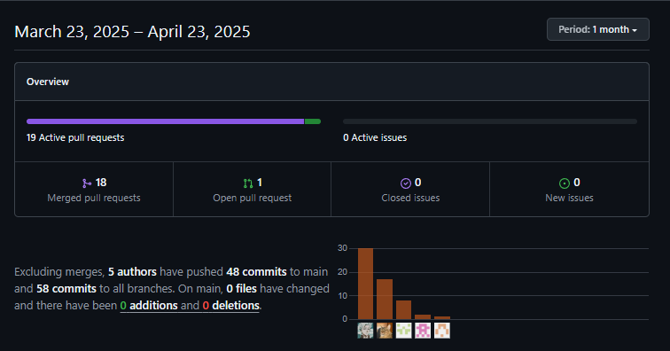

    Para facilitar el desarrollo del trabajo, optamos por seguir el flujo de trabajo Gitflow. En este esquema, cada subtítulo del informe fue tratado como una feature. Un miembro del equipo creaba una rama específica para ese subtítulo y trabajaba en ella, mientras que otros miembros podían colaborar directamente o supervisar su progreso. Una vez finalizada la feature, todo el equipo revisaba el contenido y, tras obtener el consenso, se realizaba el merge hacia la rama develop. Además, organizamos las tareas considerando su nivel de dificultad, asegurando así una distribución equitativa del trabajo entre todos los integrantes.

  A lo largo del desarrollo de la TB1, generamos varias ramas distintas que fueron integradas a la rama develop. Cada una representaba una sección específica del proyecto. Este enfoque nos permitió trabajar de manera ordenada y colaborativa, asegurando que cada parte del informe fuera desarrollada y revisada de forma independiente antes de su integración final.

    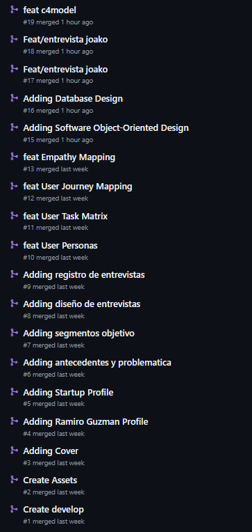

    
---
## Contenido
#### Tabla de contenidos

- [VibeFit](#vibefit)
- [UNIVERSIDAD PERUANA DE CIENCIAS APLICADAS](#universidad-peruana-de-ciencias-aplicadas)
    - [Carrera: Ingeniería de Software](#carrera-ingeniería-de-software)
    - [Ciclo: 5° ciclo](#ciclo-5-ciclo)
    - [Curso: Aplicaciones Web](#curso-aplicaciones-web)
    - [Sección: 1ASI0730](#sección-1asi0730)
    - [Profesor: Hugo Allan Mori Paiva](#profesor-hugo-allan-mori-paiva)
  - [Informe de Trabajo Final](#informe-de-trabajo-final)
    - [Integrantes:](#integrantes)
  - [Registro de Versiones del Informe](#registro-de-versiones-del-informe)
  - [Project Report Collaboration Insights](#project-report-collaboration-insights)
  - [Contenido](#contenido)
      - [Tabla de contenidos](#tabla-de-contenidos)
  - [Student Outcome](#student-outcome)
  - [Capítulo I: Introducción](#capítulo-i-introducción)
    - [1.1. Startup Profile](#11-startup-profile)
      - [1.1.1. Descripción de la startup](#111-descripción-de-la-startup)
      - [1.1.2. Perfiles de los integrantes del equipo](#112-perfiles-de-los-integrantes-del-equipo)
      - [**Muñoz Vilcapoma Mauricio – Ingeniería de Software – U202217212**](#muñoz-vilcapoma-mauricio--ingeniería-de-software--u202217212)
      - [**Ramiro Alexander Guzman Chavez – Ingeniería de Software – U202217062**](#ramiro-alexander-guzman-chavez--ingeniería-de-software--u202217062)
      - [**Farid Sebastian Briceño De La Cruz – Ingeniería de Software – U20211F211**](#farid-sebastian-briceño-de-la-cruz--ingeniería-de-software--u20211f211)
      - [**Miguel Angel Gómez Hurtado – Ingeniería de Software – U202220294**](#miguel-angel-gómez-hurtado--ingeniería-de-software--u202220294)
      - [**Diego Rolin Acuña Tomas – Ingeniería de Software – u202221436**](#diego-rolin-acuña-tomas--ingeniería-de-software--u202221436)
    - [1.2. Solution Profile](#12-solution-profile)
      - [1.2.1. Antecedentes y problemática](#121-antecedentes-y-problemática)
      - [1.2.2. Lean UX Process](#122-lean-ux-process)
        - [1.2.2.1. Lean UX Problem Statements](#1221-lean-ux-problem-statements)
        - [1.2.2.2. Lean UX Assumptions](#1222-lean-ux-assumptions)
        - [1.2.2.3. Lean UX Hypothesis Statements](#1223-lean-ux-hypothesis-statements)
        - [1.2.2.4. Lean UX Canvas](#1224-lean-ux-canvas)
    - [1.3. Segmentos objetivo](#13-segmentos-objetivo)
    - [1. Adultos y jóvenes ocupados](#1-adultos-y-jóvenes-ocupados)
    - [2. Entrenadores y profesionales del fitness](#2-entrenadores-y-profesionales-del-fitness)
  - [Capítulo II: Requirements Elicitation \& Analysis](#capítulo-ii-requirements-elicitation--analysis)
    - [2.1. Competidores](#21-competidores)
    - [a) Freeletics](#a-freeletics)
    - [b) Fitbod](#b-fitbod)
    - [c) MyFitnessPal (Under Armour)](#c-myfitnesspal-under-armour)
      - [2.1.1. Análisis competitivo](#211-análisis-competitivo)
  - [Análisis SWOT](#análisis-swot)
      - [2.1.2. Estrategias y tácticas frente a competidores](#212-estrategias-y-tácticas-frente-a-competidores)
        - [1. **Diferenciación Básica pero Clave**](#1-diferenciación-básica-pero-clave)
        - [2. **Enfoque en Nichos Específicos**](#2-enfoque-en-nichos-específicos)
        - [3. **Alianzas de Bajo Costo**](#3-alianzas-de-bajo-costo)
      - [**Acciones por Competidor (Enfoque Práctico)**](#acciones-por-competidor-enfoque-práctico)
    - [2.2. Entrevistas](#22-entrevistas)
    - [2.2.1 Diseño de entrevistas](#221-diseño-de-entrevistas)
    - [Segmento: Adultos y jóvenes ocupados](#segmento-adultos-y-jóvenes-ocupados)
      - [**Principales:**](#principales)
    - [Segmento: Entrenadores y profesionales del fitness](#segmento-entrenadores-y-profesionales-del-fitness)
      - [**Principales:**](#principales-1)
    - [2.2.2. Registro de entrevistas](#222-registro-de-entrevistas)
      - [2.2.3. Análisis de entrevistas](#223-análisis-de-entrevistas)
    - [2.3. Needfinding](#23-needfinding)
      - [2.3.1. User Personas](#231-user-personas)
      - [2.3.2. User Task Matrix](#232-user-task-matrix)
      - [2.3.3. User Journey Mapping](#233-user-journey-mapping)
      - [2.3.4. Empathy Mapping](#234-empathy-mapping)
      - [2.3.5. As-is Scenario Mapping](#235-as-is-scenario-mapping)
    - [2.4. Ubiquitous Language](#24-ubiquitous-language)
  - [Capítulo III: Requirements Specification](#capítulo-iii-requirements-specification)
    - [3.1. To-Be Scenario Mapping](#31-to-be-scenario-mapping)
    - [3.2. User Stories](#32-user-stories)
    - [3.3. Impact Mapping](#33-impact-mapping)
      - [Business Goal 1:](#business-goal-1)
      - [Business Goal 2:](#business-goal-2)
      - [Business Goal 3:](#business-goal-3)
      - [Business Goal 4:](#business-goal-4)
    - [3.4. Product Backlog](#34-product-backlog)
  - [Capítulo IV: Product Design](#capítulo-iv-product-design)
    - [4.1. Style Guidelines](#41-style-guidelines)
      - [4.1.1. General Style Guidelines](#411-general-style-guidelines)
        - [**1. Branding**](#1-branding)
        - [**2. Typography**](#2-typography)
        - [**3. Colors**](#3-colors)
        - [**4. Spacing \& Grid**](#4-spacing--grid)
        - [**5. Tono de Comunicación**](#5-tono-de-comunicación)
        - [**6. Sustento de Diseño**](#6-sustento-de-diseño)
      - [4.1.2. Web Style Guidelines](#412-web-style-guidelines)
        - [**1. Principios de Diseño**](#1-principios-de-diseño)
        - [**2. Paleta de Colores**](#2-paleta-de-colores)
        - [**3. Tipografía**](#3-tipografía)
        - [**4. Componentes Reutilizables**](#4-componentes-reutilizables)
      - [**Botones**](#botones)
        - [**Cards de Entrenamiento**](#cards-de-entrenamiento)
        - [**Formularios**](#formularios)
        - [**5. Patrones de Interacción Responsive**](#5-patrones-de-interacción-responsive)
    - [4.2. Information Architecture](#42-information-architecture)
      - [4.2.1. Organization Systems](#421-organization-systems)
        - [1. Organización Visual del Contenido](#1-organización-visual-del-contenido)
          - [a) Jerárquica (Prioridad Visual)](#a-jerárquica-prioridad-visual)
          - [b) Secuencial (Paso a Paso)](#b-secuencial-paso-a-paso)
          - [c) Matricial (Cuadrícula)](#c-matricial-cuadrícula)
        - [2. Esquemas de Categorización](#2-esquemas-de-categorización)
          - [a) Por Temas](#a-por-temas)
          - [b) Por Tipo de Usuario](#b-por-tipo-de-usuario)
          - [c) Cronológico](#c-cronológico)
          - [Mapa de Organización](#mapa-de-organización)
      - [4.2.2. Labeling Systems](#422-labeling-systems)
        - [1. Landing Page](#1-landing-page)
          - [a) Navegación Principal](#a-navegación-principal)
          - [b) Sección Hero](#b-sección-hero)
          - [c) Sección de Beneficios](#c-sección-de-beneficios)
          - [d) Sección de Sobre Nosotros](#d-sección-de-sobre-nosotros)
          - [e) Sección de Contactanos](#e-sección-de-contactanos)
          - [d) Sección de Información](#d-sección-de-información)
        - [2. Aplicación Web](#2-aplicación-web)
          - [a) Navegación Global](#a-navegación-global)
          - [b) Panel de Control](#b-panel-de-control)
          - [c) Formularios](#c-formularios)
        - [3. Convenciones Transversales](#3-convenciones-transversales)
          - [a) Estados](#a-estados)
          - [b) Tamaños de Texto](#b-tamaños-de-texto)
        - [4. Reglas de Implementación](#4-reglas-de-implementación)
      - [4.2.3. SEO Tags and Meta Tags](#423-seo-tags-and-meta-tags)
        - [1. Landing Page](#1-landing-page-1)
        - [2. Aplicación Web](#2-aplicación-web-1)
      - [4.2.4. Searching Systems](#424-searching-systems)
        - [1. Búsqueda en Dashboard Principal](#1-búsqueda-en-dashboard-principal)
          - [Filtros Disponibles:](#filtros-disponibles)
        - [2. Búsqueda en Módulo de Nutrición](#2-búsqueda-en-módulo-de-nutrición)
          - [Filtros Avanzados:](#filtros-avanzados)
      - [4.2.5. Navigation Systems](#425-navigation-systems)
        - [1. Landing Page](#1-landing-page-2)
          - [Estructura Principal](#estructura-principal)
        - [2. Aplicación Web](#2-aplicación-web-2)
          - [Navegación Global](#navegación-global)
    - [4.3. Landing Page UI Design](#43-landing-page-ui-design)
      - [4.3.1. Landing Page Wireframe](#431-landing-page-wireframe)
      - [4.3.2. Landing Page Mock-up](#432-landing-page-mock-up)
    - [4.4. Web Applications UX/UI Design](#44-web-applications-uxui-design)
      - [4.4.1. Web Applications Wireframes](#441-web-applications-wireframes)
      - [4.4.2. Web Applications Wireflow Diagrams](#442-web-applications-wireflow-diagrams)
      - [4.4.3. Web Applications Mock-ups](#443-web-applications-mock-ups)
      - [4.4.4. Web Applications User Flow Diagrams](#444-web-applications-user-flow-diagrams)
    - [4.5. Web Applications Prototyping](#45-web-applications-prototyping)
    - [4.6. Domain-Driven Software Architecture](#46-domain-driven-software-architecture)
      - [4.6.1. Software Architecture Context Diagram](#461-software-architecture-context-diagram)
      - [4.6.2. Software Architecture Container Diagrams](#462-software-architecture-container-diagrams)
      - [4.6.3. Software Architecture Components Diagrams](#463-software-architecture-components-diagrams)
    - [4.7. Software Object-Oriented Design](#47-software-object-oriented-design)
      - [4.7.1. Class Diagrams](#471-class-diagrams)
    - [4.7.2 Class Dictionary](#472-class-dictionary)
      - [4.8 Database Design](#48-database-design)
      - [4.8.1. Database Diagram](#481-database-diagram)
  - [Capítulo V: Product Implementation, Validation \& Deployment](#capítulo-v-product-implementation-validation--deployment)
    - [5.1. Software Configuration Management](#51-software-configuration-management)
    - [5.1. Software Configuration Management](#51-software-configuration-management-1)
    - [5.1.1. Software Development Environment Configuration](#511-software-development-environment-configuration)
      - [Project Management](#project-management)
      - [Requirement Management](#requirement-management)
      - [Product UX/UI Design](#product-uxui-design)
      - [Software Development](#software-development)
      - [Software Documentation](#software-documentation)
      - [Software Deployment](#software-deployment)
    - [5.1.2. Source Code Management](#512-source-code-management)
      - [Producto y Repositorio](#producto-y-repositorio)
      - [Estructura del Repositorio](#estructura-del-repositorio)
      - [Flujo de trabajo GitFlow](#flujo-de-trabajo-gitflow)
      - [Mensajes de Commits](#mensajes-de-commits)
      - [Documentación](#documentación)
    - [5.1.3. Source Code Style Guide \& Conventions](#513-source-code-style-guide--conventions)
      - [HTML](#html)
      - [CSS](#css)
      - [JavaScript](#javascript)
    - [5.1.4. Configuración de Despliegue de Software](#514-configuración-de-despliegue-de-software)
      - [Landing Page](#landing-page)
      - [Control de Versiones](#control-de-versiones)
    - [5.2. Landing Page, Services \& Applications Implementation](#52-landing-page-services--applications-implementation)
      - [5.2.1. Sprint 1](#521-sprint-1)
        - [5.2.1.1. Sprint Planning 1](#5211-sprint-planning-1)
        - [5.2.1.2. Aspect Leaders and Collaborators](#5212-aspect-leaders-and-collaborators)
        - [5.2.1.3. Sprint Backlog 1](#5213-sprint-backlog-1)
        - [5.2.1.4. Development Evidence for Sprint Review](#5214-development-evidence-for-sprint-review)
        - [5.2.1.5. Execution Evidence for Sprint Review](#5215-execution-evidence-for-sprint-review)
        - [5.2.1.6. Services Documentation Evidence for Sprint Review](#5216-services-documentation-evidence-for-sprint-review)
        - [5.2.1.7. Software Deployment Evidence for Sprint Review](#5217-software-deployment-evidence-for-sprint-review)
        - [5.2.1.8. Team Collaboration Insights during Sprint](#5218-team-collaboration-insights-during-sprint)
  - [Conclusiones](#conclusiones)
    - [Conclusiones y recomendaciones](#conclusiones-y-recomendaciones)
  - [Bibliografía](#bibliografía)
  - [Anexos](#anexos)
## Student Outcome

---

**ABET – EAC - Student Outcome 5**  
**Criterio:** La capacidad de funcionar efectivamente en un equipo cuyos miembros juntos proporcionan liderazgo, crean un entorno de colaboración e inclusivo, establecen objetivos, planifican tareas y cumplen objetivos.

En el siguiente cuadro se describen las acciones realizadas y enunciados de conclusiones por parte del grupo, que permiten sustentar el haber alcanzado el logro del ABET – EAC - Student Outcome 5.

| Criterio específico | Acciones realizadas | Conclusiones |
|---------------------|---------------------|--------------|
| 1. Trabaja en equipo para proporcionar liderazgo en forma conjunta. | **MAURICIO MUÑOZ** <br> **TB1:** Me comuniqué activamente con mi equipo para coordinar las tareas asignadas a cada miembro. Además, realicé consultas al profesor para resolver dudas del grupo y transmitir la información de forma clara y útil. <br><br> **RAMIRO GUZMÁN** <br> **TB1:** Participé en la organización interna del equipo, proponiendo soluciones durante reuniones técnicas. Fomenté el diálogo entre los miembros para asegurar una comunicación abierta y lideré la revisión final de entregables. <br><br> **MIGUEL GOMEZ** <br> **TB1:** Realizé las secciones de 2.1, 3.2 - 3.4, 4.1 y 4.2. En las cuales recibi retroalimentación de mis compañeros para los mock ups. Además, siempre mantuve un canal abierto para informar sobre mis avances y en como afectarían al desarrollo de mis compañeros. <br><br> **FARID BRICEÑO** <br> **TB1:**  <br><br> **DIEGO ACUÑA** <br> **TB1:** | **TB1:** Cada integrante cumplió con las tareas que le fueron asignadas, manteniendo una comunicación constante y efectiva, lo cual fortaleció la confianza entre los miembros. Esto contribuyó significativamente al fortalecimiento del trabajo en equipo, un aspecto esencial en proyectos colaborativos. |
| 2. Crea un entorno colaborativo e inclusivo, establece metas, planifica tareas y cumple objetivos. | **MAURICIO MUÑOZ** <br> **TB1:** Respeté los objetivos y fechas establecidos por el equipo, cumpliendo con mis tareas puntualmente. También informaba sobre nuevos avisos o cambios relevantes, ayudando a mantener la planificación y coordinación del grupo. <br><br> **RAMIRO GUZMÁN** <br> **TB1:** Apoyé activamente la planificación del proyecto, sugiriendo cronogramas realistas y detectando posibles cuellos de botella. Promoví un ambiente donde todos los integrantes se sintieran cómodos aportando ideas, favoreciendo la inclusión y el compromiso. <br><br> **MIGUEL GOMEZ** <br> **TB1:** Ayudé a segmentar nuestro público objetivo de mejor manera. En adición a esto, me presentaba a la pequeña reunión despues de clases para coordinar los detalles de nuestros avances y trabajos a realizar. <br><br> **FARID BRICEÑO** <br> **TB1:**  <br><br> **DIEGO ACUÑA** <br> **TB1:**| **TB1:** En conjunto, el equipo logró crear un entorno de trabajo colaborativo e inclusivo, en el que cada integrante aportó al establecimiento de metas claras, la planificación de tareas y el cumplimiento de los objetivos propuestos. La coordinación constante, el respeto por los plazos y la participación activa de todos los miembros permitieron un desarrollo fluido del proyecto, fortaleciendo tanto la eficiencia del grupo como el sentido de responsabilidad compartida. |

---

## Capítulo I: Introducción

### 1.1. Startup Profile

#### 1.1.1. Descripción de la startup

**VibeFit** es una startup tecnológica enfocada en mejorar el bienestar físico y mental de las personas a través de soluciones digitales inteligentes. Su misión es simplificar, personalizar y acompañar el proceso hacia una vida saludable, especialmente para quienes enfrentan barreras como la falta de tiempo, motivación o conocimiento especializado.

**Misión**  
Empoderar a las personas para que adopten y mantengan un estilo de vida saludable a través de soluciones digitales accesibles, personalizadas y motivadoras, que integren el bienestar físico y mental de forma sostenible.

**Visión**  
Ser la plataforma líder en bienestar integral digital en el Perú, reconocida por transformar hábitos de vida a través de experiencias personalizadas, innovadoras y centradas en las personas.

Su producto principal, **FitWise**, es una aplicación disponible en versión web y móvil que crea rutinas de entrenamiento y planes nutricionales completamente personalizados. La plataforma se adapta a las características, objetivos y nivel físico de cada usuario, permitiendo que cualquier persona pueda incorporar hábitos saludables a su estilo de vida, sin importar su experiencia previa o disponibilidad horaria.

La propuesta de valor de VibeFit se centra en tres pilares clave:

- **Adaptabilidad**, para ajustarse a las necesidades individuales.  
- **Personalización**, para ofrecer soluciones únicas y efectivas.  
- **Acompañamiento constante**, mediante tecnología que guía, motiva y mide el progreso del usuario.

VibeFit nace para transformar la manera en que las personas se relacionan con su salud, derribando los obstáculos más comunes y convirtiendo el bienestar en una experiencia accesible, flexible y sostenible.


#### 1.1.2. Perfiles de los integrantes del equipo

---

#### **Muñoz Vilcapoma Mauricio – Ingeniería de Software – U202217212**  


Soy Muñoz Vilcapoma Mauricio, estudiante de Ingeniería de Software. Deseo desempeñar un papel fundamental en el mundo de la tecnología, creando soluciones innovadoras y avanzadas como desarrollador de Software. Estoy comprometido con mi desarrollo profesional y con hacer una diferencia en el campo de la ingeniería de software.

---

#### **Ramiro Alexander Guzman Chavez – Ingeniería de Software – U202217062**  


Mi perfil se basa en ser una persona responsable, disciplinada en todo aspecto y comprometida con las actividades que me puedan tocar.
Considero que tengo una experiencia altamente capacitada para este tipo de tareas. Suelo desarrollarme de manera positiva en los trabajos grupales y tengo conocimientos en bases de datos, lo cual puede aportar de manera importante al equipo.
Además, cuento con conocimientos en lenguajes de programación como Java y JavaScript, lo que me permite desarrollar soluciones tanto del lado del backend como del frontend, contribuyendo a proyectos de desarrollo de software de manera integral.

---

#### **Farid Sebastian Briceño De La Cruz – Ingeniería de Software – U20211F211**  


Soy estudiante de Ingeniería de Software con un fuerte interés en el desarrollo de productos digitales y la tecnología. En mi tiempo libre, me gusta jugar videojuegos. También tengo un interés especial en la música, lo que me ayuda a equilibrar mi vida académica y personal. Cuento con habilidades en gestión de bases de datos y tengo experiencia en análisis de datos, lo que me ayuda a tomar decisiones informadas y crear soluciones efectivas.

---

#### **Miguel Angel Gómez Hurtado – Ingeniería de Software – U202220294**


Tengo 23 años y estoy estudiando la carrera de Ingeniería Informática. Me encuentro en mi segundo ciclo en la UPC Sede San Miguel. Soy una persona académica y siempre estoy abierto al diálogo. Me apasiona mi carrera y siempre estoy dispuesto a aprender sobre este curso para brindar a mis futuros usuarios un buen producto acorde a sus necesidades.

---

#### **Diego Rolin Acuña Tomas – Ingeniería de Software – u202221436**  


Soy estudiante de la carrera de Ingeniería de Software en la UPC. Elegí esta carrera porque me apasionan las matemáticas y la programación. Mi objetivo es aplicar mis conocimientos para desarrollar aplicaciones enfocadas en el área de finanzas, ya que aspiro a trabajar en el sector bancario. En mi tiempo libre, disfruto ver películas con mi familia y caminar por lugares interesantes, como montañas o playas. Considero que mis principales fortalezas son la tenacidad y la curiosidad, cualidades que me ayudarán a superar con éxito el curso y alcanzar el mejor puntaje posible.

---

### 1.2. Solution Profile

#### 1.2.1. Antecedentes y problemática

- **Who (¿Quiénes son los afectados?)**  
  Personas entre 18 y 40 años interesadas en mejorar su estado físico o mantener una vida saludable, pero que enfrentan obstáculos como la falta de tiempo, desconocimiento sobre rutinas de ejercicio y dificultad para seguir planes alimenticios realistas.

- **What (¿Qué sucede?)**  
  Existe una creciente demanda de soluciones fitness personalizadas; sin embargo, muchas aplicaciones actuales son genéricas, poco flexibles y no consideran la realidad del usuario en cuanto a tiempo, nivel, objetivos y cultura alimentaria. Esto genera frustración, abandono y poco progreso.

- **Where (¿Dónde ocurre?)**  
  Principalmente en contextos urbanos, especialmente en ciudades como Lima, donde factores como el tráfico, las largas jornadas laborales y el escaso acceso a asesoría personalizada dificultan la constancia en la actividad física y en la alimentación saludable.

- **When (¿Cuándo sucede?)**  
  De forma cotidiana, cuando las personas intentan adoptar una rutina saludable pero no encuentran un plan realista que se ajuste a su disponibilidad de tiempo y recursos personales.

- **Why (¿Por qué es un problema?)**  
  Porque afecta directamente la salud física y mental. Sin una guía adecuada y adaptada, las personas pierden motivación rápidamente, lo que impide la adquisición de hábitos saludables sostenibles en el tiempo.

- **How (¿Cómo se manifiesta?)**
  - Rutinas genéricas que no consideran el tiempo real disponible del usuario.  
  - Planes de nutrición no adaptados a la gastronomía local.  
  - Falta de seguimiento y visualización de progreso.  
  - Escasa interacción humana o profesional en las plataformas actuales.

- **How Much (¿Cuán grande es el problema?)**  
  Según el Ministerio de Salud del Perú:
  - Más del **60%** de la población adulta presenta sobrepeso u obesidad.  
  - Más del **70%** no realiza actividad física suficiente.

  Esto representa un problema de salud pública y una gran **oportunidad de mercado** para soluciones tecnológicas efectivas y accesibles como FitWise.

#### 1.2.2. Lean UX Process

##### 1.2.2.1. Lean UX Problem Statements

FitWise ha sido desarrollada con el propósito de brindar un acceso sencillo a entrenamientos y planes alimenticios personalizados, ajustándose al estilo de vida, metas personales y nivel de experiencia de cada persona. Nuestra propuesta busca ofrecer una experiencia atractiva, fácil de usar y basada en datos, con el fin de promover hábitos saludables de forma duradera.

Hemos identificado que muchos usuarios tienen dificultades para mantener la constancia en sus rutinas debido a la falta de motivación inmediata y a la ausencia de planes flexibles que se ajusten a sus horarios cambiantes o progreso. Además, la abundancia de aplicaciones de fitness genéricas —con rutinas no adaptadas y sugerencias fijas— suele generar frustración en quienes esperan obtener resultados específicos.

_¿De qué manera podríamos innovar con FitWise para fomentar una mayor constancia entre los usuarios en sus entrenamientos y planes nutricionales, aumentando así la retención y beneficios notorios en su salud?_

##### 1.2.2.2. Lean UX Assumptions

**Business Assumptions**

1. Creemos que los clientes no tienen tiempo o motivación para mantenerse en buena forma.
2. Nuestros clientes iniciales serán adultos que oscilarán entre los 25-40 años de edad que buscan hacer ejercicios para mejorar su salud.
3. Las necesidades de nuestros clientes se satisfacerán con una plataforma centralizada (para web/mobile) que abarque la actividad física y nutrición adecuada al perfil del usuario.
4. Los clientes tendrán beneficios notorios al usar por un tiempo la aplicación.
5. Nuestros clientes buscan conseguir un eficiente plan de entrenamiento y nutrición que les ayude a conseguir sus metas físicas o de salud deseadas sin la necesidad de sobrecargarse de información.
6. Adquiriremos clientes mediante estrategias de marketing digital, alianzas con gimnasios locales y reseñas de usuarios satisfechos.
7. El beneficio económico del proyecto consiste en implementar un sistema de suscripciones premium (planes avanzados, entrenadores certificados) y comisiones por asociaciones con marcas enfocadas en la salud.
8. Nuestro mayor riesgo es que el usuario no valore nuestra propuesta porque prefieran propuestas más simples o baratas.
9. Nuestra principal competencia serán las apps genéricas de fitness (como Freeletics o MyFitnessPal) y la oferta de entrenadores en redes sociales.
10. Venceremos a la competencia por nuestra capacidad de personalización dinámica y la integración de tecnología pensada en motivar al usuario.
11. Realizaremos estrategias de onboarding amigables, incentivos iniciales y llevaremos un registro sobre cuáles son los features más utilizados por el usuario para enfocarnos en esa característica.
**¿Qué otras suposiciones tenemos que, si resultan falsas, harán que nuestro negocio/proyecto fracase?**

**User Assumptions**

1. ¿Quiénes serán nuestros usuarios?
  - Personas con poco conocimiento y las que ya tienen entendimiento del mundo fitness que busca mejorar su rendimiento general.
2. ¿Dónde encaja nuestro producto en su vida?
  - Mucho dependerá de la rutina del usuario. Por lo que puede ser en las mañanas al despertar; durante breaks por las tardes, así como también por las noches.
3. ¿Qué problemas resuelve nuestro producto?
  - La falta de tiempo de para planificar dietas o rutinas de ejercicio.
  - Desmotivación por resultados lentos.
  - Desconocimiento de técnicas adecuadas para ejercitarse.  - La obesidad de la población.
4. ¿Cómo y cuándo es usado nuestro producto?
  - Antes de ingerir alimentos el usuario buscará y pequeño tiempo para crear rutinas de ejercicios o dietas nutricionales. Así conseguirá armar un horario de ejercicio adecuado a su perfil y tiempo.
5. ¿Qué características son importantes?
  - Personalización automática, recordatorios inteligentes, comunidad motivacional y seguimiento visual del progreso (gráficos, badges).
6. ¿Cómo luce y se comporta nuestro producto?
  - Luce agradable a la vista, con botones con bordes redondeados y evitar los colores neon para no fatigar la visión del usuario.
  - Usa colores enérgicos, lenguaje informal con buena ortografía y flujos de acción cortos para máxima eficiencia.

##### 1.2.2.3. Lean UX Hypothesis Statements

**Pensamos que**, al brindar a los usuarios una plataforma donde puedan descubrir rutinas de entrenamiento y planes nutricionales adaptados a su experiencia, metas, tiempo disponible y características físicas, será más fácil para ellos alcanzar sus objetivos y mejorar su condición física. **Comprobaremos que** esto funciona **cuando** observemos un aumento constante en los registros exitosos y altos niveles de satisfacción reflejados en reseñas y comentarios tras cada actividad.

**Consideramos que**, al permitir que los usuarios definan sus metas físicas y las zonas del cuerpo que desean trabajar durante el proceso de registro inicial, las rutinas generadas serán más pertinentes y personalizadas. **Confirmaremos** esta hipótesis **cuando** notemos una mayor proporción de usuarios que completan el onboarding y una disminución en la tasa semanal de abandono de rutinas.

**Creemos que**, al añadir un sistema de insignias y recompensas para quienes completen sus rutinas semanales, incrementaremos la motivación de los usuarios y su constancia. **Validaremos** esta suposición **cuando** se registre un incremento en el número promedio de entrenamientos completados por semana.

##### 1.2.2.4. Lean UX Canvas


### 1.3. Segmentos objetivo

### 1. Adultos y jóvenes ocupados

**Descripción:**  
Hombres y mujeres que trabajan a tiempo completo o parcial, estudian, residen principalmente en zonas urbanas como Lima Metropolitana, interesados en mejorar su salud física. Debido a sus agendas ajustadas, buscan soluciones prácticas, rápidas y efectivas que puedan integrar fácilmente en su rutina diaria.

**Características clave:**  
- Profesionales o estudiantes con horarios poco flexibles e intensos.  
- Nivel socioeconómico medio a alto.  
- Acceso frecuente y constante a smartphones.  
- Metas claras de salud, pero requieren guía y motivación para alcanzarlas.  
- Prefieren programas de entrenamiento y dietas flexibles y personalizables.

**Datos de sustento:**  
- La población ocupada en Lima Metropolitana fue de aproximadamente 5.46 millones entre diciembre 2024 y febrero 2025, con más del 54% en el rango de 25 a 44 años (INEI, 2025).

- El 70% de la población no realiza actividad física de manera regular, lo que evidencia la necesidad de soluciones prácticas para mejorar la salud (Ministerio de Salud, 2023).

- La penetración de smartphones en Perú es del 91.6%, facilitando el acceso a aplicaciones móviles para salud y bienestar (INEI, 2022).

- El 45% de jóvenes peruanos manifiesta interés en llevar una vida más saludable (Ipsos Perú, 2023).

### 2. Entrenadores y profesionales del fitness

**Descripción:**  
Entrenadores personales, coaches de fitness y otros profesionales del sector salud y bienestar que buscan una herramienta para gestionar mejor a sus clientes y optimizar los entrenamientos que ofrecen. Este segmento busca una plataforma para crear rutinas personalizadas, realizar seguimientos y brindar un servicio más eficiente.

**Características clave:**  
- Profesionales del fitness con experiencia en la creación de rutinas personalizadas.  
- Interesados en herramientas tecnológicas para mejorar la gestión de clientes.  
- Buscan integrar la tecnología para optimizar su trabajo y aumentar su alcance.  
- Valoran las funciones de análisis de datos y seguimiento del progreso de los clientes.  
- Necesitan una plataforma que sea fácil de usar tanto para ellos como para sus clientes.

**Datos de sustento:**  
- El mercado global de la industria del fitness alcanzó $97.1 mil millones en 2023, con un crecimiento anual proyectado del 7.5% (IBISWorld, 2023).

- El 30% de entrenadores personales en mercados urbanos utiliza aplicaciones digitales para gestionar rutinas y seguimiento de clientes (Statista, 2023).

- El 85% de entrenadores están interesados en herramientas digitales para mejorar la comunicación y seguimiento de resultados (American Council on Exercise, 2023).

- En Perú, el 40% de gimnasios y centros fitness planean adoptar tecnología digital para mejorar la experiencia del cliente (Estudio de mercado Perú, 2023).


## Capítulo II: Requirements Elicitation & Analysis

### 2.1. Competidores

FitWise compite directamente con estas plataformas digitales de fitness y bienestar:

### a) Freeletics
Aplicación líder en entrenamiento personalizado por IA que ofrece:
- Rutinas adaptables sin equipamiento
- Planes nutricionales complementarios
- Comunidad activa y desafíos motivacionales
**Punto débil:** Los planes de nutrición son menos completos que su oferta de entrenamiento

### b) Fitbod
Plataforma especializada en entrenamiento de fuerza que destaca por:
- Algoritmos que consideran equipamiento disponible
- Ajustes basados en fatiga muscular
- Enfoque en hipertrofia y rendimiento
**Punto débil:** Carece completamente de componente nutricional integrado

### c) MyFitnessPal (Under Armour)
El referente en tracking nutricional con:
- Mayor base de datos de alimentos del mercado
- Integración con wearables y otras apps
- Herramientas para conteo de macros
**Punto débil:** Funcionalidades limitadas de entrenamiento personalizado

#### 2.1.1. Análisis competitivo

| Competitive Analysis Landscape                                                                 | Su startup (VibeFit - FitWise) | Competidor 1 (Freeletics) | Competidor 2 (Fitbod) | Competidor 3 (MyFitnessPal) |
|------------------------------------------------------------------------------------------------|--------------------------------|---------------------------|------------------------|-----------------------------|
| **¿Por qué llevar a cabo este análisis?**<br>Identificar ventajas competitivas y oportunidades de diferenciación en el mercado de fitness* |                                |[](https://postimg.cc/D8p5Pfym)|[](https://postimg.cc/QKt1F57m) | [](https://postimg.cc/tZDFRDs7) |
| **Perfil**                                                                        |                                |                           |                        |                             |
| **Overview**                                                                                   | App integral fitness + nutrición + bienestar mental | App de entrenamiento con IA | App de fuerza con IA | Tracking nutricional + integraciones |
| **Ventaja competitiva**<br>*¿Qué valor ofrece a los clientes?*                                 | Personalización holística y adaptación continua | Entrenamientos sin equipo y comunidad | Rutinas inteligentes basadas en fatiga muscular | Mayor base de datos de alimentos |
| **Perfil de Marketing**                                                                        |                                |                           |                        |                             |
| **Mercado objetivo**                                                                           | Personas con poco tiempo que buscan solución todo-en-uno | Deportistas sin acceso a gimnasio | Usuarios de gimnasio que buscan progreso | Personas enfocadas en control nutricional |
| **Estrategias de marketing**                                                                   | Freemium + alianzas corporativas (B2B) | Marketing de comunidad (retos virales) | Enfoque en resultados cuantificables | Partnership con wearables |
| **Perfil de Producto**                                                                         |                                |                           |                        |                             |
| **Productos & Servicios**                                                                      | - Rutinas adaptables<br>- Planes nutricionales<br>- Seguimiento de bienestar | - Entrenamientos por IA<br>- Nutrición básica | - Rutinas de fuerza<br>- Ajuste por equipamiento | - Tracking de calorías<br>- Recetario |
| **Precios & Modelo**    | - Freemium y plan Premium                    | - Asesoramiento con costos variables. <br>- Pagos trimestrales, semestrales y anuales                              | - Pago mensual ($15.99) y pago anual                            | Freemium + $162.90/año (Premium)      |
| **Canales Distribución**| - iOS/Android<br>- Web<br>  | - iOS/Android<br>- Web                  | - iOS/Android                         | - iOS/Android<br>- Web<br> |

## Análisis SWOT

| Elemento       | VibeFit - FitWise                                      | Freeletics                              | Fitbod                                 | MyFitnessPal                         |
|----------------|-------------------------------------------------------|-----------------------------------------|----------------------------------------|-------------------------------------|
| **Fortalezas** | - Solución integral<br>- IA adaptativa                | - Comunidad activa<br>- Sin equipos     | - Algoritmos de fatiga muscular        | - Base nutricional más completa      |
| **Debilidades**| - Menor reconocimiento de marca                       | - Nutrición limitada                    | - No incluye nutrición                 | - Entrenamiento básico               |
| **Oportunidades**| - Alianzas corporativas<br>- Expansión a wellness mental | - Mercado fitness casero              | - Integración con gimnasios           | - Dominio en tracking nutricional   |
| **Amenazas**   | - Competidores establecidos<br>- Saturación de mercado | - Apps gratuitas con funciones similares | - Especialización limitada            | - Dependencia de integraciones      |

#### 2.1.2. Estrategias y tácticas frente a competidores

##### 1. **Diferenciación Básica pero Clave**
**Objetivo:** Destacar con 1-2 features únicas sin sobrecargar desarrollo
- **Tácticas alcanzables:**
  -  **"Plan Nutricional Express"**: Menús semanales simples (5 ingredientes max) para usuarios sin tiempo
  -  **Rutinas de 15 min** enfocadas en hogar/oficina (vs competidores con rutinas largas)
  -  **Recordatorios humanos**: Notificaciones con lenguaje motivacional (ej: "¡Vamos, [nombre]! Tu sesión de 15 min está lista")

##### 2. **Enfoque en Nichos Específicos**
**Objetivo:** Evitar competir frontalmente con apps establecidas
- **Tácticas:**
  -  **"Workfrom Fitness"**: Rutinas para teletrabajadores (estiramientos, pausas activas)
  -  **Versión senior light**: Adaptar ejercicios para adultos mayores (mercado poco atendido)

##### 3. **Alianzas de Bajo Costo**
**Objetivo:** Ganar visibilidad sin gran inversión
- **Tácticas:**
  -  Colaborar con micro-influencers locales (500-5K seguidores) a cambio de acceso premium
  -  Ofrecer prueba gratuita a 2-3 startups pequeñas (feedback + casos de uso)

####  **Acciones por Competidor (Enfoque Práctico)**

| Competidor   | Aprovechar Debilidad                | Solución Simple                      |
|--------------|-------------------------------------|--------------------------------------|
| **Freeletics**| Complejidad para principiantes      | Video-tutoriales "Desde Cero"        |
| **Fitbod**   | Solo para gimnasio                  | Rutinas con sillas/botellas de agua  |
| **MyFitnessPal**| Interface obsoleta               | Diseño mobile-first más intuitivo    |

### 2.2. Entrevistas

### 2.2.1 Diseño de entrevistas

**Segmentos encontrados:**

- **Adultos y jóvenes ocupados**
- **Entrenadores y profesionales del fitness**

Antes de realizar las entrevistas, consideramos prudente realizar un análisis previo para llevar a cabo las entrevistas de la manera más efectiva. Para cada uno de nuestros segmentos, proponemos las siguientes preguntas para conocer mejor a nuestro público objetivo.

---

### Segmento: Adultos y jóvenes ocupados

#### **Principales:**
1. **Introducción al Rol:** ¿Podrías describir tu rol profesional y las principales responsabilidades que tienes en tu día a día?  
2. **Contexto Personal:** ¿Cómo describirías tu estilo de vida diario en cuanto a trabajo, estudios y actividades personales?  
3. **Prioridades de Salud:** ¿Qué tan importante es para ti mantener un estilo de vida saludable?  
4. **Desafíos en la Salud:** ¿Cuáles son los principales obstáculos que enfrentas para mantener una vida saludable (por ejemplo, falta de tiempo, motivación, etc.)?  
5. **Herramientas Actuales:** ¿Utilizas alguna aplicación o herramienta digital para hacer ejercicio o llevar un control de tu salud?  
6. **Experiencias Pasadas:** ¿Has intentado seguir algún programa de ejercicios o dieta en el pasado? ¿Qué funcionó y qué no?  
7. **Uso de Tecnología:** ¿Cómo crees que la tecnología podría ayudarte a mejorar tu salud física y mental?  
8. **Motivación:** ¿Qué te motiva a comenzar una rutina de ejercicios o dieta saludable?  
9. **Adaptabilidad de las Herramientas:** ¿Te gustaría que una app de bienestar se adaptara a tus horarios y rutinas?  
10. **Interés en Personalización:** ¿Qué tan importante sería para ti que una app personalice los entrenamientos y planes de alimentación según tus preferencias y metas?  
11. **Compromiso:** ¿Qué tipo de motivación o seguimiento consideras necesario para mantener tu compromiso con una rutina saludable?  
12. **Disposición a Pagar:** ¿Estarías dispuesto a pagar por una app que ofrezca asesoría personalizada y flexible para tus necesidades de salud?  
13. **Socialización:** ¿Te gustaría tener opciones para interactuar con otros usuarios dentro de la app (por ejemplo, desafíos, comunidad)?  
14. **Impacto del Estrés:** ¿Cómo manejas el estrés y la presión laboral, y cómo crees que una app podría ayudarte en ese sentido?  
15. **Expectativas:** ¿Qué expectativas tendrías al usar una app para tu bienestar físico y mental? ¿Qué funcionalidades te gustaría que tuviera?

---

### Segmento: Entrenadores y profesionales del fitness

#### **Principales:**
1. **Introducción al Rol:** ¿Podrías describir tu experiencia profesional en el mundo del fitness? ¿Cuáles son tus principales responsabilidades como entrenador o profesional del bienestar?  
2. **Tipo de Clientes:** ¿Qué tipo de clientes sueles atender (por ejemplo, deportistas, personas que buscan perder peso, mejorar su condición física, etc.)?  
3. **Métodos de Entrenamiento:** ¿Qué tipo de programas o rutinas de entrenamiento sueles diseñar para tus clientes?  
4. **Uso de Tecnología:** ¿Qué herramientas o aplicaciones utilizas actualmente para gestionar a tus clientes, diseñar rutinas o hacer un seguimiento de su progreso?  
5. **Desafíos en la Gestión de Clientes:** ¿Cuáles son los principales desafíos que enfrentas al gestionar a tus clientes, ya sea en el aspecto físico o en el seguimiento de sus metas?  
6. **Necesidades de Herramientas Digitales:** ¿Qué funcionalidades consideras esenciales en una aplicación que utilices como entrenador?  
7. **Interacción con Clientes:** ¿Qué tan importante es para ti poder mantener una comunicación constante con tus clientes a través de una aplicación? ¿Qué canales prefieres para interactuar con ellos (mensajes, seguimiento en tiempo real, etc.)?  
8. **Valor de la Personalización:** ¿Qué tan valiosa consideras que sea la personalización de los programas de entrenamiento y dieta según las necesidades individuales de cada cliente?  
9. **Análisis de Progreso:** ¿Cuánto valoras la capacidad de una app para ofrecer análisis detallados sobre el progreso de tus clientes (como métricas de rendimiento, estadísticas de entrenamiento, etc.)?  
10. **Integración de Plataformas:** ¿Te gustaría que una app de bienestar pudiera integrarse con otras plataformas o dispositivos que ya usas (como monitores de frecuencia cardíaca, apps de nutrición, etc.)?  
11. **Soporte y Formación:** ¿Qué tipo de soporte o formación te gustaría recibir para utilizar mejor una app de bienestar con tus clientes?  
12. **Satisfacción del Cliente:** ¿Qué tan importante es para ti que la app también sea amigable para los usuarios finales, en este caso, tus clientes? ¿Qué funcionalidades crees que mejorarían su experiencia?  
13. **Feedback y Mejora Continua:** ¿Te gustaría que la app incluyera mecanismos de retroalimentación para ayudarte a mejorar tus métodos de entrenamiento basados en los resultados de tus clientes?  
14. **Disposición a Pagar:** ¿Estarías dispuesto a pagar por una herramienta que te permita ofrecer servicios más personalizados, eficientes y escalables a tus clientes? ¿Qué características justificarían el costo?  
15. **Competencia:** ¿Qué diferencias ves entre las apps o herramientas actuales en el mercado para entrenadores? ¿Qué te gustaría que hiciera una nueva app que aún no ofrecen otras soluciones?  
16. **Expectativas:** ¿Cuáles son tus expectativas al integrar una nueva app o tecnología en tu trabajo como entrenador o profesional del fitness?

---

### 2.2.2. Registro de entrevistas

En esta sección se documenta la recolección de información a través de entrevistas realizadas a representantes de los segmentos objetivo. Para esta investigación, se consideraron dos grupos clave: adultos jóvenes ocupados y entrenadores y profesionales del fitness. El propósito es comprender sus necesidades, desafíos y expectativas para el desarrollo de la aplicación VibeFit, enfocada en promover un estilo de vida saludable y activo.

&nbsp;

| **Entrevista 1** |
|------------------|
| <strong>Nombre:</strong> Christopher Adrián Carlos Urcia Tardío |
| <strong>Edad:</strong> 27 |
| <strong>Procedencia:</strong> Lima |
| <strong>Segmento:</strong> Adultos y jóvenes ocupados |
| <strong>Resumen:</strong> Christopher trabaja como asistente en oficina, con una jornada de 9 a 5. Su rutina diaria incluye organizar reuniones, responder correos y colaborar en pequeños proyectos. Luego del trabajo, dedica tiempo al estudio y procura mantenerse activo a través del ejercicio, lectura o actividades recreativas. Considera muy importante llevar un estilo de vida saludable, aunque a veces enfrenta obstáculos como la falta de tiempo y motivación. Utiliza una aplicación para registrar su actividad física y alimentación, lo que le ayuda a mantenerse enfocado. Ha probado diferentes dietas, pero lo que más le ha funcionado es mantener hábitos sostenibles. Cree que la tecnología puede ser una gran aliada para organizar sus rutinas, reducir el estrés con herramientas como meditación, y recibir recordatorios personalizados. Le gustaría una app que se adapte a sus horarios, personalice entrenamientos y planes alimenticios, y que incluya funciones de comunidad, retos y seguimiento personalizado. Está dispuesto a pagar por una app que cumpla con estas expectativas. |
| <strong>Enlace de video:</strong> [https://drive.google.com/file/d/1CefdfzctUQmsBDRiMwWRxyFM35zNvKiG/view?usp=sharing](https://drive.google.com/file/d/1CefdfzctUQmsBDRiMwWRxyFM35zNvKiG/view?usp=sharing) |
| <strong>Foto del entrevistado:</strong><br> |

&nbsp;

| **Entrevista 2** |
|------------------|
| <strong>Nombre:</strong> Joaquin Pedraza Zapata |
| <strong>Edad:</strong> 20 |
| <strong>Procedencia:</strong> Lima |
| <strong>Segmento:</strong> Adultos y jóvenes ocupados |
| <strong>Resumen:</strong> Joakin Pedraza es un estudiante universitario de 21 años, cursa una carrera demandante que combina clases presenciales con tareas, proyectos y estudios fuera del aula. A pesar de su agenda apretada, se esfuerza por mantener un estilo de vida activo y equilibrado. Le gusta entrenar al menos 4 veces por semana, alternando entre pesas, cardio y rutinas funcionales. El ejercicio no solo le ayuda a mantenerse en forma, sino que también le sirve para despejarse mentalmente y reducir el estrés académico. |
| <strong>Enlace de video:</strong>  https://www.mediafire.com/file/opz4ufwqupod8us/2025-04-23+00-38-08.mp4/file|
| <strong>Foto del entrevistado:</strong><br> |

&nbsp;

| **Entrevista 3** |
|------------------|
| <strong>Nombre:</strong> Alexia Jesus Acuña Calderon |
| <strong>Edad:</strong> 25 |
| <strong>Procedencia:</strong> Lima |
| <strong>Segmento:</strong> Adultos y jóvenes ocupados |
| <strong>Resumen:</strong> Alexia, de 25 años, es egresada universitaria y trabaja como coordinadora de pruebas de lunes a viernes, de 8 a.m. a 6 p.m. En su tiempo libre estudia para mantenerse actualizada. Los fines de semana también estudia, pero por las tardes asiste al gimnasio, ya que considera importante cuidar su salud física como forma de combatir el estrés y el sedentarismo laboral. Valora una aplicación integral que le ofrezca funciones como recordatorios, rutinas de ejercicio, plan de alimentación, y otras herramientas en un solo lugar, sin necesidad de usar múltiples apps. |
| <strong>Enlace de video:</strong>  https://www.mediafire.com/file/opz4ufwqupod8us/2025-04-23+00-38-08.mp4/file|
| <strong>Foto del entrevistado:</strong><br> |

&nbsp;

| **Entrevista 4** |
|------------------|
| <strong>Nombre:</strong> Renzo Tomas Dueñas |
| <strong>Edad:</strong> 25 |
| <strong>Procedencia:</strong> Lima |
| <strong>Segmento:</strong> Entrenadores y profesionales del fitness |
| <strong>Resumen:</strong> Renzo tiene 2 años de experiencia como entrenador en gimnasios, especializado en la preparación física. Sus clientes suelen ser personas que buscan perder peso, ganar masa muscular o mejorar su rendimiento deportivo. Sus programas incluyen rutinas en máquinas de gimnasio y dietas personalizadas, según las necesidades de cada cliente. Actualmente, usa Excel para hacer seguimiento y WhatsApp para comunicarse, motivar y resolver dudas. Le parece atractiva la idea de una comunidad de entrenadores dentro de una aplicación, donde puedan compartir consejos y recomendaciones. Además, considera clave que la plataforma sea fácil de usar para sus clientes, ya que no deben frustrarse al utilizarla. Estaría dispuesto a pagar por una herramienta que facilite su trabajo y comunicación, siempre que el precio sea razonable.  |
| <strong>Enlace de video:</strong>  https://www.mediafire.com/file/opz4ufwqupod8us/2025-04-23+00-38-08.mp4/file|
| <strong>Foto del entrevistado:</strong><br> |

&nbsp;

| **Entrevista 5** |
|------------------|
| **Nombre:** Gino Renatto Tineo Ynga |
| **Edad:** 24 |
| **Procedencia:** Lima |
| **Segmento:** Entrenadores y profesionales del fitness |
| **Resumen:** Gino Tineo, entrenador personal con varios años de experiencia, se especializa en diseñar planes personalizados de entrenamiento enfocados en fuerza, cardio, movilidad y funcionalidad, dirigidos a una amplia gama de clientes, desde personas que desean mejorar su salud hasta atletas. Utiliza herramientas como MyFitnessPal, Trainerize y Google Sheets para la gestión de rutinas y seguimiento del progreso. Destaca la importancia de la constancia del cliente, la personalización de programas, y una comunicación constante a través de apps o WhatsApp. Considera esencial que una app de bienestar sea intuitiva, personalizable, integrada con otros dispositivos, y que ofrezca análisis detallados del progreso. Estaría dispuesto a pagar por una solución que mejore la eficiencia, escalabilidad y experiencia tanto para él como para sus clientes. |
| **Enlace de video:** [https://drive.google.com/file/d/1JM1VFKlOb5gjg_1NJ1n5pVgYztdiGKkV/view?usp=sharing](https://drive.google.com/file/d/1JM1VFKlOb5gjg_1NJ1n5pVgYztdiGKkV/view?usp=sharing) |
| **Foto del entrevistado:**<br> |

| **Entrevista 6** |
|------------------|
| <strong>Nombre:</strong> Diego Alonso Quispe Flores |
| <strong>Edad:</strong> 24 |
| <strong>Procedencia:</strong> Lima |
| <strong>Segmento:</strong> Adultos y jóvenes ocupados |
| <strong>Resumen:</strong> Diego Alonso Crispe Flores, de 23 años, trabaja como analista de créditos en la Caja de Arequipa y estudia Administración de Empresas en la Universidad UTP en el turno nocturno, lo que le deja poco tiempo libre y afecta negativamente su estilo de vida saludable. Aunque antes realizaba actividad física regularmente y cuidaba su alimentación, hoy su rutina es sedentaria y su dieta irregular debido al cansancio, la falta de tiempo y la desorganización. A pesar de esto, desea retomar hábitos saludables motivado por el bienestar emocional que el ejercicio le proporcionaba. Prefiere entrenamientos de calistenia en casa por su practicidad y estaría interesado en una aplicación que le ayude a organizar su rutina con recordatorios, planes personalizados, recetas sencillas y accesibles, y elementos de gamificación como logros o medallas. Considera útil una app que se adapte a su contexto local, como sugerencias de menús saludables en restaurantes cercanos o en su universidad, y estaría dispuesto a pagar por una versión premium si la gratuita demuestra resultados y el contenido adicional agrega valor real. |
| <strong>Enlace de video:</strong>  https://upcedupe-my.sharepoint.com/:v:/g/personal/u202220294_upc_edu_pe/Ec2-DTawnKpJmRVi3kEhvRIB6N1oNz-iJSSt4fJJ4FKj-w?e=w80jc2&nav=eyJyZWZlcnJhbEluZm8iOnsicmVmZXJyYWxBcHAiOiJTdHJlYW1XZWJBcHAiLCJyZWZlcnJhbFZpZXciOiJTaGFyZURpYWxvZy1MaW5rIiwicmVmZXJyYWxBcHBQbGF0Zm9ybSI6IldlYiIsInJlZmVycmFsTW9kZSI6InZpZXcifX0%3D|
| <strong>Foto del entrevistado:</strong><br>
 |

#### 2.2.3. Análisis de entrevistas

### 2.3. Needfinding

#### 2.3.1. User Personas

- **Adultos Jóvenes Ocupados (25–40 años)**
<p align="center">
  

- **Jóvenes Universitarios Saludables en Formación (18–24 años)**
<p align="center">
  

#### 2.3.2. User Task Matrix

En esta sección se presentan las tareas que los User Persona realizan para alcanzar sus objetivos de salud y bienestar. Las tareas listadas son independientes de la existencia de una aplicación, y reflejan acciones comunes realizadas por los usuarios en su vida cotidiana al momento de intentar adoptar hábitos saludables.  
Los segmentos considerados son:

- **Adultos Jóvenes Ocupados (25–40 años)**
- **Jóvenes Universitarios Saludables en Formación (18–24 años)**

| **Tarea / Task**                                 | **Alejandro Ríos (Adulto Joven Ocupado)** |                 | **Camila Fernández (Universitaria Saludable)** |                 |
| ------------------------------------------------ | ----------------------------------------- | --------------- | ---------------------------------------------- | --------------- |
|                                                  | **Frecuencia**                            | **Importancia** | **Frecuencia**                                 | **Importancia** |
| Buscar recetas saludables adaptadas al tiempo    | Media                                     | Alta            | Alta                                           | Alta            |
| Planificar tiempos para hacer ejercicio          | Baja                                      | Alta            | Media                                          | Media           |
| Probar rutinas cortas en YouTube/TikTok          | Baja                                      | Media           | Alta                                           | Alta            |
| Comer saludable fuera de casa                    | Alta                                      | Alta            | Baja                                           | Media           |
| Medir o visualizar su progreso físico            | Media                                     | Alta            | Alta                                           | Alta            |
| Compartir avances en redes sociales              | Baja                                      | Baja            | Alta                                           | Alta            |
| Buscar motivación o inspiración                  | Media                                     | Media           | Alta                                           | Alta            |
| Probar nuevas apps de fitness                    | Media                                     | Media           | Alta                                           | Alta            |
| Pedir consejos a conocidos sobre salud/bienestar | Baja                                      | Media           | Media                                          | Media           |
| Mantener constancia en rutinas de entrenamiento  | Baja                                      | Muy Alta        | Media                                          | Alta            |
| Seguir influencers o cuentas fitness             | Baja                                      | Baja            | Alta                                           | Media           |

- **Tareas con mayor frecuencia e importancia para ambos segmentos:**

  - **Medir o visualizar el progreso físico:** ambas personas valoran poder ver resultados tangibles.
  - **Buscar recetas saludables:** aunque difieren en contexto (tiempo vs. presupuesto), es una tarea clave para ambos.

- **Tareas especialmente relevantes para Alejandro Ríos (Adulto Joven Ocupado):**

  - **Planificar tiempo para entrenar y comer sano fuera de casa**, tareas que requieren mayor organización debido a su carga laboral.
  - **Mantener constancia**, aunque su frecuencia es baja, su importancia es muy alta, lo que representa una oportunidad para diseñar soluciones que fomenten hábitos.

- **Tareas especialmente relevantes para Camila Fernández (Universitaria):**

  - **Compartir avances, probar nuevas apps y rutinas de TikTok**, muestra una fuerte necesidad de interacción visual y motivación social.
  - **Buscar inspiración** es parte de su rutina, influenciada por redes sociales y contenido fitness moderno.

- **Coincidencias:**
  - Ambos buscan herramientas o estrategias para **mantener la motivación**, **organizar su alimentación** y **visualizar progreso**, aunque desde diferentes niveles de conocimiento, tiempo y objetivos.

#### 2.3.3. User Journey Mapping

- **Adultos Jóvenes Ocupados (25–40 años)**
<p align="center">
  

- **Jóvenes Universitarios Saludables en Formación (18–24 años)**
  <p align="center">
  

#### 2.3.4. Empathy Mapping

- **Adultos Jóvenes Ocupados (25–40 años)**
<p align="center">
  

- **Jóvenes Universitarios Saludables en Formación (18–24 años)**
  <p align="center">
  

#### 2.3.5. As-is Scenario Mapping

**Jóvenes Profesionales Urbanos**
Esta sección presenta el As-Is Scenario Mapping de jóvenes profesionales que buscan mejorar su salud mediante entrenamiento y dieta. A partir de una lluvia de ideas, el equipo identificó las etapas clave de su experiencia, considerando acciones, pensamientos y emociones. El mapeo resalta aspectos positivos, dificultades y áreas a investigar para optimizar su recorrido.

  <p align="center">
  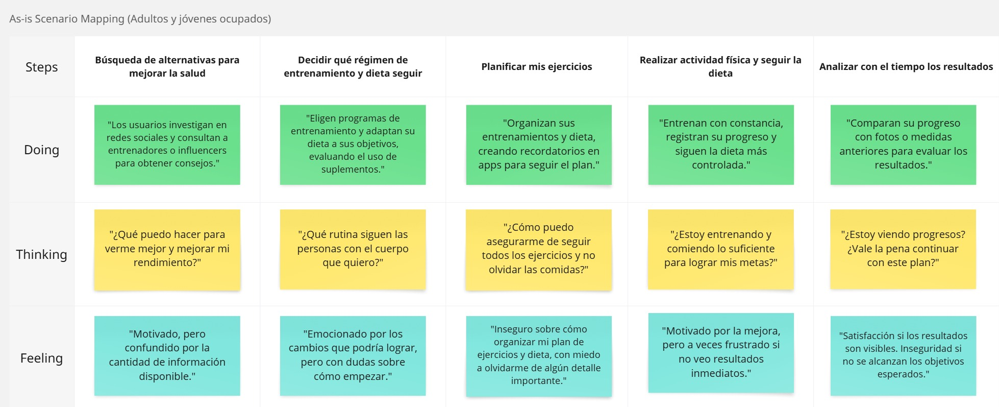

**Jóvenes Universitarios Saludables en Formación**
Esta sección presenta el As-Is Scenario Mapping de jóvenes universitarios que buscan mejorar su rendimiento deportivo o apariencia física mediante entrenamiento y dieta. El equipo identificó las etapas clave de su experiencia, incluyendo acciones, pensamientos y emociones. El mapeo revela aciertos, dificultades y aspectos que requieren mayor análisis, sirviendo como base para mejorar su proceso.

  <p align="center">
  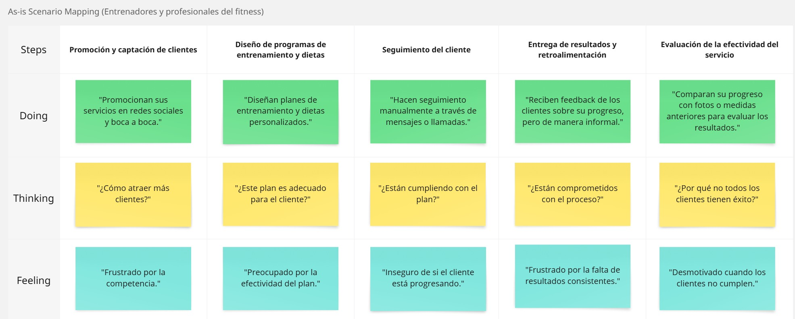

### 2.4. Ubiquitous Language


| Termino | Significado dentro del dominio de la app       |
|---------|-------------|
| Usuario ocupado | Persona entre 25 y 40 años con poco tiempo libre, que busca mejorar su salud de forma eficiente.|
| Universitario saludable | Joven entre 18 y 24 años que busca mejorar su físico o rendimiento deportivo con hábitos saludables.|
|Plan personalizado| Rutina de ejercicios y plan nutricional adaptado a los objetivos, tiempo disponible y nivel del usuario.|
|Adaptabilidad|	Capacidad de la app para ajustarse dinámicamente al contexto y cambios del usuario (tiempo, ánimo, progreso).|
|Gamificación	|Elementos lúdicos en la app como logros, niveles, desafíos o insignias que fomentan la constancia.|
|Plan Nutricional Express	|Menús simples, rápidos y accesibles, especialmente diseñados para usuarios con poco tiempo o recursos.|
|Workfrom Fitness|	Entrenamientos breves enfocados en personas que trabajan desde casa (pausas activas, estiramientos, etc.).|
|Freemium	|Modelo de negocio en el que la app ofrece una versión gratuita básica, con opción a pagar por funcionalidades premium.|
|Acompañamiento constante|	Función que asegura que el usuario sienta seguimiento y apoyo continuo, ya sea mediante IA, notificaciones o comunidad.|
|Plan flexible	|Rutina o dieta que puede modificarse según el día, el estado de ánimo o el tiempo disponible del usuario.
|Comunidad	|Espacio dentro de la app donde los usuarios pueden interactuar, compartir logros y participar en desafíos.|
|Retos semanales	|Micro objetivos o desafíos dentro de la app que incentivan el uso frecuente y construyen hábito.|
|Bienestar integral	|Concepto que combina salud física, mental y emocional en la propuesta de valor de la app.|
|Tracking	|Registro y seguimiento de actividad física, alimentación, sueño, o estado de ánimo del usuario.|
|Fit Journey	|Camino del usuario desde su punto de partida hasta sus metas de bienestar, visualizado dentro de la app.|


## Capítulo III: Requirements Specification

### 3.1. To-Be Scenario Mapping

**Jóvenes Profesionales Urbanos**
En esta sección se presenta el To-Be Scenario Mapping para el segmento de Jóvenes Profesionales Urbanos. El equipo llevó a cabo una fase de preparación y lluvia de ideas para definir las etapas clave de una experiencia mejorada al buscar rutinas de ejercicio y planes alimenticios enfocados en el bienestar integral. Este mapeo compara el escenario actual (As-Is) con el escenario ideal (To-Be), destacando los cambios que pueden mejorar las acciones, pensamientos y emociones del usuario, con el objetivo de brindar una experiencia más útil, motivadora y personalizada.

  <p align="center">
  


**Jóvenes Universitarios Saludables en Formación**
Esta sección presenta el To-Be Scenario Mapping para el perfil de Jóvenes Universitarios Saludables en Formación. A través de un proceso de análisis y lluvia de ideas, se definieron las etapas de una experiencia mejorada al buscar rutinas de entrenamiento y planes alimenticios orientados a mejorar su rendimiento deportivo o apariencia física. La comparación con el escenario actual (As-Is) permite identificar oportunidades para optimizar sus acciones, pensamientos y emociones, brindando una experiencia más efectiva y motivadora.

  <p align="center">
  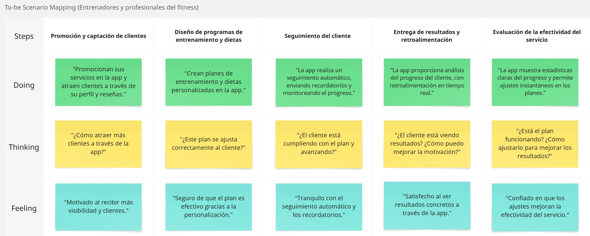

### 3.2. User Stories

| User Story ID | Título | Descripción | Criterios de Aceptación (Gherkin) | Relacionado con (Epic ID) |
|---|---|---|---|---|
| **US01** | Registro básico | Como nuevo usuario, quiero registrarme con email y contraseña, para acceder a la plataforma | 1. **Dado que** el usuario ingresa un email con formato válido y una contraseña de al menos 8 caracteres (con 1 mayúscula y 1 número)<br>**Cuando** hace clic en "Registrarse"<br>**Entonces** el sistema envía un email de verificación con un enlace válido por 24 horas<br><br>2. **Dado que** el usuario ingresa un email ya registrado<br>**Cuando** intenta registrarse<br>**Entonces** el sistema muestra el mensaje "Este email ya está en uso" | EP01 |
| **US02** | Registro completo | Como usuario, quiero completar mi perfil inicial, para obtener recomendaciones personalizadas | 1. **Dado que** el usuario ingresa un peso de 70kg y una altura de 170cm<br>**Cuando** guarda la información<br>**Entonces** el sistema calcula un IMC de 24.2 y sugiere 3 rutinas de tipo cardio<br><br>2. **Dado que** el usuario deja el campo "altura" vacío<br>**Cuando** intenta guardar<br>**Entonces** el sistema muestra un mensaje indicando que el campo es obligatorio | EP01 |
| **US03** | Login social | Como usuario, quiero acceder con redes sociales, para agilizar mi registro | 1. **Dado que** el usuario selecciona "Continuar con Google" y acepta los permisos<br>**Cuando** completa el proceso<br>**Entonces** el sistema importa automáticamente su nombre y foto de perfil<br><br>2. **Dado que** el usuario cierra el popup de login<br>**Cuando** reintenta dentro de los 2 minutos siguientes<br>**Entonces** el sistema mantiene la sesión de Google activa | EP01 |
| **US04** | Verificación email | Como usuario, quiero confirmar mi cuenta, para garantizar seguridad | 1. **Dado que** el usuario hace clic en el enlace de verificación dentro de las 24 horas<br>**Cuando** completa el proceso<br>**Entonces** el sistema activa su cuenta y lo redirige al dashboard principal<br><br>2. **Dado que** han pasado más de 24 horas desde el envío del email de verificación<br>**Cuando** el usuario intenta usar el enlace<br>**Entonces** el sistema muestra un mensaje indicando que el enlace ha expirado | EP01 |
| **US05** | Perfil de asesor | Como entrenador, quiero registrarme como profesional, para ofrecer mis servicios | 1. **Dado que** el asesor sube un archivo PDF válido como certificación<br>**Cuando** completa el formulario de registro<br>**Entonces** el sistema marca su perfil como "En revisión"<br><br>2. **Dado que** el asesor intenta subir un archivo con formato no permitido (.exe)<br>**Cuando** intenta guardar<br>**Entonces** el sistema muestra un mensaje indicando los formatos aceptables | EP01 |
| **US06** | Actualización objetivos | Como usuario, quiero modificar mis metas, para ajustar mi plan | 1. **Dado que** el usuario cambia su objetivo a "ganar músculo"<br>**Cuando** confirma los cambios<br>**Entonces** el sistema ajusta sus requerimientos calóricos con un incremento del 15%<br><br>2. **Dado que** el usuario tiene una asesoría activa<br>**Cuando** modifica sus objetivos<br>**Entonces** el sistema notifica automáticamente a su asesor asignado | EP01 |
| **TS01** | API Autenticación | Como desarrollador, quiero integrar login/registro | 1. **Dado que** se realiza una petición POST a /api/register con credenciales válidas<br>**Cuando** el servidor procesa la solicitud<br>**Entonces** responde con un código 201 y un token JWT válido<br><br>2. **Dado que** se realiza una petición con un email en formato inválido<br>**Cuando** el servidor valida los datos<br>**Entonces** responde con un código 400 y un mensaje de error descriptivo | EP01 |

| User Story ID | Título | Descripción | Criterios de Aceptación (Gherkin) | Relacionado con (Epic ID) |
|---|---|---|---|---|
| **US07** | Generación de plan nutricional | Como usuario, quiero un plan de comidas semanal, para mantener una dieta saludable | 1. **Dado que** el usuario tiene registradas sus preferencias (vegetariano, sin gluten)<br>**Cuando** solicita un nuevo plan nutricional<br>**Entonces** el sistema genera 21 recetas (3 diarias) que cumplen con sus restricciones<br><br>2. **Dado que** el usuario selecciona "alto en proteínas"<br>**Cuando** se genera el plan<br>**Entonces** cada comida contiene mínimo 30g de proteína | EP02 |
| **US08** | Lista de compras | Como usuario, quiero una lista de ingredientes organizada, para facilitar mis compras | 1. **Dado que** el plan nutricional está generado<br>**Cuando** el usuario accede a la sección de compras<br>**Entonces** muestra los ingredientes agrupados por categoría (lácteos, granos, etc.)<br><br>2. **Dado que** existe un ingrediente repetido en múltiples recetas<br>**Cuando** se genera la lista<br>**Entonces** consolida las cantidades en un solo item | EP02 |
| **US09** | Sustitución de ingredientes | Como usuario, quiero reemplazar alimentos que no me gustan, para personalizar mi plan | 1. **Dado que** el usuario selecciona "no quinua"<br>**Cuando** regenera el plan<br>**Entonces** todas las recetas usan kiwicha o cañihua como sustituto<br><br>2. **Dado que** se sustituye un ingrediente principal<br>**Cuando** se actualiza el plan<br>**Entonces** el sistema recalcula automáticamente los valores nutricionales | EP02 |
| **US10** | Información nutricional | Como usuario, quiero ver detalles nutricionales, para controlar mi ingesta | 1. **Dado que** el usuario visualiza una receta<br>**Cuando** abre la sección nutricional<br>**Entonces** muestra desglose de macros (proteínas: 30g, carbohidratos: 45g, grasas: 10g)<br><br>2. **Dado que** el usuario sigue una dieta de 2000 kcal<br>**Cuando** revisa el plan diario<br>**Entonces** la suma total no excede ±5% del objetivo | EP02 |
| **TS02** | API Planes Nutricionales | Como desarrollador, quiero consumir el servicio de planes | 1. **Dado que** se envía un request GET /api/meal-plans con parámetros válidos<br>**Cuando** el servidor responde<br>**Entonces** retorna un JSON con 7 días de comidas y sus nutrientes<br><br>2. **Dado que** se solicita un plan sin parámetros requeridos<br>**Cuando** el servidor valida<br>**Entonces** responde con error 400 y lista de campos faltantes | EP02 |

| User Story ID | Título | Descripción | Criterios de Aceptación (Gherkin) | Relacionado con (Epic ID) |
|---|---|---|---|---|
| **US011** | Generación de rutinas | Como usuario, quiero una rutina de ejercicios personalizada, para entrenar eficientemente | 1. **Dado que** el usuario especifica "nivel: principiante" y "objetivo: bajar grasa"<br>**Cuando** genera su rutina<br>**Entonces** el sistema sugiere 3 días/semana de cardio (20-30 min) y 2 de fuerza<br><br>2. **Dado que** el usuario indica "espacio: pequeño"<br>**Cuando** visualiza los ejercicios<br>**Entonces** solo muestra opciones que requieren ≤1m² | EP03 |
| **US012** | Progresión automática | Como usuario, quiero que mi rutina se ajuste a mi progreso, para mantener el desafío | 1. **Dado que** el usuario completa >90% de sus sesiones por 2 semanas<br>**Cuando** el sistema analiza su desempeño<br>**Entonces** aumenta la intensidad en 10-15% (peso/repeticiones)<br><br>2. **Dado que** el usuario falla en completar 3+ ejercicios consecutivos<br>**Cuando** se regenera la rutina<br>**Entonces** sugiere ejercicios alternativos con menor dificultad | EP03 |
| **US13** | Demostraciones de ejercicios | Como principiante, quiero ver cómo realizar cada ejercicio correctamente, para evitar lesiones | 1. **Dado que** el usuario selecciona un ejercicio<br>**Cuando** abre los detalles<br>**Entonces** muestra un video con: ángulos múltiples, errores comunes y modificaciones<br><br>2. **Dado que** el ejercicio requiere equipamiento<br>**Cuando** se reproduce la demo<br>**Entonces** incluye alternativa con materiales domésticos (ej: botellas como pesas) | EP03 |
| **US14** | Registro de sesiones | Como usuario, quiero marcar mis ejercicios completados, para llevar un historial | 1. **Dado que** el usuario finaliza una sesión<br>**Cuando** marca "completado"<br>**Entonces** el sistema registra: fecha, ejercicios, y tiempo total<br><br>2. **Dado que** salta un ejercicio<br>**Cuando** guarda el progreso<br>**Entonces** pregunta "¿Quieres reprogramarlo para hoy o saltarlo definitivamente?" | EP03 |
| **TS03** | API de Rutinas | Como desarrollador, quiero integrar el generador de rutinas | 1. **Dado que** se llama a /api/routines con {level: "beginner", goal: "strength"}<br>**Cuando** el servidor responde<br>**Entonces** retorna JSON con ejercicios que priorizan grupos musculares clave<br><br>2. **Dado que** se solicita una rutina sin parámetros obligatorios<br>**Cuando** el servidor valida<br>**Entonces** responde 422 con {error: "Missing required field: 'goal'"} | EP03 |

| User Story ID | Título | Descripción | Criterios de Aceptación (Gherkin) | Relacionado con (Epic ID) |
|---|---|---|---|---|
| **US15** | Registro de métricas físicas | Como usuario, quiero registrar mis medidas corporales, para monitorear mi progreso | 1. **Dado que** el usuario ingresa peso=85kg y cintura=90cm<br>**Cuando** guarda los datos<br>**Entonces** el sistema calcula automáticamente el IMC y porcentaje de grasa estimado<br><br>2. **Dado que** el usuario intenta registrar peso=0kg<br>**Cuando** guarda<br>**Entonces** el sistema muestra "El peso debe estar entre 30-300kg" | EP04 |
| **US16** | Visualización de progreso | Como usuario, quiero ver gráficos de mi evolución, para motivarme | 1. **Dado que** el usuario tiene 3+ registros semanales de peso<br>**Cuando** accede a "Mi Progreso"<br>**Entonces** muestra gráfico de línea con tendencia y promedio móvil<br><br>2. **Dado que** el usuario selecciona "Últimos 30 días"<br>**Cuando** visualiza el dashboard<br>**Entonces** resalta hitos clave (ej: "Mayor pérdida: -2kg el 15/03") | EP04 |
| **US17** | Recomendaciones automáticas | Como usuario, quiero sugerencias basadas en mis resultados, para mejorar mi rendimiento | 1. **Dado que** el usuario pierde >3kg en 1 semana<br>**Cuando** abre la app<br>**Entonces** sugiere "¿Quieres ajustar tu plan para evitar pérdida muscular?"<br><br>2. **Dado que** el usuario estanca su peso por 2 semanas<br>**Cuando** revisa su progreso<br>**Entonces** recomienda "Consulta con un nutricionista" con CTA directo | EP04 |
| **US18** | Reporte semanal | Como usuario, quiero un resumen de mi actividad, para mantenerme accountable | 1. **Dado que** es domingo a las 20:00<br>**Cuando** el sistema genera el reporte<br>**Entonces** incluye: % objetivos cumplidos, comparación semana anterior y sugerencias<br><br>2. **Dado que** el usuario completa <50% de sus entrenamientos<br>**Cuando** recibe el reporte<br>**Entonces** destaca "Te faltaron 3 sesiones vs meta semanal" | EP04 |
| **TS04** | API de Progreso | Como desarrollador, quiero integrar el módulo de seguimiento | 1. **Dado que** se envía POST /api/progress con {weight, date}<br>**Cuando** los datos son válidos<br>**Entonces** responde 201 y almacena la entrada en la base de datos<br><br>2. **Dado que** se solicita GET /api/progress?range=last_month<br>**Cuando** existe historial<br>**Entonces** retorna JSON con {dates[], values[], avg} | EP04 |

| User Story ID | Título | Descripción | Criterios de Aceptación (Gherkin) | Relacionado con (Epic ID) |
|---|---|---|---|---|
| **US19** | Búsqueda de asesores | Como usuario, quiero encontrar profesionales cerca de mi ubicación, para acceder a asesorías presenciales | 1. **Dado que** el usuario activa los permisos de ubicación<br>**Cuando** busca "nutricionistas"<br>**Entonces** el sistema prioriza asesores en un radio de 10km<br><br>2. **Dado que** el usuario no comparte su ubicación<br>**Cuando** realiza una búsqueda<br>**Entonces** muestra asesores filtrados por especialidad con indicador "Distancia no disponible" | EP05 |
| **US20** | Perfiles de asesores | Como usuario, quiero ver información detallada de cada profesional, para tomar decisiones informadas | 1. **Dado que** el usuario visualiza un perfil de asesor<br>**Cuando** revisa la sección de certificaciones<br>**Entonces** muestra: título profesional, años de experiencia y especialidades<br><br>2. **Dado que** un asesor tiene 10+ reseñas<br>**Cuando** se carga su perfil<br>**Entonces** calcula y muestra el rating promedio (1-5 estrellas) | EP05 |
| **US21** | Reserva de sesiones | Como usuario, quiero agendar citas con asesores, para programar mis entrenamientos/nutrición | 1. **Dado que** el usuario selecciona un horario disponible<br>**Cuando** confirma la reserva<br>**Entonces** bloquea ese slot en el calendario del asesor<br><br>2. **Dado que** el usuario intenta agendar en horario no laboral<br>**Cuando** selecciona la fecha<br>**Entonces** muestra "Este profesional no atiende los domingos" | EP05 |
| **US22** | Sistema de pagos | Como usuario, quiero pagar sesiones de forma segura, para acceder a los servicios | 1. **Dado que** el usuario selecciona "Pagar con Yape"<br>**Cuando** confirma el monto<br>**Entonces** genera un QR con el código de pago y número de referencia<br><br>2. **Dado que** el pago no se confirma en 15 minutos<br>**Cuando** el usuario revisa su reserva<br>**Entonces** muestra "Pendiente de pago - Reintentar" | EP05 |
| **US23** | Comunicación integrada | Como usuario, quiero contactar a mi asesor, para resolver dudas rápidamente | 1. **Dado que** el usuario tiene una reserva confirmada<br>**Cuando** accede al chat<br>**Entonces** muestra el historial de mensajes anteriores con ese profesional<br><br>2. **Dado que** el asesor no responde en 24h<br>**Cuando** el usuario envía un mensaje<br>**Entonces** muestra notificación "Respuesta usual en 48h" | EP05 |
| **TS05** | API de Marketplace | Como desarrollador, quiero integrar el sistema de asesorías | 1. **Dado que** se llama a GET /api/coaches?location=-12.0432,-77.0282<br>**Cuando** hay asesores disponibles<br>**Entonces** retorna JSON ordenado por proximidad (km)<br><br>2. **Dado que** se envía POST /api/bookings sin token de autenticación<br>**Cuando** el servidor valida<br>**Entonces** responde 401 Unauthorized | EP05 |

| User Story ID | Título | Descripción | Criterios de Aceptación (Gherkin) | Relacionado con (Epic ID) |
|---|---|---|---|---|
| **US24** | Suscripción premium | Como usuario, quiero mejorar a un plan premium, para acceder a funciones exclusivas | 1. **Dado que** el usuario selecciona "Plan Avanzado"<br>**Cuando** completa el pago exitosamente<br>**Entonces** desbloquea: rutinas especializadas y nutricionista virtual<br><br>2. **Dado que** el pago falla por saldo insuficiente<br>**Cuando** reintenta<br>**Entonces** sugiere "Prueba otro método de pago" con opciones alternativas | EP06 |
| **US25** | Pasarela de pagos | Como usuario, quiero pagar con métodos locales, para mayor comodidad | 1. **Dado que** el usuario selecciona "Pagar con Yape"<br>**Cuando** confirma el monto<br>**Entonces** genera QR con referencia única válida por 10min<br><br>2. **Dado que** el QR expira<br>**Cuando** escanea<br>**Entonces** auto-genera un nuevo código sin perder el carrito | EP06 |
| **US26** | Gestión de renovaciones | Como usuario premium, quiero controlar mi suscripción, para administrar gastos | 1. **Dado que** la renovación automática está activa<br>**Cuando** llega la fecha de corte<br>**Entonces** carga el monto y envía voucher por email<br><br>2. **Dado que** el usuario cancela antes del vencimiento<br>**Cuando** finaliza el ciclo<br>**Entonces** mantiene acceso premium hasta la fecha pagada | EP06 |
| **US27** | Acceso diferencial | Como usuario premium, quiero beneficios exclusivos, para sentir valor agregado | 1. **Dado que** el plan incluye "Nutricionista Virtual"<br>**Cuando** accede a su perfil<br>**Entonces** muestra badge "Premium" y chat prioritario<br><br>2. **Dado que** el usuario visita una función restringida<br>**Cuando** no tiene suscripción activa<br>**Entonces** muestra modal "Upgrade requerido" con comparativa de planes | EP06 |
| **TS06** | API de Pagos | Como desarrollador, quiero procesar transacciones | 1. **Dado que** se recibe un webhook de Culqi con status="paid"<br>**Cuando** se verifica la firma digital<br>**Entonces** activa los beneficios asociados a esa compra<br><br>2. **Dado que** falla la conexión con el banco<br>**Cuando** se intenta cobrar<br>**Entonces** programa reintento automático cada 5min (max 3 veces) | EP06 |

| User Story ID | Título | Descripción | Criterios de Aceptación (Gherkin) | Relacionado con (Epic ID) |
|---|---|---|---|---|
| **US28** | Recordatorios personalizados | Como usuario, quiero recibir notificaciones inteligentes, para mantener mi disciplina | 1. **Dado que** el usuario suele entrenar a las 7:00 AM<br>**Cuando** es 6:45 AM<br>**Entonces** el sistema envía notificación "¿Listo para tu sesión de hoy?"<br><br>2. **Dado que** el usuario no registra actividad por 3 días<br>**Cuando** abre la app<br>**Entonces** muestra mensaje motivacional + CTA "Reanudar rutina" | EP07 |
| **US29** | Notificaciones de progreso | Como usuario, quiero alertas sobre mis logros, para mantenerme motivado | 1. **Dado que** el usuario completa 5 entrenamientos consecutivos<br>**Cuando** finaliza la última sesión<br>**Entonces** envía badge virtual "Racha de 5 días"<br><br>2. **Dado que** el usuario supera su marca personal en sentadillas<br>**Cuando** sincroniza los datos<br>**Entonces** muestra comparativa: "Nuevo récord: 50kg (antes: 45kg)" | EP07 |
| **US30** | Alertas de asesorías | Como usuario, quiero recordatorios de mis citas programadas, para no olvidarlas | 1. **Dado que** hay una asesoría agendada para hoy a las 17:00<br>**Cuando** son las 16:30<br>**Entonces** envía SMS/email con link directo a la videollamada<br><br>2. **Dado que** el usuario no se conecta 5min después de la hora<br>**Cuando** el asesor inicia la sesión<br>**Entonces** envía notificación push "Tu asesor ya está esperando" | EP07 |
| **TS07** | API de Notificaciones | Como desarrollador, quiero gestionar envíos automatizados | 1. **Dado que** se llama a POST /api/notifications con {user_id, type="reminder"}<br>**Cuando** los datos son válidos<br>**Entonces** programa el envío y retorna {notification_id, scheduled_time}<br><br>2. **Dado que** el usuario desactiva notificaciones<br>**Cuando** el sistema intenta enviar<br>**Entonces** registra el intento sin enviar y retorna status 204 | EP07 |

| User Story ID | Título | Descripción | Criterios de Aceptación (Gherkin) | Relacionado con (Epic ID) |
|---|---|---|---|---|
| **US31** | Gestión de usuarios | Como administrador, quiero ver y filtrar todos los usuarios registrados, para realizar mantenimientos | 1. **Dado que** el admin ingresa al panel<br>**Cuando** aplica filtros "Fecha: Últimos 30 días" y "Tipo: Asesores"<br>**Entonces** muestra lista paginada con: nombre, email, fecha registro y estado<br><br>2. **Dado que** un usuario viola los términos de servicio<br>**Cuando** el admin selecciona "Suspender cuenta"<br>**Entonces** envía email de notificación y bloquea el acceso inmediatamente | EP08 |
| **US32** | Moderación de contenido | Como administrador, quiero revisar y editar planes nutricionales/entrenamientos, para garantizar calidad | 1. **Dado que** un asesor sube una rutina con ejercicios avanzados<br>**Cuando** el admin la marca como "Para principiantes"<br>**Entonces** notifica al asesor para su revisión<br><br>2. **Dado que** se reporta una receta con ingredientes incorrectos<br>**Cuando** el admin verifica<br>**Entonces** corrige los valores nutricionales y actualiza todas las instancias | EP08 |
| **US33** | Reportes estadísticos | Como administrador, quiero exportar datos de crecimiento, para tomar decisiones estratégicas | 1. **Dado que** el admin selecciona "Reporte Q2 2024"<br>**Cuando** genera el documento<br>**Entonces** descarga CSV con: nuevos usuarios, retención, ingresos y asesorías completadas<br><br>2. **Dado que** hay un pico de cancelaciones<br>**Cuando** se visualiza el dashboard<br>**Entonces** resalta correlación con eventos específicos (ej: cambio en planes premium) | EP08 |
| **TS08** | API de Administración | Como desarrollador, quiero integrar funcionalidades de backoffice | 1. **Dado que** se llama a DELETE /api/users/{id} con rol=admin<br>**Cuando** el usuario existe<br>**Entonces** desactiva la cuenta y responde 200 (no borra físicamente) | EP08 |

| User Story ID | Título | Descripción | Criterios de Aceptación (Gherkin) | Relacionado con (Epic ID) |
|---|---|---|---|---|
| **US34** | Hero Section Principal | Como visitante, quiero ver una sección hero clara y atractiva, para entender inmediatamente el valor de FitWise | 1. **Dado que** el usuario carga la landing page<br>**Cuando** aparece la hero section<br>**Entonces** debe mostrar: un headline principal, subtítulo explicativo, CTA "Empieza Gratis" e imagen representativa<br><br>2. **Dado que** la hero section está visible<br>**Cuando** el usuario hace clic en el CTA<br>**Entonces** debe redirigir al formulario de registro | EP09 |
| **US35** | Formulario de Registro Simplificado | Como visitante, quiero registrarme rápidamente, para comenzar a usar la plataforma sin fricciones | 1. **Dado que** el usuario accede al formulario<br>**Cuando** ingresa email válido y contraseña de 8+ caracteres<br>**Entonces** permite el registro y muestra mensaje de éxito<br><br>2. **Dado que** el usuario deja campos vacíos<br>**Cuando** intenta registrarse<br>**Entonces** muestra mensaje "Complete todos los campos" en rojo | EP09 |
| **US36** | Sección de Beneficios Clave | Como visitante, quiero ver los principales beneficios, para convencerme de usar FitWise | 1. **Dado que** el usuario hace scroll<br>**Cuando** llega a la sección de beneficios<br>**Entonces** muestra 3-4 features con iconos (ej: "Plan nutricional automático")<br><br>2. **Dado que** se muestran los beneficios<br>**Cuando** el usuario pasa el mouse sobre ellos<br>**Entonces** muestra breve descripción (tooltip) | EP09 |
| **US37** | Testimonios Verificados | Como visitante, quiero ver casos de éxito reales, para generar confianza en la plataforma | 1. **Dado que** el usuario ve la sección de testimonios<br>**Cuando** revisa los casos<br>**Entonces** muestra foto, nombre, edad y logros (ej: "-15kg en 3 meses")<br><br>2. **Dado que** hay múltiples testimonios<br>**Cuando** el usuario hace clic en ">"<br>**Entonces** muestra el siguiente testimonio con animación fade | EP09 |
| **US38** | Comparación de Planes | Como visitante, quiero comparar opciones, para decidir qué plan elegir | 1. **Dado que** el usuario ve la tabla de planes<br>**Cuando** compara gratis vs premium<br>**Entonces** muestra al menos 3 diferencias clave (ej: "Entrenador Fit 24/7")<br><br>2. **Dado que** el usuario hace clic en "Premium"<br>**Cuando** selecciona el plan<br>**Entonces** resalta ese plan con borde dorado | EP09 |
| **US39** | Versión Mobile Responsive | Como usuario móvil, quiero una experiencia optimizada, para navegar fácilmente | 1. **Dado que** se accede desde smartphone<br>**Cuando** se carga la página<br>**Entonces** los textos se ajustan sin horizontal scroll<br><br>2. **Dado que** el usuario toca el menú<br>**Cuando** está en móvil<br>**Entonces** muestra menú hamburguesa colapsable | EP09 |

### 3.3. Impact Mapping

A continuación se cubrirán algunas User Story más importantes.

#### Business Goal 1: 
Incrementar la retención de usuarios en la plataforma en un 30% en 6 meses

**URL de imagen:** [https://i.postimg.cc/YCDcpQQ5/image.png](https://i.postimg.cc/YCDcpQQ5/image.png)
[](https://postimg.cc/75zt9Gs9)

#### Business Goal 2: 
Aumentar la conversión a planes premium en un 25% en 4 meses

**URL de imagen:** [https://i.postimg.cc/L8b7d2pR/image.png](https://i.postimg.cc/L8b7d2pR/image.png)
[](https://postimg.cc/mP7VCxk6)

#### Business Goal 3: 
Lograr que el 40% de los usuarios registrados completen su perfil inicial en el primer mes

**URL de imagen:** [https://i.postimg.cc/1Xs70zp0/image.png](https://i.postimg.cc/1Xs70zp0/image.png)
[](https://postimg.cc/LYQV22Qh)

#### Business Goal 4: 
Incrementar en un 20% las asesorías contratadas por usuarios activos en 3 meses

**URL de imagen:** [https://i.postimg.cc/K8jTkyg1/image.png](https://i.postimg.cc/K8jTkyg1/image.png)
[](https://postimg.cc/rD6s33jT)

### 3.4. Product Backlog

| Orden | User Story ID | Título | Descripción | Story Points |
|-------|--------------|--------|-------------|-------------|
| 1 | US01 | Registro básico | Como nuevo usuario, quiero registrarme con email y contraseña, para acceder a la plataforma | 3 |
| 2 | US02 | Registro completo | Como usuario, quiero completar mi perfil inicial, para obtener recomendaciones personalizadas | 3 |
| 3 | US03 | Login social | Como usuario, quiero acceder con redes sociales, para agilizar mi registro | 5 |
| 4 | US04 | Verificación email | Como usuario, quiero confirmar mi cuenta, para garantizar seguridad | 2 |
| 5 | US05 | Perfil de asesor | Como entrenador, quiero registrarme como profesional, para ofrecer mis servicios | 5 |
| 6 | US06 | Actualización objetivos | Como usuario, quiero modificar mis metas, para ajustar mi plan | 3 |
| 7 | TS01 | API Autenticación | Como desarrollador, quiero integrar login/registro | 5 |
| 8 | US07 | Generación de plan nutricional | Como usuario, quiero un plan de comidas semanal, para mantener una dieta saludable | 8 |
| 9 | US08 | Lista de compras | Como usuario, quiero una lista de ingredientes organizada, para facilitar mis compras | 5 |
| 10 | US09 | Sustitución de ingredientes | Como usuario, quiero reemplazar alimentos que no me gustan, para personalizar mi plan | 5 |
| 11 | US10 | Información nutricional | Como usuario, quiero ver detalles nutricionales, para controlar mi ingesta | 3 |
| 12 | TS02 | API Planes Nutricionales | Como desarrollador, quiero consumir el servicio de planes | 8 |
| 13 | US011 | Generación de rutinas | Como usuario, quiero una rutina de ejercicios personalizada, para entrenar eficientemente | 8 |
| 14 | US012 | Progresión automática | Como usuario, quiero que mi rutina se ajuste a mi progreso, para mantener el desafío | 5 |
| 15 | US13 | Demostraciones de ejercicios | Como principiante, quiero ver cómo realizar cada ejercicio correctamente, para evitar lesiones | 5 |
| 16 | US14 | Registro de sesiones | Como usuario, quiero marcar mis ejercicios completados, para llevar un historial | 3 |
| 17 | TS03 | API de Rutinas | Como desarrollador, quiero integrar el generador de rutinas | 13 |
| 18 | US15 | Registro de métricas físicas | Como usuario, quiero registrar mis medidas corporales, para monitorear mi progreso | 5 |
| 19 | US16 | Visualización de progreso | Como usuario, quiero ver gráficos de mi evolución, para motivarme | 8 |
| 20 | US17 | Recomendaciones automáticas | Como usuario, quiero sugerencias basadas en mis resultados, para mejorar mi rendimiento | 5 |
| 21 | US18 | Reporte semanal | Como usuario, quiero un resumen de mi actividad, para mantenerme accountable | 3 |
| 22 | TS04 | API de Progreso | Como desarrollador, quiero integrar el módulo de seguimiento | 13 |
| 23 | US19 | Búsqueda de asesores | Como usuario, quiero encontrar profesionales cerca de mi ubicación | 8 |
| 24 | US20 | Perfiles de asesores | Como usuario, quiero ver información detallada de cada profesional | 5 |
| 25 | US21 | Reserva de sesiones | Como usuario, quiero agendar citas con asesores | 8 |
| 26 | US22 | Sistema de pagos | Como usuario, quiero pagar sesiones de forma segura | 13 |
| 27 | US23 | Comunicación integrada | Como usuario, quiero contactar a mi asesor | 5 |
| 28 | TS05 | API de Marketplace | Como desarrollador, quiero integrar el sistema de asesorías | 13 |
| 29 | US24 | Suscripción premium | Como usuario, quiero mejorar a un plan premium para acceder a funciones exclusivas | 8 |
| 30 | US25 | Pasarela de pagos | Como usuario, quiero pagar con métodos locales para mayor comodidad | 8 |
| 31 | US26 | Gestión de renovaciones | Como usuario premium, quiero controlar mi suscripción para administrar gastos | 5 |
| 32 | US27 | Acceso diferencial | Como usuario premium, quiero beneficios exclusivos para sentir valor agregado | 5 |
| 33 | TS06 | API de Pagos | Como desarrollador, quiero procesar transacciones | 13 |
| 34 | US28 | Recordatorios personalizados | Como usuario, quiero recibir notificaciones inteligentes para mantener mi disciplina | 5 |
| 35 | US29 | Notificaciones de progreso | Como usuario, quiero alertas sobre mis logros para mantenerme motivado | 5 |
| 36 | US30 | Alertas de asesorías | Como usuario, quiero recordatorios de mis citas programadas para no olvidarlas | 3 |
| 37 | TS07 | API de Notificaciones | Como desarrollador, quiero gestionar envíos automatizados | 13 |
| 38 | US31 | Gestión de usuarios | Como administrador, quiero ver y filtrar todos los usuarios registrados | 8 |
| 39 | US32 | Moderación de contenido | Como administrador, quiero revisar y editar planes nutricionales/entrenamientos | 5 |
| 40 | US33 | Reportes estadísticos | Como administrador, quiero exportar datos de crecimiento | 8 |
| 41 | TS08 | API de Administración | Como desarrollador, quiero integrar funcionalidades de backoffice | 13 |
| 42 | US34 | Hero Section Principal | Como visitante, quiero ver una sección hero clara y atractiva | 3 |
| 43 | US35 | Formulario de Registro Simplificado | Como visitante, quiero registrarme rápidamente | 5 |
| 44 | US36 | Sección de Beneficios Clave | Como visitante, quiero ver los principales beneficios | 3 |
| 45 | US37 | Testimonios Verificados | Como visitante, quiero ver casos de éxito reales | 5 |
| 46 | US38 | Comparación de Planes | Como visitante, quiero comparar opciones | 5 |
| 47 | US39 | Versión Mobile Responsive | Como usuario móvil, quiero una experiencia optimizada | 8 |

## Capítulo IV: Product Design

### 4.1. Style Guidelines

#### 4.1.1. General Style Guidelines 

Esta guía establece los fundamentos de diseño visual y de comunicación para **FitWise**, centrándose en **patrones repetibles**, **consistencia** y **experiencia de usuario**. Se basa en principios de diseño modernos y buenas prácticas de UI/UX.  

##### **1. BRANDING**  
**Identidad Visual:**  
- **Estilo:** Minimalista funcional con toques energéticos.  
- **Enfoque:** Comunidad fitness + datos accionables.  
- **Elementos clave:**  
  - **Logo:** Tipografía semibold + ícono de pulso (opcional).  
  - **Eslogan:** *"Conecta, entrena, evoluciona"*.  

**Personalidad de Marca:**  
- **Motivacional pero realista:** Mensajes como *"Dieta seleccionada: ¡Tú puedes!"*.  
- **Confiable:** Diseño limpio y jerarquía clara.  

---

##### **2. TYPOGRAPHY**  
**Jerarquía:**  
| Elemento          | Estilo (Mobile First)       | Ejemplo en Mockup       |  
|-------------------|----------------------------|-------------------------|  
| **H1 (Título)**   | `600 1.75rem/2.25rem`       | Dietas de la comunidad |  
| **H2 (Subtítulo)**| `500 1.25rem/1.75rem`       | Filtrar por |  
| **Body (Texto)**  | `400 1rem/1.5rem`           | Descripciones de dietas |  
| **Botones**       | `500 1rem/1rem` + ALL CAPS  | ACEPTAR OBJETIVO |  

**Fuentes:**  
- **Principal:** `Inter` (sans-serif, legible).  
- **Secundaria:** `Roboto Condensed` para datos numéricos.  

**Reglas:**  
- Alineación izquierda (excepto CTAs centrados).  
- Negritas solo para títulos o acciones clave.  

---

##### **3. COLORS**  
**Paleta Principal:**  
| Rol               | Color (HEX)     | Uso                             |  
|-------------------|----------------|--------------------------------|  
| **Primario**      | `##000000` `#454A59` | Botones principales, títulos. |  
| **Fondo**         | `#D7F205` `#F2F2F2`| Cards, fondos. |  
| **Texto**         | `#909090`  | Cuerpo. |  

[](https://postimg.cc/qN8xZrN6)

**Accesibilidad:**  
- Contraste mínimo `4.5:1` (texto/fondo).  
- Modo oscuro: `#121212` (fondo) + `#E0E0E0` (texto).  

---

##### **4. SPACING**  
**Sistema 8px:**  
- **Márgenes entre secciones:** `24px` (ej: entre `## Filtrar por` y cards).  
- **Padding interno:** `16px` (móvil) / `24px` (desktop).  
- **Botones:** `12px 24px` (alto contraste táctil).  

**Grid:**  
- **Mobile:** 1 columna (scroll vertical).  
- **Desktop:** 2-3 columnas para cards (ej: listado de dietas).  

---

##### **5. TONO DE COMUNICACIÓN**  
**Lenguaje:**  
| Situación          | Ejemplo                              |  
|--------------------|--------------------------------------|  
| **Instrucciones**  | *"Seleccione intervalo de tiempo"* (claro). |  
| **Motivación**     | *"¡Objetivo aceptado! 💪"* (emoji opcional). |  
| **Errores**        | *"Completa todos los campos"* (sin culpar). |  

**Reglas:**  
- **Imperativo positivo:** *"Descubre rutinas"* (no *"Podrías descubrir"*).  
- **Empatía:** *"¿Olvidaste tu contraseña?"* en lugar de *"Error de credenciales"*.  

---

##### **6. LENGUAJE APLICADO**  
**Consistencia en términos:**  
- **Dietas:** Usar *"Dieta [nombre]"* (ej: *Dieta vegana*).  
- **Filtros:** *Fácil/Intermedio/Difícil* (siempre en español).  
- **Botones:** Verbos en infinitivo (*"Iniciar sesión"*, *"Registrarse"*).  

#### 4.1.2. Web Style Guidelines

Aquí tienes una propuesta de **Web Style Guide** para **FitWise**, aplicando estándares visuales y de interacción para una interfaz *responsive*. Incluiré elementos clave como colores, tipografía, componentes y pautas de interacción, enfocados en usabilidad y consistencia.  

---

#### **1. Componentes UI Responsive**  
**Patrones reutilizables y su comportamiento en distintos dispositivos:**  

##### **A. Header/Navegación**  
- **Desktop:**  
  - Logo a la derecha + menú horizontal (`display: flex`).  
  - Hover en ítems: subrayado azul (`border-bottom: 2px solid #454A59`).  
- **Mobile:**  
  - Menú hamburguesa (`position: fixed`) + overlay al abrir.  
  - Logo a la derecha, tamaño reducido a `40px`.  

##### **B. Cards (Dietas/Rutinas)**  
- **Desktop:**  
  - 3 columnas (`grid-template-columns: repeat(3, 1fr)`).  
  - Hover: Sombra (`box-shadow: 0 4px 8px rgba(0,0,0,0.1)`).  
- **Mobile:**  
  - 1 columna + scroll horizontal (`overflow-x: auto`).  
  - Tamaño fijo: `300px` de ancho.  

##### **C. Formularios (Login/Registro)**  
- **Desktop:**  
  - Ancho del 50% (`width: 50%`) centrado.  
- **Mobile:**  
  - Ancho completo (`width: 100%`), padding `16px`.  
  - Inputs: Altura mínima de `48px` (área táctil).  

---

#### **2. Interacciones y Estados**  
**Microinteracciones para mejorar la usabilidad:**  

| Componente   | Estado        | Estilo/Comportamiento                          |  
|--------------|---------------|-----------------------------------------------|  
| **Botón**    | Hover         | `background-color: #3A7BD5` (oscurecer 10%). |  
| **Input**    | Focus         | `outline: 2px solid #454A59`.                |  
| **Filtros**  | Active        | `background: #D7F205`, `color: #000000`.     |  
| **Cards**    | Clic/Tap      | Animación de escala (`transform: scale(1.02)`). |  

---

#### **3. Breakpoints y Grid**  
**Puntos de ruptura basados en contenido (no solo en dispositivos):**  

```css  
/* Mobile First */  
.container { padding: 16px; }  

/* Tablet (≥768px) */  
@media (min-width: 768px) {  
  .container { padding: 24px; }  
  .grid { grid-template-columns: repeat(2, 1fr); }  
}  

/* Desktop (≥1024px) */  
@media (min-width: 1024px) {  
  .grid { grid-template-columns: repeat(3, 1fr); }  
}  
```  

---

#### **4. Animaciones y Transiciones**  
**Sutiles pero efectivas:**  
- **Carga de contenido:** Fade-in (`opacity: 0 → 1` en `0.3s`).  
- **Botones:** Transición de color (`transition: all 0.2s ease`).  
- **Scroll suave:** Para secciones largas (`scroll-behavior: smooth`).  

---

#### **5. Ejemplo de Código (CSS Responsive)**  
**Card de Dieta:**  
```css  
.diet-card {  
  background: #F2F2F2;  
  border-radius: 12px;  
  padding: 16px;  
  margin-bottom: 24px;  
  transition: transform 0.2s ease;  

  &:hover { transform: translateY(-4px); }  

  @media (max-width: 768px) {  
    width: 280px;  
    display: inline-block; /* Scroll horizontal */  
    margin-right: 16px;  
  }  
}  
```  

### 4.2. Information Architecture

#### 4.2.1. Organization Systems

##### 1. Organización Visual del Contenido

###### a) Jerárquica (Prioridad Visual)
**Se aplica en:**
- **Página de inicio (Landing Page)**
  - Hero principal > Beneficios > Testimonios > Planes > CTA final
  - Técnicas: 
    - Tamaño decreciente (título > subtítulo > texto normal)
    - Colores: Botones primarios (#4CAF50) vs secundarios (#9E9E9E)

- **Panel de control principal**
  - Progreso semanal (arriba) > Rutina diaria > Nutrición

**Justificación:**
Guía al usuario naturalmente hacia las acciones clave (registro, conversión)

###### b) Secuencial (Paso a Paso)
**Flujos clave:**
1. Registro nuevo usuario:
   - Paso 1: Email/contraseña
   - Paso 2: Datos biométricos
   - Paso 3: Objetivos

2. Reserva de asesoría:
   - Paso 1: Buscar profesional
   - Paso 2: Seleccionar horario
   - Paso 3: Confirmar pago

###### c) Matricial (Cuadrícula)
**Uso en:**
- Explorar ejercicios:
  - Filas: Tipo (cardio/fuerza)
  - Columnas: Dificultad (baja/media/alta)

##### 2. Esquemas de Categorización

###### a) Por Temas
**Estructura principal:**
- Nutrición
- Entrenamiento
- Progreso
- Asesorías

###### b) Por Tipo de Usuario
**Vistas diferenciadas:**
1. Usuario regular:
   - Mis rutinas
   - Mi plan alimenticio

2. Asesor:
   - Clientes asignados
   - Calendario

3. Administrador:
   - Moderación
   - Reportes

###### c) Cronológico
**Casos de uso:**
- Historial de progreso:
  - Gráficos ordenados por fecha
  - Comparativa semanal/mensual

###### Mapa de Organización

| Componente          | Estructura Visual | Categorización       |
|---------------------|-------------------|----------------------|
| Página Principal    | Jerárquica        | Por temas            |
| Proceso de Registro | Secuencial        | Por usuario (nuevo) |
| Buscador Ejercicios | Matricial         | Por tema/dificultad |
| Panel de Control    | Jerárquica        | Por usuario/tipo    |

**Principios clave:**
1. Priorizar conversión en elementos clave
2. Simplificar flujos complejos
3. Adaptar la información al tipo de usuario
4. Mantener consistencia entre plataformas

#### 4.2.2. Labeling Systems

##### 1. Landing Page

###### a) Navegación Principal
| Elemento Menú    |Explicación                                                                                     |
|------------------|------------------------------------------------------------------------------------------------|
| **Home**         | Página principal que muestra una visión general de los servicios y ofrece acceso rápido a las principales funcionalidades. Incluye el llamado a acción principal ("Empieza gratis"). |
| **Information**  | Sección detallada que explica cómo funciona la plataforma, metodologías utilizadas y requisitos técnicos necesarios para usar los servicios. |
| **Benefits**     | Listado de ventajas competitivas, mostrando comparativas entre planes gratuitos y premium, con testimonios reales de usuarios. |
| **About us**     | Información corporativa: historia de la marca, equipo profesional, certificaciones y valores de la compañía. |
| **Contact us**    | Formulario de contacto directo con soporte técnico, ubicación física (si aplica) y horarios de atención. |
| **Follow us**    | Enlaces a redes sociales (Facebook, Instagram, YouTube) y opción para suscribirse al newsletter. |

###### b) Sección Hero
| Elemento            | Etiqueta                          | Notas de Uso                                                                 |
|---------------------|-----------------------------------|------------------------------------------------------------------------------|
| **Título principal**  | "Transforma tu salud, sin complicaciones" | - Frase motivacional <br> - Incluye beneficio clave (simplicidad) <br> - 7 palabras cumple mejor práctica |
| **Subtítulo**        | "Entrena y aliméntate con planes 100% personalizados" | - Explica el valor diferencial <br> - Usa "tú" para personalización <br> - 9 palabras (límite recomendado) |
| **Llamada secundaria** | "Tú decides cuándo y cómo empezar" | - Empodera al usuario <br> - Refuerza flexibilidad <br> - 7 palabras |
| **CTA principal**     | "Empieza Gratis"                  | - Verbo en imperativo <br> - Color naranja (#FF9800) para destacar <br> - Mayúscula en "Gratis" para énfasis |

###### c) Sección de Beneficios
| Elemento            | Etiqueta                    | Descripción |
|---------------------|-----------------------------|-------------|
| **Título principal** | "¿Por qué elegir FitWise?" | Encabezado emocional que siembra un poco de curiosidad por el servicio. |
| **Rutinas**         | "Entrenamientos 100% adaptados" | Destaca la personalización extrema con número concreto ("100%") para generar confianza inmediata. Incluye icono de pesa (🏋️). |
| **Plan nutricional** | "Comidas rápidas y saludables" | Comunica dos beneficios clave en 4 palabras: velocidad + salud. Icono de ensalada (🥗) para reconocimiento visual. |
| **Seguimiento**     | "Motivación constante"       | Unifica los conceptos de recordatorios y enfoque en una sola etiqueta activa. Subtexto explica el cómo: "Notificaciones personalizadas". Icono de campana (🔔). |

###### d) Sección de Sobre Nosotros
| Elemento            | Etiqueta                    | Descripción |
|---------------------|-----------------------------|-------------|
| **Título principal** | "Impulsamos tu bienestar físico y mental con tecnología" | Comunica el propósito central de la empresa integrando los tres pilares (físico, mental y tecnológico) en una frase inspiradora. |
| **Descripción**     | "VibeFit es una startup tecnológica creada por estudiantes..." | Texto de presentación que establece credibilidad (origen académico), propuesta de valor (salud accesible/personalizada) y filosofía (hábitos constantes). |
| **Producto destacado** | "Desarrollamos **FitWise**, una app que integra..." | Destaca el nombre del producto en negrita y explica su diferencial (integración de entrenamiento, nutrición y bienestar). |
| **Sección equipo**   | "Nuestro equipo"            | Encabezado preparatorio para presentar a los miembros fundadores (debe incluir fotos, roles y mini-bios en el diseño final). |

###### e) Sección de Contactanos
| Elemento            | Etiqueta                    | Descripción |
|---------------------|-----------------------------|-------------|
| **Título principal** | "¿Listo para transformar tu vida?" | Encabezado en formato H1 que plantea una pregunta directa al usuario para generar engagement. |
| **Texto descriptivo** | "Conéctate con entrenadores expertos..." | Párrafo complementario que explica el valor principal del servicio (acceso a profesionales) y el beneficio final (vida saludable). |
| **Campo de entrada** | "Enter your email..." | Campo de formulario con placeholder que indica dónde ingresar el correo electrónico. |
| **Botón CTA**       | "Get started"               | Botón de llamado a acción principal con texto en inglés que invita a comenzar el proceso. |

###### d) Sección de Información
| Elemento            | Etiqueta                    | Descripción |
|---------------------|-----------------------------|-------------|
| **Encabezado de sección** | "SOBRE FITWISE" | Texto en mayúsculas que funciona como título identificador de la sección, con espaciado entre letras para mejor legibilidad. |
| **Título principal** | "Tu guía completa hacia una vida saludable" | Encabezado H1 que establece el posicionamiento central del producto como solución integral para el bienestar. |
| **Descripción del producto** | "FitWise es una aplicación web y móvil que combina..." | Párrafo descriptivo que enumera los componentes clave de la plataforma (ejercicio, nutrición, seguimiento) y su público objetivo (personas con poco tiempo). |
| **Botón de acción** | "Conoce más" | Elemento interactivo que permite al usuario acceder a información adicional, presentado como texto hipervinculado o botón según diseño. |

##### 2. Aplicación Web

###### a) Navegación Global
| Elemento            | Etiqueta          | Ubicación       | Estado Activo       |
|---------------------|-------------------|-----------------|---------------------|
| Inicio             | Mi progreso       | Barra lateral   | Icono azul (#2196F3)|
| Nutrición          | Mi alimentación   |                 |                     |
| Entrenamiento      | Mis rutinas       |                 |                     |
| Asesorías          | Profesionales     |                 |                     |

###### b) Panel de Control
| Elemento            | Etiqueta          | Contexto                 |
|---------------------|-------------------|--------------------------|
| Resumen semanal    | Esta semana       | Sección superior         |
| Último entrenamiento | Continuar rutina | Botón naranja (#FF9800)  |
| Próxima cita       | Tu próxima sesión | Con fecha y hora         |

###### c) Formularios
| Elemento            | Etiqueta          | Validación               |
|---------------------|-------------------|--------------------------|
| Campo peso         | Peso (kg)         | Rango 30-300kg           |
| Campo altura       | Altura (cm)       | Rango 100-250cm          |
| Botón enviar       | Guardar cambios   | Deshabilitado si hay errores |

##### 3. Convenciones Transversales

###### a) Estados
| Estado              | Etiqueta          | Color         |
|---------------------|-------------------|---------------|
| Éxito              | ¡Listo!           | Verde (#4CAF50)|
| Error              | Alerta            | Rojo (#F44336)|
| Advertencia        | Atención          | Amarillo (#FFC107)|

###### b) Tamaños de Texto
| Jerarquía          | Tamaño   | Uso típico          |
|--------------------|----------|---------------------|
| H1                 | 24px     | Títulos principales |
| H2                 | 20px     | Subtítulos          |
| Body               | 16px     | Texto normal        |
| Notas              | 14px     | Texto secundario    |

##### 4. Reglas de Implementación

1. **Consistencia lingüística:**
   - Siempre "tú" en lugar de "usted"
   - Imperativos en CTAs ("Completa", "Guarda", "Comienza")

2. **Accesibilidad:**
   - Alt text para iconos: "Icono de nutrición (manzana)"
   - Etiquetas ARIA para elementos interactivos

3. **Localización:**
   - Versión LATAM: "Ejercicios" en lugar de "Workouts"
   - Formatos de fecha: DD/MM/AAAA

#### 4.2.3. SEO Tags and Meta Tags

##### 1. Landing Page

| Tag               | Contenido                                                                 |
|-------------------|---------------------------------------------------------------------------|
| **Title**         | "FitWise - Planes Personalizados de Entrenamiento y Nutrición"            |
| **Meta Description** | "App todo-en-uno para fitness y bienestar con rutinas adaptables y seguimiento inteligente. Transforma tus hábitos en 30 días." |
| **Keywords**      | "app fitness, entrenamiento personalizado, plan nutricional, salud integral" |
| **Author**        | "VibeFit Technologies"                                                   |

##### 2. Aplicación Web

| Tag               | Contenido                                                                 |
|-------------------|---------------------------------------------------------------------------|
| **Title**         | "FitWise - Mi Progreso [NombreUsuario]"                                  |
| **Meta Description** | "Dashboard personal con tus métricas de salud, rutinas completadas y logros alcanzados." |
| **Keywords**      | "seguimiento fitness, progreso entrenamiento, métricas saludables"       |
| **Author**        | "VibeFit Technologies"                                                   |

#### 4.2.4. Searching Systems

##### 1. Búsqueda en Dashboard Principal

###### Filtros Disponibles:
| Filtro               | Opciones                          | Función                                                                 |
|----------------------|-----------------------------------|-------------------------------------------------------------------------|
| **Tipo de Actividad** | Ejercicio/Nutrición/Bienestar    | Filtra contenido por categoría principal                                |
| **Rango de Fechas**  | Selector de calendario           | Visualizar progreso en período específico (ej: últimos 30 días)         |
| **Intensidad**       | Principiante/Intermedio/Avanzado | Adapta resultados al nivel del usuario                                  |

**Visualización de Resultados:**
- Gráficos comparativos de progreso físico
- Lista cronológica de actividades completadas
- Resumen semanal con métricas clave

##### 2. Búsqueda en Módulo de Nutrición

###### Filtros Avanzados:
| Filtro               | Opciones                          | UI Control                             |
|----------------------|-----------------------------------|----------------------------------------|
| **Tipo de Dieta**    | Keto/Vegana/Sin gluten, etc.      | Chips seleccionables                   |
| **Tiempo Prep.**     | <15min / 15-30min / >30min        | Slider con iconos de reloj             |
| **Ingredientes**     | Búsqueda por alimento principal   | Campo autocompletado                   |

**Resultados:**
- Grid de recetas con:
  - Foto del platillo
  - Tiempo de preparación
  - Valor nutricional (calorías, proteínas)
  - Badge "Favorito" si fue guardado previamente

#### 4.2.5. Navigation Systems

##### 1. Landing Page

###### Estructura Principal
| Sección              | Descripción                                                                 | Elementos Clave                                                                 |
|----------------------|-----------------------------------------------------------------------------|---------------------------------------------------------------------------------|
| **Hero**             | Introducción principal con llamado a acción                                 | - Botón "Empieza gratis"<br>- Video explicativo de 30 segundos                   |
| **Beneficios**       | Muestra diferenciales clave de la plataforma                                | - 3 tarjetas con iconos (🏋️ Nutrición, 🥗 Entrenamiento, 📈 Progreso)          |
| **Testimonios**      | Casos de éxito de usuarios reales                                           | - Fotos + métricas ("-15kg en 3 meses")<br>- Carrusel interactivo                |
| **Planes**           | Comparativa entre versión gratuita y premium                                | - Tabla responsive<br>- Botón "Upgrade" destacado                                |
| **Contacto**         | Formulario para consultas y soporte                                         | - Campos esenciales (email, mensaje)<br>- Chatbot de ayuda                       |

**Técnicas de Navegación:**
- **Menú sticky superior:** Acceso rápido a todas las secciones
- **Scroll suave:** Transiciones animadas entre secciones
- **Breadcrumbs:** "Inicio > Beneficios > Planes" para orientación
- **Floating CTA:** Botón flotante "¿Necesitas ayuda?" en móvil

##### 2. Aplicación Web

###### Navegación Global
| Sección              | Funcionalidad                                                               | Componentes UI                                                                 |
|----------------------|-----------------------------------------------------------------------------|--------------------------------------------------------------------------------|
| **Dashboard**        | Vista resumen del progreso                                                  | - Gráficos semanales<br>- Accesos rápidos a rutinas del día                     |
| **Nutrición**        | Gestión de planes alimenticios                                               | - Buscador de recetas<br>- Lista de compras automática                          |
| **Entrenamiento**    | Rutinas y ejercicios personalizados                                         | - Filtros por tipo/dificultad<br>- Videos demostrativos                         |
| **Progreso**         | Historial de métricas físicas                                               | - Comparativas temporales<br>- Exportar reportes                                |
| **Asesorías**        | Agenda con profesionales                                                    | - Búsqueda geolocalizada<br>- Sistema de reseñas                                |

### 4.3. Landing Page UI Design

#### 4.3.1. Landing Page Wireframe


#### 4.3.2. Landing Page Mock-up

### 4.4. Web Applications UX/UI Design

#### 4.4.1. Web Applications Wireframes

#### 4.4.2. Web Applications Wireflow Diagrams

#### 4.4.3. Web Applications Mock-ups

#### 4.4.4. Web Applications User Flow Diagrams

### 4.5. Web Applications Prototyping

### 4.6. Domain-Driven Software Architecture

#### 4.6.1. Software Architecture Context Diagram

  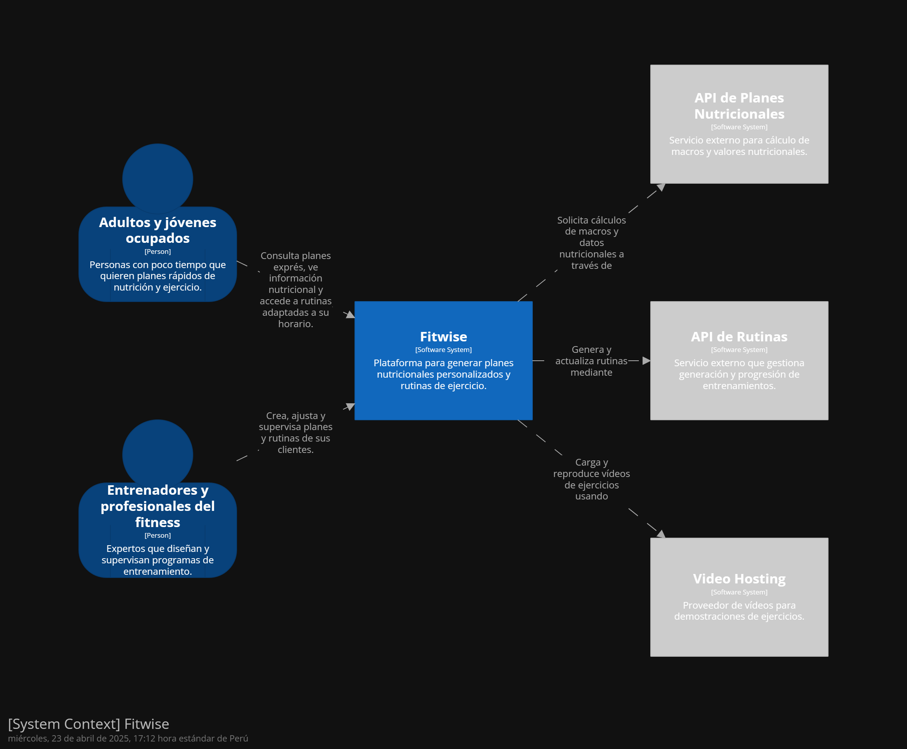
  
#### 4.6.2. Software Architecture Container Diagrams

  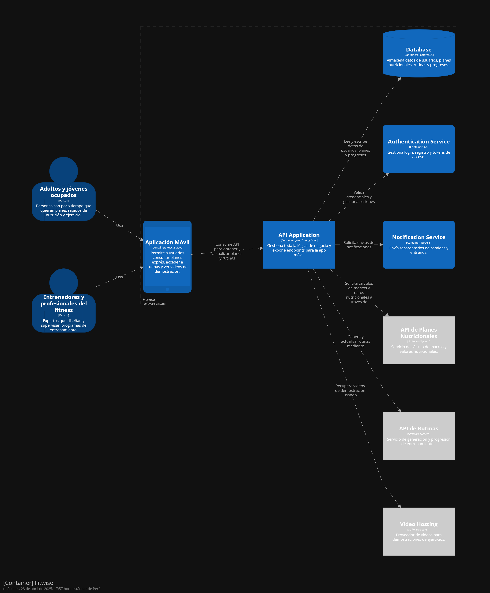
  
#### 4.6.3. Software Architecture Components Diagrams

  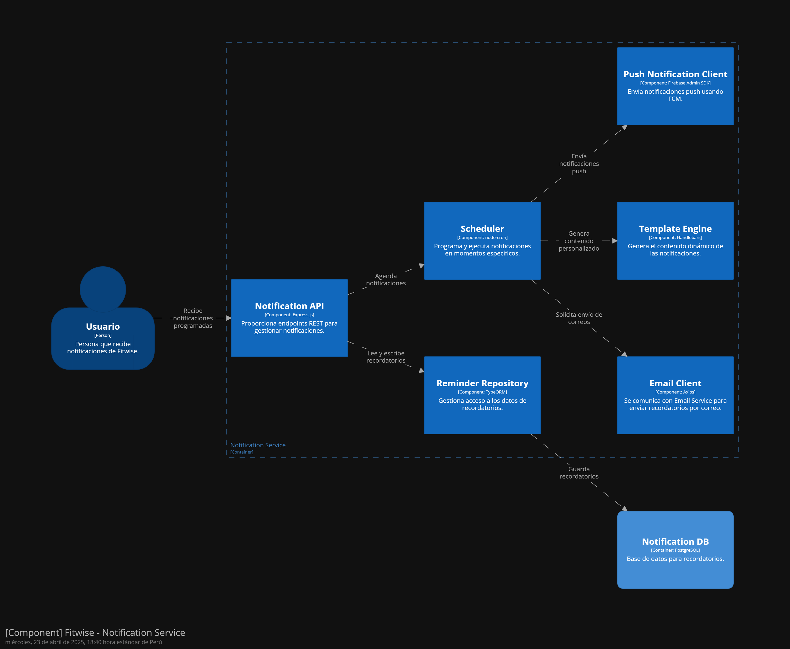
  
### 4.7. Software Object-Oriented Design

El diseño orientado a objetos del software será esencial para nuestro proyecto. Estructuramos nuestro software de acuerdo a nuestras reglas de
negocio para poder crear componentes que puedan ser entendibles para su desarrollo en un sistema real, y sean fáciles de modificar para
nosotros.

#### 4.7.1. Class Diagrams

<p align="center">
  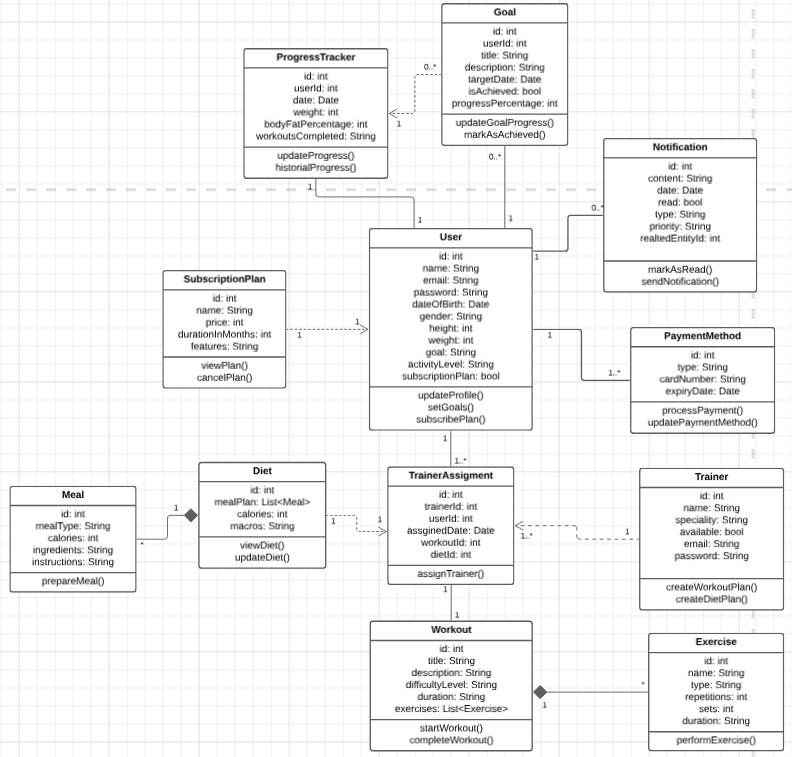
</p>

Link del diagrama de clases: https://lucid.app/lucidchart/820c8fb4-d02f-4642-ba83-e1ccc2e2c12d/edit?view_items=-M7.ztNoRUNc&invitationId=inv_70bbbf39-4896-45ec-b9d2-18263c00af63

### 4.7.2 Class Dictionary


| Clase               | Atributo              | Descripción                                                      | Tipo de Dato               |
|---------------------|------------------------|------------------------------------------------------------------|----------------------------|
| **User**            | id                     | Identificador único del usuario                                  | int                        |
| **User**            | name                   | Nombre del usuario                                               | String                     |
| **User**            | email                  | Correo electrónico                                               | String                     |
| **User**            | password               | Contraseña del usuario                                           | String                     |
| **User**            | dateOfBirth            | Fecha de nacimiento                                              | Date                       |
| **User**            | gender                 | Género del usuario                                               | String                     |
| **User**            | height                 | Altura del usuario                                               | int                        |
| **User**            | weight                 | Peso del usuario                                                 | int                        |
| **User**            | activityLevel          | Nivel de actividad física                                        | String                     |
| **User**            | subscriptionPlan       | Plan de suscripción activo                                       | bool                       |
| **Goal**            | id                     | Identificador del objetivo                                       | int                        |
| **Goal**            | userId                 | ID del usuario asociado                                          | int                        |
| **Goal**            | title                  | Título del objetivo                                              | String                     |
| **Goal**            | description            | Descripción del objetivo                                         | String                     |
| **Goal**            | targetDate             | Fecha límite del objetivo                                        | Date                       |
| **Goal**            | isAchieved             | Indicador de logro del objetivo                                  | bool                       |
| **Goal**            | progressPercentage     | Progreso en porcentaje                                           | int                        |
| **ProgressTracker** | id                     | Identificador del registro de progreso                           | int                        |
| **ProgressTracker** | userId                 | ID del usuario asociado                                          | int                        |
| **ProgressTracker** | date                   | Fecha del registro                                               | Date                       |
| **ProgressTracker** | weight                 | Peso del usuario ese día                                         | int                        |
| **ProgressTracker** | bodyFatPercentage      | Porcentaje de grasa corporal                                     | int                        |
| **ProgressTracker** | workoutsCompleted      | Cantidad de rutinas completadas                                  | int                        |
| **Notification**    | id                     | Identificador de la notificación                                 | int                        |
| **Notification**    | content                | Contenido del mensaje                                            | String                     |
| **Notification**    | date                   | Fecha de envío                                                   | Date                       |
| **Notification**    | read                   | Indicador de lectura                                             | bool                       |
| **Notification**    | type                   | Tipo de notificación                                             | String                     |
| **Notification**    | priority               | Prioridad (alta/media/baja)                                      | String                     |
| **Notification**    | relatedEntityId        | ID de entidad relacionada                                        | int                        |
| **SubscriptionPlan**| id                     | Identificador del plan                                           | int                        |
| **SubscriptionPlan**| name                   | Nombre del plan                                                  | String                     |
| **SubscriptionPlan**| price                  | Precio del plan                                                  | int                        |
| **SubscriptionPlan**| durationInMonths       | Duración del plan en meses                                       | int                        |
| **SubscriptionPlan**| features               | Características incluidas                                        | String                     |
| **PaymentMethod**   | id                     | Identificador del método de pago                                 | int                        |
| **PaymentMethod**   | type                   | Tipo de tarjeta                                                  | String                     |
| **PaymentMethod**   | cardNumber             | Número de tarjeta                                                | String                     |
| **PaymentMethod**   | expiryDate             | Fecha de vencimiento                                             | Date                       |
| **Trainer**         | id                     | Identificador del entrenador                                     | int                        |
| **Trainer**         | name                   | Nombre del entrenador                                            | String                     |
| **Trainer**         | speciality             | Especialidad del entrenador                                      | String                     |
| **Trainer**         | available              | Disponibilidad actual                                            | bool                       |
| **Trainer**         | email                  | Correo electrónico                                               | String                     |
| **Trainer**         | password               | Contraseña del entrenador                                        | String                     |
| **TrainerAssignment**| id                    | ID del registro de asignación                                    | int                        |
| **TrainerAssignment**| trainerId             | ID del entrenador asignado                                       | int                        |
| **TrainerAssignment**| userId                | ID del usuario asignado                                          | int                        |
| **TrainerAssignment**| assignedDate          | Fecha de asignación                                              | Date                       |
| **TrainerAssignment**| workoutId             | ID del entrenamiento asignado                                    | int                        |
| **TrainerAssignment**| dietId                | ID de la dieta asignada                                          | int                        |
| **Workout**         | id                     | Identificador del entrenamiento                                  | int                        |
| **Workout**         | title                  | Nombre o título del workout                                      | String                     |
| **Workout**         | description            | Descripción de la rutina                                         | String                     |
| **Workout**         | difficultyLevel        | Nivel de dificultad                                              | String                     |
| **Workout**         | duration               | Duración estimada                                                | String                     |
| **Workout**         | exercises              | Lista de ejercicios incluidos                                    | List<Exercise>             |
| **Exercise**        | id                     | Identificador del ejercicio                                      | int                        |
| **Exercise**        | name                   | Nombre del ejercicio                                             | String                     |
| **Exercise**        | type                   | Tipo de ejercicio (cardio, fuerza, etc.)                         | String                     |
| **Exercise**        | repetitions            | Número de repeticiones                                           | int                        |
| **Exercise**        | sets                   | Número de sets                                                   | int                        |
| **Exercise**        | duration               | Duración del ejercicio                                           | String                     |
| **Diet**            | id                     | Identificador de la dieta                                        | int                        |
| **Diet**            | mealPlan               | Lista de comidas incluidas                                       | List<Meal>                 |
| **Diet**            | calories               | Calorías totales                                                 | int                        |
| **Diet**            | macros                 | Información de macronutrientes                                   | String                     |
| **Meal**            | id                     | Identificador de la comida                                       | int                        |
| **Meal**            | mealType               | Tipo de comida (desayuno, almuerzo, etc.)                        | String                     |
| **Meal**            | calories               | Calorías por comida                                              | int                        |
| **Meal**            | ingredients            | Ingredientes de la comida                                        | String                     |
| **Meal**            | instructions           | Instrucciones de preparación                                     | String                     |


#### 4.8 Database Design

El diseño de la base de datos será fundamental para nuestro proyecto, ya que proporcionará la estructura subyacente para almacenar y gestionar
los datos de manera eficiente y segura. Esto nos permitirá organizar los datos de manera lógica y coherente, facilitando su recuperación y
manipulación en respuesta a las solicitudes de los usuarios.

#### 4.8.1. Database Diagram

<p align="center">
  
</p>


## Capítulo V: Product Implementation, Validation & Deployment

### 5.1. Software Configuration Management
### 5.1. Software Configuration Management

En este apartado se establecen los lineamientos y procedimientos adoptados durante el desarrollo y publicación del sitio web de FitWise, con el propósito de asegurar la coherencia y estabilidad del software desde sus primeras etapas hasta su implementación y posterior mantenimiento.

### 5.1.1. Software Development Environment Configuration

#### Project Management

Para una gestión eficiente del proyecto, se hizo necesaria la implementación de un conjunto de herramientas destinadas a la asignación de tareas, la facilitación de reuniones y la colaboración entre los integrantes. Asimismo, se empleó un repositorio centralizado para consolidar los avances de manera coordinada. A continuación, se presentan las plataformas seleccionadas junto con su respectivo propósito dentro del marco del proyecto.
- **Centro de organización de trabajo:** Github  
- **Planificación de tareas:** Trello  
- **Reuniones de equipo:** Google Meet  
- **Coordinación grupal:** WhatsApp  

#### Requirement Management

Durante el desarrollo del proyecto se recurrió a diversas herramientas que facilitaron la definición, análisis y representación visual de los requerimientos técnicos y funcionales. Estas plataformas promovieron una planificación estructurada y una mayor claridad en el diseño conceptual del sistema:

| Herramienta   | Descripción                                                                                                     | Enlace                                      |
|---------------|-----------------------------------------------------------------------------------------------------------------|---------------------------------------------|
| **Trello**        | Herramienta de organización de proyectos basada en tableros y tarjetas, empleada para distribuir tareas entre los miembros del equipo y hacer seguimiento al progreso de cada fase del desarrollo. | [trello.com](https://trello.com/)           |
| **Uxpressia**     | Aplicación digital utilizada para el diseño de mapas estratégicos, como *Impact Mapping*, lo cual permitió vincular los objetivos del negocio con las funcionalidades del producto de forma clara y visual. | [uxpressia.com](https://uxpressia.com/)     |
| **Structurizr**   | Plataforma de modelado arquitectónico que facilita la construcción de diagramas C4, permitiendo representar la estructura lógica del sistema y su interacción entre componentes de manera estandarizada. | [structurizr.com](https://www.structurizr.com/) |
| **Lucidchart**    | Entorno colaborativo de diagramación empleado para desarrollar modelos técnicos como diagramas de clases y estructuras de bases de datos, fundamentales en la definición de la arquitectura del sistema. | [lucidchart.com](https://www.lucidchart.com/) |

---

#### Product UX/UI Design

El diseño de la experiencia de usuario y de la interfaz visual se abordó mediante herramientas especializadas que posibilitaron la creación de prototipos gráficos y esquemas de navegación. Esto permitió validar la estructura de la aplicación antes de su implementación:

| Herramienta | Descripción                                                                                          | Enlace                              |
|-------------|------------------------------------------------------------------------------------------------------|-------------------------------------|
| **Figma**   | Plataforma de diseño colaborativo en línea que permitió a los miembros del equipo crear y editar en tiempo real wireframes y mockups, asegurando la coherencia visual y funcional de la landing page. | [figma.com](https://www.figma.com/) |

---

#### Software Development

Para el desarrollo de la página web, se emplearon lenguajes de programación y etiquetado esenciales para crear la estructura, el diseño y las funcionalidades del sistema. A continuación, se describen las herramientas utilizadas:

| Herramienta    | Descripción                                                                                              | Enlace                                                       |
|----------------|----------------------------------------------------------------------------------------------------------|--------------------------------------------------------------|
| **HTML**       | Lenguaje de marcado fundamental para estructurar el contenido y la disposición de los elementos en la web. | [HTML](https://www.w3schools.com/html/default.asp)           |
| **CSS**        | Lenguaje de diseño que permite aplicar estilos visuales a los elementos estructurados en HTML, mejorando su presentación. | [CSS](https://www.w3schools.com/css/default.asp)             |
| **JavaScript** | Lenguaje de programación orientado a objetos utilizado para agregar interactividad y funcionalidades dinámicas a la página web. | [JavaScript](https://www.w3schools.com/js/default.asp)       |

---

#### Software Documentation

La gestión y documentación del proyecto se llevó a cabo utilizando herramientas que facilitaron la organización y el acceso a la información técnica, asegurando la transparencia y la trazabilidad del desarrollo:

| Herramienta    | Descripción                                                                                              | Enlace                                                       |
|----------------|----------------------------------------------------------------------------------------------------------|--------------------------------------------------------------|
| **GitHub**     | Plataforma de desarrollo colaborativo que también se utilizó para gestionar y alojar la documentación del proyecto. | [GitHub](https://github.com/SmartFinance-OpenSource/Report)  |
| **Markdown**   | Formato de texto ligero utilizado para escribir y estructurar la documentación técnica del proyecto de forma clara y legible. | [markdown.es](https://markdown.es/)                          |

---

#### Software Deployment

Para el despliegue de la landing page, se optó por una plataforma de hosting que permite la publicación directa desde un repositorio de GitHub, garantizando una gestión eficiente del ciclo de vida de la aplicación:

| Herramienta     | Descripción                                                                                              | Enlace                                                       |
|-----------------|----------------------------------------------------------------------------------------------------------|--------------------------------------------------------------|
| **GitHub Pages** | Servicio de GitHub que permite desplegar la aplicación directamente desde el repositorio, facilitando la visualización pública de la página. | [GitHub Pages](https://pages.github.com/)                   |

---


### 5.1.2. Source Code Management

#### Producto y Repositorio

| Producto             | Repositorio        | URL                                                       |
|----------------------|--------------------|------------------------------------------------------------|
| Landing Page         | FitWise-Landing Page| [LandingPage](https://github.com/AplicacionesWeb-4380-G2-VibeFit/Landing-Page)     |
| Web Services         | FitWise-Web Services| [Backend](https://github.com/AplicacionesWeb-4380-G2-VibeFit/Backend-FitWise) |
| Front Web Application| FitWise-Frontend    | [Frontend](https://github.com/AplicacionesWeb-4380-G2-VibeFit/Frontend-FitWise) |

#### Estructura del Repositorio

Hemos organizado el repositorio en ramas específicas para diferentes etapas del desarrollo, garantizando un flujo de trabajo ordenado y eficiente. La estructura de ramas es la siguiente:

- **Main branch** (rama principal): Contiene la versión estable y lista para producción del software.
- **Develop branch**: Contiene el código en desarrollo que se integrará en la rama principal después de ser probado y validado.

Además, para el desarrollo de nuevas funcionalidades, creamos ramas específicas siguiendo las convenciones de nomenclatura:

- **Feature branches**: Ramas dedicadas al desarrollo de nuevas características. La nomenclatura para estas ramas es `feature/nueva-funcionalidad`.

Implementamos **GitFlow**, un modelo de ramificación diseñado por Vincent Driessen, que incluye las siguientes ramas:

- **Main branch**: Rama principal que alberga el código estable y preparado para producción.
- **Develop branch**: Rama de desarrollo donde se integran nuevas funcionalidades y correcciones antes de ser fusionadas a la rama principal.
- **Feature branches**: Creadas a partir de `develop` para añadir nuevas características, siguiendo la nomenclatura `feature/nueva-funcionalidad`.
- **Release branches**: Preparadas para la liberación de nuevas versiones, permitiendo pruebas finales y corrección de errores antes del despliegue a producción.
- **Hotfix branches**: Utilizadas para corregir errores críticos en producción, siguiendo la nomenclatura `hotfix/correccion-critica`.


#### Flujo de trabajo GitFlow

- Una rama de **producción** (`main`).
- Una rama de **pruebas** (`develop`).
- Rama de **hotfix** para corrección de errores críticos (`hotfix/*`).
- Rama de **release** para estabilización y pruebas previas al despliegue (`release/*`).
- Ramas para **features** (`feature/*`).
- Cada cambio en **producción** se considera una nueva versión.
- Cambios en `main` y `develop` requieren aprobación.


#### Mensajes de Commits

Adoptamos el estándar **Conventional Commits** para los mensajes de nuestros commits, lo que facilita la comprensión del historial de cambios y la automatización de versiones. Ejemplos de mensajes son:

- `feat`: Añadir nueva funcionalidad, por ejemplo, `feat: implementar sistema de notificaciones`.
- `fix`: Corregir errores, por ejemplo, `fix: solucionar problema con la validación de datos`.
- `docs`: Actualizar documentación, por ejemplo, `docs: actualizar guía de instalación`.
- `style`: Aplicar formato, por ejemplo, `style: ajustar estilo de código según las pautas`.
- `refactor`: Mejorar el código sin cambiar su funcionalidad, por ejemplo, `refactor: optimizar el rendimiento del módulo de usuario`.
- `test`: Añadir o modificar pruebas, por ejemplo, `test: añadir pruebas para la funcionalidad de autenticación`.


#### Documentación

La documentación del proyecto se encuentra en el archivo `README.md` dentro del repositorio. Este archivo proporciona detalles sobre la configuración, el uso del software y las guías para contribuir al proyecto.


---

### 5.1.3. Source Code Style Guide & Conventions

#### HTML

Durante la construcción de la estructura del sitio, se adoptaron las siguientes buenas prácticas para asegurar accesibilidad y organización:

- Escribir todas las etiquetas en minúsculas.
- Asegurar el cierre correcto de todos los elementos.
- Mantener los atributos en minúscula.
- Incluir `alt`, `width` y `height` en imágenes para accesibilidad y control visual.
- Evitar espacios innecesarios dentro de las etiquetas.

**Ejemplo de imagen:**

```html

```

**Etiquetas HTML utilizadas:**

```html
<header>, <nav>, <div>, , <ul>, <li>, <a>, <p>, <button>, <h1>, <h2>, <h3>, <h4>
```

---

#### CSS

Para mantener consistencia en el diseño y facilitar la lectura del código, se aplicaron las siguientes reglas:

- Usar nombres de clases e IDs que sean descriptivos y semánticos.
- Elegir nombres breves pero comprensibles.

```css
#gallery {}
.video {}
```

- Usar propiedades abreviadas siempre que sea posible para mantener el código compacto.

```css
padding: 0 1em 2em;
```

- No utilizar unidades en valores cero.

```css
margin: 0;
padding: 0;
```

- Ordenar las propiedades alfabéticamente para facilitar el escaneo visual.

```css
background: fuchsia;
border: 1px solid;
border-radius: 4px;
color: black;
text-align: center;
text-indent: 2em;
```

---

#### JavaScript

Para lograr un código más claro y mantenible, se establecieron las siguientes prácticas de codificación:

- Utilizar funciones con llaves bien estructuradas.

```js
function myFunc() {
  console.log('Hello!');
}
```

- Usar `lowerCamelCase` para declarar variables.

```js
let playerScore = 0;
```

- Preferir el uso de `let` y `const` sobre `var`.

```js
const myName = 'Chris';
let myAge = 40;
myAge++;
console.log(myAge);
```

- Nombrar las funciones también siguiendo la convención `lowerCamelCase`.

```js
function sayHello() {
  alert('Hello!');
}
```

---

### 5.1.4. Configuración de Despliegue de Software

#### Landing Page

**Consideraciones previas al despliegue:**

1. Archivos en formato HTML, CSS y JS.
2. Publicación en un repositorio de GitHub.
3. Realización de pruebas de funcionamiento (internas y externas).

**Requisitos:**

- Repositorio en GitHub (público).
- Código fuente completo de la landing page.

**Pasos para realizar el despliegue:**

A continuación, se detallan los pasos para desplegar nuestro sitio web utilizando GitHub Pages.

&nbsp;

1. **Despliegue con GitHub Pages**: Primero, accedemos al repositorio en GitHub donde se encuentra el proyecto y luego nos dirigimos a la configuración del repositorio.

   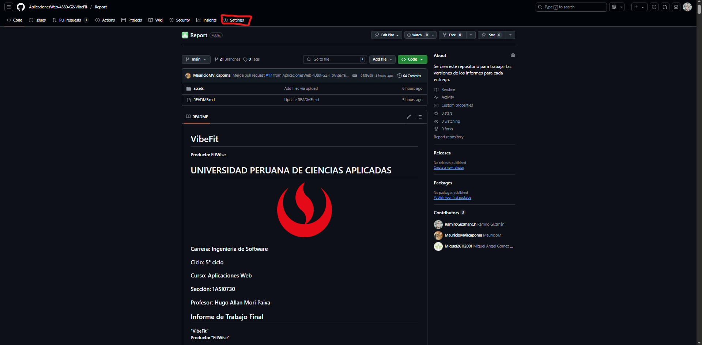

   &nbsp;

3. Dentro del menú de ajustes, seleccionamos la opción "Pages".

   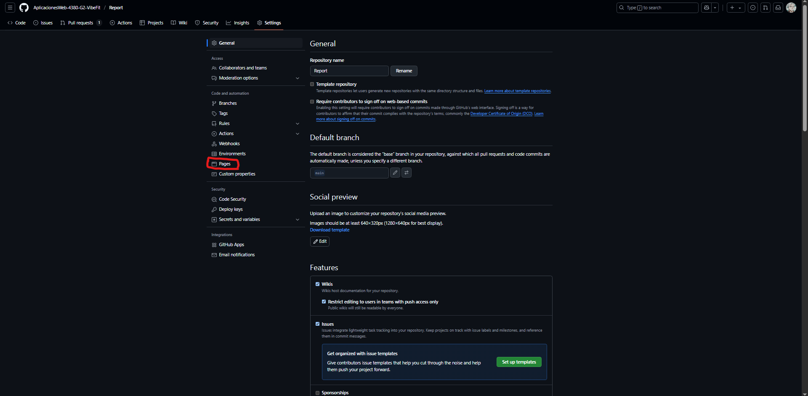
   
---

#### Control de Versiones

**Uso de Git**: Es importante mantener un historial completo de los cambios para gestionar las diferentes versiones del código de manera eficiente.

En la sección de **GitHub Pages**, elegimos la rama principal (`main`) en el menú desplegable de la opción "Branch" y luego hacemos clic en "Save" para guardar los cambios. Después de un breve periodo de espera, obtendremos el enlace a nuestro sitio web, ahora publicado en GitHub Pages.

---


### 5.2. Landing Page, Services & Applications Implementation
#### 5.2.1. Sprint 1
En Scrum, un Sprint es un lapso corto y definido durante el cual el equipo trabaja de forma concentrada para completar las tareas requeridas y alcanzar el objetivo del producto, conocido como "Product Goal" (Scrum Alliance, 2024).
##### 5.2.1.1. Sprint Planning 1

Un sprint es un periodo corto y estructurado en el que se llevan a cabo tareas específicas dentro de un proyecto, siguiendo metodologías ágiles como Scrum. El Sprint #1, iniciado el 14 de agosto de 2024, tiene como meta crear una landing page llamativa para EcoMovil, diseñada para atraer a los usuarios y destacar las principales ventajas del producto.


<table>
     <tr> 
        <th>  Sprint #  </th>
        <th> Sprint 1 </th>
     </tr>
     <tr> 
        <td style="font-weight: bold;" colspan="7"> Sprint Planing Background</td>
     </tr>
     <tr>
       <td style="font-weight: bold;"> Date </td>
       <td>  19/04/2025 </td>
     </tr>
     <tr>
       <td style="font-weight: bold;"> Time </td>
       <td> 17:00 horas (GMT-5) </td>
     </tr>
     <tr>
       <td style="font-weight: bold;"> Location </td>
       <td> Modalidad remota a través de Discord <td>
     </tr>
      <tr>
        <td style="font-weight: bold;"> Prepared By </td>
        <td> Acuña Tomas, Diego Rolin <td>
     </tr>
        <tr>
        <td style="font-weight: bold;"> Attendees (to planning meeting) </td>
        <td> 
            <br>
             Acuña Tomas, Diego Rolin
            <br>
             Guzmán Chávez, Ramiro Alexander
            <br>
            Gómez Hurtado, Miguel Angel
            <br>
             Briceño De La Cruz, Farid Sebastian
            <br>
            Muñoz Vilcapoma, Mauricio Rigoberto
        <td>
     </tr>
     <tr>
        <td style="font-weight: bold;"> Sprint 0 Review Summary </td>
        <td> Al tratarse de nuestro primer sprint de desarrollo, aún no se cuenta con un resumen de revisión del sprint. <td>
     </tr>
     <tr>
        <td style="font-weight: bold;"> Sprint 0 Retrospective Summary </td>
        <td> Como este es nuestro primer sprint de desarrollo, todavía no hemos definido planes de mejora.<td>
     </tr>
     <tr> 
        <td style="font-weight: bold;" colspan="7"> Sprint Goal & User Stories</td>
     </tr>
       <tr>
          <td style="font-weight: bold;"> Sprint 1 Goal</td>
          <td>  En este sprint, se tiene previsto desarrollar la landing page con las secciones de inicio de sesión, hero y elementos de navegación para el usuario, como el footer y la sección "About us". Al concluir el sprint, la landing page deberá estar publicada en GitHub, permitiendo que cualquier usuario acceda a ella mediante un enlace. <td>
      </tr>
       <tr>
          <td style="font-weight: bold;"> Sprint 1 Velocity </td>
          <td>  26  <td>
      </tr>
      <tr>
          <td style="font-weight: bold;"> Sum of Story Points </td>
          <td> 26 <td>
      </tr>


  </table>


##### 5.2.1.2. Aspect Leaders and Collaborators
##### 5.2.1.3. Sprint Backlog 1
##### 5.2.1.4. Development Evidence for Sprint Review
##### 5.2.1.5. Execution Evidence for Sprint Review
##### 5.2.1.6. Services Documentation Evidence for Sprint Review
##### 5.2.1.7. Software Deployment Evidence for Sprint Review
##### 5.2.1.8. Team Collaboration Insights during Sprint

## Conclusiones
### Conclusiones y recomendaciones


## Bibliografía

## Anexos
