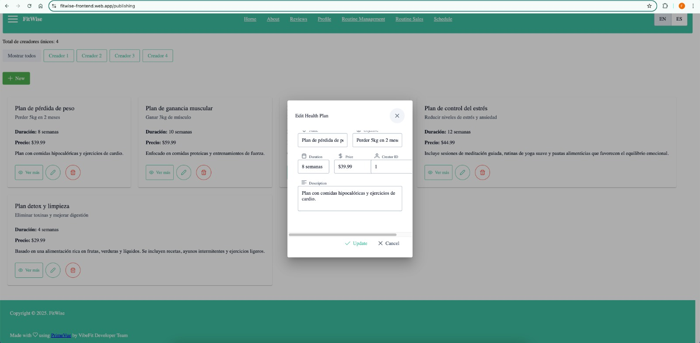

# VibeFit  
**Producto: FitWise**  
# UNIVERSIDAD PERUANA DE CIENCIAS APLICADAS

<p align="center">
  
</p>

### Carrera: Ingeniería de Software  
### Ciclo: 5° ciclo  
### Curso: Aplicaciones Web  
### Sección: 1ASI0730  
### Profesor: Hugo Allan Mori Paiva

## Informe de Trabajo Final  
**"VibeFit"**  
**Producto: "FitWise"**

### Integrantes:
- Ramiro Alexander Guzmán Chávez – U202217062  
- Diego Rolin Acuña Tomas – U202221436  
- Miguel Angel Gómez Hurtado – U202220294  
- Farid Sebastian Briceño De La Cruz – U20211F211  
- Mauricio Rigoberto Muñoz Vilcapoma – U202217212  

**Abril, 2025**  
**URL del proyecto:** [https://github.com/AplicacionesWeb-4380-G2-VibeFit](https://github.com/AplicacionesWeb-4380-G2-VibeFit)

---

## Registro de Versiones del Informe

| Versión | Fecha       | Autor | Descripción |
|---------|-------------|-------|-------------|
| TB1     | 17/04/2025  |  Ramiro Alexander Guzman Chavez <br><br> Miguel Angel Gomez Hurtado  | - Desarrollé la carátula del repositorio, el startup profile, la solution profile, establecí los segmentos objetivos, el diseño de las entrevistas y mis entrevistas por segmento objetivo. <br> - Realizé el análisis de competidores y las estrategias contra ellos. Tome liderazgo en la creación de las historias de usuario e impact Mapping |
| TB1     | 25/04/2025  |   Ramiro Alexander Guzman Chavez  <br><br> Miguel Angel Gomez Hurtado |  - Desarrollé el diagrama de clases, el class dictionary, el diseño de la base de datos y el prototipo web. <br> - Realizé el Product Backlog y la guía de estilos generales y web de los puntos 4.1 y 4.2. Además, valida los deploys y documenté los resultados de la creación de la Landing Page.  |
| TB1     | 24/04/2025  |   Farid Sebastian Briceño De La Cruz   | - Desarollé el wireframe y mockup de la landing page (4.3). |
| TB1     | 25/04/2025  |   Farid Sebastian Briceño De La Cruz   | - Desarollé Web Application UX/UI Design (4.4), lo que incluye wireframe, wireflow, mockup y user flow. |
| TB1     | 25/04/2025  |   Mauricio Rigoberto Muñoz Vilcapoma    | -Desarrolle el needfinding (user persona, task matrix, journey mapping e impact mapping)            |
| TB1     | 25/04/2025  |   Mauricio Rigoberto Muñoz Vilcapoma   |     -Desarrolle el modelo c4 del diagrama de contexto        |
| TB1     | 25/04/2025  |   Mauricio Rigoberto Muñoz Vilcapoma     |        -Desarrolle el modelo c4 del diagrama de componentes     |
| TB1     | 25/04/2025  |   Mauricio Rigoberto Muñoz Vilcapoma    |       -Desarrolle el modelo c4 del diagrama de contenedores      |
| TB1     | 25/04/2025  |   Diego Rolin Acuña Tomas     |    - Realicé las entrevistas asignadas y desarrollé un registro para ellas.         |
| TB1     | 25/04/2025  |   Diego Rolin Acuña Tomas     |     - Programé la landing page estática desde cero, asegurándome de que fuera responsive y que pudiera hacer deploy. También estuve modificándola para solucionar errores.        |
| TB1     | 25/04/2025  |   Diego Rolin Acuña Tomas    |      - Realicé los As-is Scenario Mapping, Ubiquitous Language y To-Be Scenario Mapping al revisar el trabajo, reconocer las palabras clave y guiarme por las entrevistas.       |
| TB1     | 25/04/2025  |   Diego Rolin Acuña Tomas    |      - Completé los capítulos del Sprint 1, incluyendo el Sprint Planning 1, Aspect Leaders and Collaborators, y Sprint Backlog 1.     |
| TB1     | 25/04/2025  |   Diego Rolin Acuña    |      - Realicé el Trello para organizar y confirmar el desarrollo de las secciones de la landing page.     |
| TP      | 14/05/2025  |   Miguel Angel Gomez Hurtado    |      - Realicé el código del bounded context de publishing, el cual se encarga de editar, mostrar rutinas.     |
| TP      | 14/05/2025  |   Farid Sebastian Briceño De La Cruz    |      - Realicé el código del bounded context de organizing, el cual se encarga de editar, mostrar itinerarios.     |
| TP      | 14/05/2025  |   Mauricio Rigoberto Muñoz Vilcapoma    |      - Realicé el código del bounded context de selling, el cual se encarga de editar, mostrar planes a vender.     |
| TP      | 14/05/2025  |   Diego Rolin Acuña Tomas    |      - Realicé el código del bounded context de presenting, el cual se encarga de editar, mostrar el perfil del usuario.     |
| TP      | 14/05/2025  |   Ramiro Alexander Guzman Chavez    |      - Realicé el código del bounded context de reviewing, el cual se encarga de editar, mostrar el perfil comentarios.     |
| TB2     | 14/05/2025  |   Diego Rolin Acuña Tomas    |      - Actualicé el código del bounded context de presenting, el cual se encarga de editar, mostrar el perfil del usuario y administrar seguidores.     |
| TB2     | 14/05/2025  |   Diego Rolin Acuña Tomas    |      - reporte algo   |
| TB2     | 14/05/2025  |   Mauricio Rigoberto Muñoz Vilcapoma    |      - Actualicé el código del bounded context de selling, el cual se encarga de editar, mostrar, registrar las ventas del usuario.     |
| TB2     | 14/05/2025  |   Mauricio Rigoberto Muñoz Vilcapoma    |      - reporte algo |
| TB2     | 14/05/2025  |   Farid Sebastian Briceño De La Cruz    |      - Actualicé el código del bounded context de organizing, el cual se encarga de editar, mostrar y eliminar itinerarios del usuario.     |
| TB2     | 14/05/2025  |   Farid Sebastian Briceño De La Cruz    |      - Añadí el punto 5.2.3 que corresponde al sprint 3 del proyecto     |
| TB2     | 14/05/2025  |   Miguel Angel Gomez Hurtado    |      - Actualicé el código del bounded context de publishing, el cual se encarga de editar, mostrar, agregar y eliminar rutinas gestionadas por el usuario.     |
| TB2     | 14/05/2025  |   Miguel Angel Gomez Hurtado    |      - reporte algo    |
| TB2     | 14/05/2025  |   Ramiro Alexander Guzman Chavez    |      - Actualicé el código del bounded context de reviewing, el cual se encarga de editar, mostrar, añadir, borrar y reportar comentarios.     |
| TB2     | 14/05/2025  |   Ramiro Alexander Guzman Chavez    |      - Revisé y realicé las correcciones correspondientes del diagrama de base de datos. |


---

## Project Report Collaboration Insights

- **URL de la organización del proyecto:**  
  [https://github.com/AplicacionesWeb-4380-G2-VibeFit](https://github.com/AplicacionesWeb-4380-G2-VibeFit)
- **URL del repositorio del informe:**  
  [https://github.com/AplicacionesWeb-4380-G2-VibeFit/Report](https://github.com/AplicacionesWeb-4380-G2-VibeFit/Report)


  Todas las tareas correspondientes a la entrega de la TB1 han sido completadas y están documentadas en el repositorio de GitHub de la organización del equipo. Para la elaboración del informe, cada integrante del equipo se encargó de redactar y generar gráficos en formato Markdown, según los puntos que le fueron asignados, realizando commits para dejar constancia del progreso en el repositorio.

  Aquí se pueden visualizar todos los commits realizados para la TB1, lo cual evidencia el trabajo colaborativo del equipo.

    

    Para facilitar el desarrollo del trabajo, optamos por seguir el flujo de trabajo Gitflow. En este esquema, cada subtítulo del informe fue tratado como una feature. Un miembro del equipo creaba una rama específica para ese subtítulo y trabajaba en ella, mientras que otros miembros podían colaborar directamente o supervisar su progreso. Una vez finalizada la feature, todo el equipo revisaba el contenido y, tras obtener el consenso, se realizaba el merge hacia la rama develop. Además, organizamos las tareas considerando su nivel de dificultad, asegurando así una distribución equitativa del trabajo entre todos los integrantes.

  A lo largo del desarrollo de la TB1, generamos varias ramas distintas que fueron integradas a la rama develop. Cada una representaba una sección específica del proyecto. Este enfoque nos permitió trabajar de manera ordenada y colaborativa, asegurando que cada parte del informe fuera desarrollada y revisada de forma independiente antes de su integración final.

    

    
---
---
## Contenido
#### Tabla de contenidos

- [Student Outcome](#student-outcome)
- [Capítulo I: Introducción](#capítulo-i-introducción)
  - [1.1. Startup Profile](#11-startup-profile)
    - [1.1.1. Descripción de la startup](#111-descripción-de-la-startup)
    - [1.1.2. Perfiles de los integrantes del equipo](#112-perfiles-de-los-integrantes-del-equipo)
  - [1.2. Solution Profile](#12-solution-profile)
    - [1.2.1. Antecedentes y problemática](#121-antecedentes-y-problemática)
    - [1.2.2. Lean UX Process](#122-lean-ux-process)
      - [1.2.2.1. Lean UX Problem Statements](#1221-lean-ux-problem-statements)
      - [1.2.2.2. Lean UX Assumptions](#1222-lean-ux-assumptions)
      - [1.2.2.3. Lean UX Hypothesis Statements](#1223-lean-ux-hypothesis-statements)
      - [1.2.2.4. Lean UX Canvas](#1224-lean-ux-canvas)
  - [1.3. Segmentos objetivo](#13-segmentos-objetivo)
- [Capítulo II: Requirements Elicitation & Analysis](#capítulo-ii-requirements-elicitation--analysis)
  - [2.1. Competidores](#21-competidores)
    - [2.1.1. Análisis competitivo](#211-análisis-competitivo)
    - [2.1.2. Estrategias y tácticas frente a competidores](#212-estrategias-y-tácticas-frente-a-competidores)
  - [2.2. Entrevistas](#22-entrevistas)
    - [2.2.1. Diseño de entrevistas](#221-diseño-de-entrevistas)
    - [2.2.2. Registro de entrevistas](#222-registro-de-entrevistas)
    - [2.2.3. Análisis de entrevistas](#223-análisis-de-entrevistas)
  - [2.3. Needfinding](#23-needfinding)
    - [2.3.1. User Personas](#231-user-personas)
    - [2.3.2. User Task Matrix](#232-user-task-matrix)
    - [2.3.3. User Journey Mapping](#233-user-journey-mapping)
    - [2.3.4. Empathy Mapping](#234-empathy-mapping)
    - [2.3.5. As-is Scenario Mapping](#235-as-is-scenario-mapping)
  - [2.4. Ubiquitous Language](#24-ubiquitous-language)
- [Capítulo III: Requirements Specification](#capítulo-iii-requirements-specification)
  - [3.1. To-Be Scenario Mapping](#31-to-be-scenario-mapping)
  - [3.2. User Stories](#32-user-stories)
  - [3.3. Impact Mapping](#33-impact-mapping)
  - [3.4. Product Backlog](#34-product-backlog)
- [Capítulo IV: Product Design](#capítulo-iv-product-design)
  - [4.1. Style Guidelines](#41-style-guidelines)
    - [4.1.1. General Style Guidelines](#411-general-style-guidelines)
    - [4.1.2. Web Style Guidelines](#412-web-style-guidelines)
  - [4.2. Information Architecture](#42-information-architecture)
    - [4.2.1. Organization Systems](#421-organization-systems)
    - [4.2.2. Labeling Systems](#422-labeling-systems)
    - [4.2.3. SEO Tags and Meta Tags](#423-seo-tags-and-meta-tags)
    - [4.2.4. Searching Systems](#424-searching-systems)
    - [4.2.5. Navigation Systems](#425-navigation-systems)
  - [4.3. Landing Page UI Design](#43-landing-page-ui-design)
    - [4.3.1. Landing Page Wireframe](#431-landing-page-wireframe)
    - [4.3.2. Landing Page Mock-up](#432-landing-page-mock-up)
  - [4.4. Web Applications UX/UI Design](#44-web-applications-uxui-design)
    - [4.4.1. Web Applications Wireframes](#441-web-applications-wireframes)
    - [4.4.2. Web Applications Wireflow Diagrams](#442-web-applications-wireflow-diagrams)
    - [4.4.3. Web Applications Mock-ups](#443-web-applications-mock-ups)
    - [4.4.4. Web Applications User Flow Diagrams](#444-web-applications-user-flow-diagrams)
  - [4.5. Web Applications Prototyping](#45-web-applications-prototyping)
  - [4.6. Domain-Driven Software Architecture](#46-domain-driven-software-architecture)
    - [4.6.1. Software Architecture Context Diagram](#461-software-architecture-context-diagram)
    - [4.6.2. Software Architecture Container Diagrams](#462-software-architecture-container-diagrams)
    - [4.6.3. Software Architecture Components Diagrams](#463-software-architecture-components-diagrams)
  - [4.7. Software Object-Oriented Design](#47-software-object-oriented-design)
    - [4.7.1. Class Diagrams](#471-class-diagrams)
  - [4.7.2. Class Dictionary](#472-class-dictionary)
  - [4.8. Database Design](#48-database-design)
    - [4.8.1. Database Diagram](#481-database-diagram)
- [Capítulo V: Product Implementation, Validation & Deployment](#capítulo-v-product-implementation-validation--deployment)
  - [5.1. Software Configuration Management](#51-software-configuration-management)
    - [5.1.1. Software Development Environment Configuration](#511-software-development-environment-configuration)
    - [5.1.2. Source Code Management](#512-source-code-management)
    - [5.1.3. Source Code Style Guide & Conventions](#513-source-code-style-guide--conventions)
    - [5.1.4. Software Deployment Configuration](#514-software-deployment-configuration)
  - [5.2. Landing Page, Services & Applications Implementation](#52-landing-page-services--applications-implementation)
- [5.2.1. Sprint 1](#521-sprint-1)
  - [5.2.1.1. Sprint Planning 1](#5211-sprint-planning-1)
  - [5.2.1.2. Aspect Leaders and Collaborators](#5212-aspect-leaders-and-collaborators)
  - [5.2.1.3. Sprint Backlog 1](#5213-sprint-backlog-1)
  - [5.2.1.4. Development Evidence for Sprint Review](#5214-development-evidence-for-sprint-review)
  - [5.2.1.5. Execution Evidence for Sprint Review](#5215-execution-evidence-for-sprint-review)
  - [5.2.1.6. Services Documentation Evidence for Sprint Review](#5216-services-documentation-evidence-for-sprint-review)
  - [5.2.1.7. Software Deployment Evidence for Sprint Review](#5217-software-deployment-evidence-for-sprint-review)
  - [5.2.1.8. Team Collaboration Insights during Sprint](#5218-team-collaboration-insights-during-sprint)
- [5.2.2. Sprint 2](#522-sprint-2)
  - [5.2.2.1. Sprint Planning 2](#5221-sprint-planning-2)
  - [5.2.2.2. Aspect Leaders and Collaborators](#5222-aspect-leaders-and-collaborators)
  - [5.2.2.3. Sprint Backlog 2](#5223-sprint-backlog-2)
  - [5.2.2.4. Development Evidence for Sprint Review](#5224-development-evidence-for-sprint-review)
  - [5.2.2.5. Execution Evidence for Sprint Review](#5225-execution-evidence-for-sprint-review)
  - [5.2.2.6. Services Documentation Evidence for Sprint Review](#5226-services-documentation-evidence-for-sprint-review)
  - [5.2.2.7. Software Deployment Evidence for Sprint Review](#5227-software-deployment-evidence-for-sprint-review)
  - [5.2.2.8. Team Collaboration Insights during Sprint](#5228-team-collaboration-insights-during-sprint)
- [5.2.3. Sprint 3](#523-sprint-3)
  - [5.2.3.1. Sprint Planning 3](#5231-sprint-planning-3)
  - [5.2.3.2. Aspect Leaders and Collaborators](#5232-aspect-leaders-and-collaborators)
  - [5.2.3.3. Sprint Backlog 3](#5233-sprint-backlog-3)
  - [5.2.3.4. Development Evidence for Sprint Review](#5234-development-evidence-for-sprint-review)
  - [5.2.3.5. Execution Evidence for Sprint Review](#5235-execution-evidence-for-sprint-review)
  - [5.2.3.6. Services Documentation Evidence for Sprint Review](#5236-services-documentation-evidence-for-sprint-review)
  - [5.2.3.7. Software Deployment Evidence for Sprint Review](#5237-software-deployment-evidence-for-sprint-review)
  - [5.2.3.8. Team Collaboration Insights during Sprint](#5238-team-collaboration-insights-during-sprint)
- [Conclusiones](#conclusiones)
- [Bibliografía](#bibliografía)
- [Anexos](#anexos)

## Student Outcome

---

**ABET – EAC - Student Outcome 5**  
**Criterio:** La capacidad de funcionar efectivamente en un equipo cuyos miembros juntos proporcionan liderazgo, crean un entorno de colaboración e inclusivo, establecen objetivos, planifican tareas y cumplen objetivos.

En el siguiente cuadro se describen las acciones realizadas y enunciados de conclusiones por parte del grupo, que permiten sustentar el haber alcanzado el logro del ABET – EAC - Student Outcome 5.

| Criterio específico | Acciones realizadas | Conclusiones |
|---------------------|---------------------|--------------|
| 1. Trabaja en equipo para proporcionar liderazgo en forma conjunta. | **MAURICIO MUÑOZ** <br> **TB1:** Me comuniqué activamente con mi equipo para coordinar las tareas asignadas a cada miembro. Además, realicé consultas al profesor para resolver dudas del grupo y transmitir la información de forma clara y útil. <br><br> **TP:**<br><br>  **RAMIRO GUZMÁN** <br> **TB1:** Participé en la organización interna del equipo, proponiendo soluciones durante reuniones técnicas. Fomenté el diálogo entre los miembros para asegurar una comunicación abierta y lideré la revisión final de entregables. <br><br> **TP:** <br><br> **MIGUEL GOMEZ** <br> **TB1:** Realicé las secciones de 2.1, 3.2 - 3.4, 4.1 y 4.2. En las cuales recibi retroalimentación de mis compañeros para los mock ups. Además, siempre mantuve un canal abierto para informar sobre mis avances y en cómo afectarían al desarrollo de mis compañeros. <br><br> **TP:** Realizé el bounded context de publishing y modiqfique las historias de usaurios pertinentes<br><br> **TB2:** Finalizé el diseño del front end Publishing y entregué la primera versión del BackEnd de Publishing (HealthPlans)<br><br>**FARID BRICEÑO** <br> **TB1:** Coordiné las reuniones para asegurarme de que todos los miembros del equipo estuvieran alineados con los objetivos del proyecto. Además, propuse estrategias para mantener la motivación y el enfoque dentro del equipo, contribuyendo a la toma de decisiones finales en conjunto. <br><br> **TP:** <br><br> **DIEGO ACUÑA** <br> **TB1:** Asumí un rol activo en la toma de decisiones técnicas y en la organización del trabajo. Realicé propuestas para mejorar los procesos del equipo y garantice que se cumplieran los plazos establecidos. <br><br> **TP:** <br><br> | **TB1:** Cada integrante cumplió con las tareas que le fueron asignadas, manteniendo una comunicación constante y efectiva, lo cual fortaleció la confianza entre los miembros. Esto contribuyó significativamente al fortalecimiento del trabajo en equipo, un aspecto esencial en proyectos colaborativos. <br><br> **TP:** Cada integrantes realizó sus actividades realizadasy mantuvieron una comunicación efectiva mediante el desarrollo del front end en github y ramas. Esto contribuyó en el cumplimiento de los diferentes objetivos propuestos para este sprint.<br><br>**TB2:** Esta entregra estuvo principalmente centrada en terminar definitivamente el desarrollo del FrontEnd y la presentación del inicio del BackEnd. Utilizamos herramientas nuevas como deploy de bases de datos y uso de platillas vue como Sakai.<br><br>|
 | 2. Crea un entorno colaborativo e inclusivo, establece metas, planifica tareas y cumple objetivos. | **MAURICIO MUÑOZ** <br> **TB1:** Respeté los objetivos y fechas establecidos por el equipo, cumpliendo con mis tareas puntualmente. También informaba sobre nuevos avisos o cambios relevantes, ayudando a mantener la planificación y coordinación del grupo. <br><br> **TP:** <br><br> **RAMIRO GUZMÁN** <br> **TB1:** Apoyé activamente la planificación del proyecto, sugiriendo cronogramas realistas y detectando posibles cuellos de botella. Promoví un ambiente donde todos los integrantes se sintieran cómodos aportando ideas, favoreciendo la inclusión y el compromiso. <br><br> **TP:** <br><br> **MIGUEL GOMEZ** <br> **TB1:** Ayudé a segmentar nuestro público objetivo de mejor manera. En adición a esto, me presentaba a la pequeña reunión después de clases para coordinar los detalles de nuestros avances y trabajos a realizar. <br><br> **TP:** M encagué de la destribución de bounded context con los integrantes del grupo, mantuve cierta auditoría con los progresos del equipo y fomente el apoyo antes dudas de tema teórico y práctico.<br><br>**TB2:** Me encargue de la coordinación del desarrollo del apartado BackEnd mediante la entrega de proyectos base y prototipos de mis endpoints.<br><br> **FARID BRICEÑO** <br> **TB1:** Contribuí al establecimiento de metas claras, ayudando a organizar las tareas de manera efectiva. Aseguré que todos los miembros del equipo tuvieran las herramientas necesarias para cumplir sus objetivos y fomentar una atmósfera inclusiva. <br><br> **TP:** <br><br> **DIEGO ACUÑA** <br> **TB1:** Propuse y coordine varias reuniones para establecer metas claras y medibles para el proyecto. Además, gestioné los tiempos de cada tarea para asegurar el cumplimiento de los objetivos del equipo. <br><br> **TP:** <br><br> | **TB1:** En conjunto, el equipo logró crear un entorno de trabajo colaborativo e inclusivo, en el que cada integrante aportó al establecimiento de metas claras, la planificación de tareas y el cumplimiento de los objetivos propuestos. La coordinación constante, el respeto por los plazos y la participación activa de todos los miembros permitieron un desarrollo fluido del proyecto, fortaleciendo tanto la eficiencia del grupo como el sentido de responsabilidad compartida. <br><br> **TP:** El equipo de trabajó logro mantener un orden en su cronograma de entregas, ya que consideramos pertinentes múltiples reuniones para coordinar las divisiones de carga de trabajo durante el desarrollo del front end.<br><br>**TB2:** El equipo pudo avanzar el desarrollo de manera continua aunque un poco pausada debido a la dificultad con la que se adaptaban al desarrallo backend.<br><br>|


---

## Capítulo I: Introducción

### 1.1. Startup Profile

#### 1.1.1. Descripción de la startup

**VibeFit** es una startup tecnológica enfocada en mejorar el bienestar físico y mental de las personas a través de soluciones digitales inteligentes. Su misión es simplificar, personalizar y acompañar el proceso hacia una vida saludable, especialmente para quienes enfrentan barreras como la falta de tiempo, motivación o conocimiento especializado.

**Misión**  
Empoderar a las personas para que adopten y mantengan un estilo de vida saludable a través de soluciones digitales accesibles, personalizadas y motivadoras, que integren el bienestar físico y mental de forma sostenible.

**Visión**  
Ser la plataforma líder en bienestar integral digital en el Perú, reconocida por transformar hábitos de vida a través de experiencias personalizadas, innovadoras y centradas en las personas.

Su producto principal, **FitWise**, es una aplicación disponible en versión web y móvil que crea rutinas de entrenamiento y planes nutricionales completamente personalizados. La plataforma se adapta a las características, objetivos y nivel físico de cada usuario, permitiendo que cualquier persona pueda incorporar hábitos saludables a su estilo de vida, sin importar su experiencia previa o disponibilidad horaria.

La propuesta de valor de VibeFit se centra en tres pilares clave:

- **Adaptabilidad**, para ajustarse a las necesidades individuales.  
- **Personalización**, para ofrecer soluciones únicas y efectivas.  
- **Acompañamiento constante**, mediante tecnología que guía, motiva y mide el progreso del usuario.

VibeFit nace para transformar la manera en que las personas se relacionan con su salud, derribando los obstáculos más comunes y convirtiendo el bienestar en una experiencia accesible, flexible y sostenible.


#### 1.1.2. Perfiles de los integrantes del equipo

---

#### **Muñoz Vilcapoma Mauricio – Ingeniería de Software – U202217212**  


Soy Muñoz Vilcapoma Mauricio, estudiante de Ingeniería de Software. Deseo desempeñar un papel fundamental en el mundo de la tecnología, creando soluciones innovadoras y avanzadas como desarrollador de Software. Estoy comprometido con mi desarrollo profesional y con hacer una diferencia en el campo de la ingeniería de software.

---

#### **Ramiro Alexander Guzman Chavez – Ingeniería de Software – U202217062**  


Mi perfil se basa en ser una persona responsable, disciplinada en todo aspecto y comprometida con las actividades que me puedan tocar.
Considero que tengo una experiencia altamente capacitada para este tipo de tareas. Suelo desarrollarme de manera positiva en los trabajos grupales y tengo conocimientos en bases de datos, lo cual puede aportar de manera importante al equipo.
Además, cuento con conocimientos en lenguajes de programación como Java y JavaScript, lo que me permite desarrollar soluciones tanto del lado del backend como del frontend, contribuyendo a proyectos de desarrollo de software de manera integral.

---

#### **Farid Sebastian Briceño De La Cruz – Ingeniería de Software – U20211F211**  


Soy estudiante de Ingeniería de Software con un fuerte interés en el desarrollo de productos digitales y la tecnología. En mi tiempo libre, me gusta jugar videojuegos. También tengo un interés especial en la música, lo que me ayuda a equilibrar mi vida académica y personal. Cuento con habilidades en gestión de bases de datos y tengo experiencia en análisis de datos, lo que me ayuda a tomar decisiones informadas y crear soluciones efectivas.

---

#### **Miguel Angel Gómez Hurtado – Ingeniería de Software – U202220294**


Tengo 23 años y estoy estudiando la carrera de Ingeniería Informática. Me encuentro en mi segundo ciclo en la UPC Sede San Miguel. Soy una persona académica y siempre estoy abierto al diálogo. Me apasiona mi carrera y siempre estoy dispuesto a aprender sobre este curso para brindar a mis futuros usuarios un buen producto acorde a sus necesidades.

---

#### **Diego Rolin Acuña Tomas – Ingeniería de Software – u202221436**  


Soy estudiante de la carrera de Ingeniería de Software en la UPC. Elegí esta carrera porque me apasionan las matemáticas y la programación. Mi objetivo es aplicar mis conocimientos para desarrollar aplicaciones enfocadas en el área de finanzas, ya que aspiro a trabajar en el sector bancario. En mi tiempo libre, disfruto ver películas con mi familia y caminar por lugares interesantes, como montañas o playas. Considero que mis principales fortalezas son la tenacidad y la curiosidad, cualidades que me ayudarán a superar con éxito el curso y alcanzar el mejor puntaje posible.

---

### 1.2. Solution Profile

#### 1.2.1. Antecedentes y problemática

Con el transcurso de los años son cada vez más la evidencias de que los principales problemas de salud de ser humano están relacionadas con la carencia o ausencia de ejercicio físico y una buena dieta. Por un lado, la falta de tiempo de las personas se presenta como una de las causas, tanto profesionales como estudiantes se ven afectados por sus horarios apretados, lo que conlleva a evitar agendar realizar ejercicios; por otro lado, también es notable la falta de cultura alimentaria en la población, lo que ha traído problemas cardíacos, obesidad, diabetes, entre otras enfermedades, debido a que no tienen quién les brinde esta información.

- **Who (¿Quiénes son los afectados?)**  
  Personas entre 18 y 40 años interesadas en mejorar su estado físico o mantener una vida saludable, pero que enfrentan obstáculos como la falta de tiempo, desconocimiento sobre rutinas de ejercicio y dificultad para seguir planes alimenticios realistas.

- **What (¿Qué sucede?)**  
  Existe una creciente demanda de soluciones fitness personalizadas; sin embargo, muchas aplicaciones actuales son genéricas, poco flexibles y no consideran la realidad del usuario en cuanto a tiempo, nivel, objetivos y cultura alimentaria. Esto genera frustración, abandono y poco progreso.

- **Where (¿Dónde ocurre?)**  
  Principalmente en contextos urbanos, especialmente en ciudades como Lima, donde factores como el tráfico, las largas jornadas laborales y el escaso acceso a asesoría personalizada dificultan la constancia en la actividad física y en la alimentación saludable.

- **When (¿Cuándo sucede?)**  
  De forma cotidiana, cuando las personas intentan adoptar una rutina saludable pero no encuentran un plan realista que se ajuste a su disponibilidad de tiempo y recursos personales.

- **Why (¿Por qué es un problema?)**  
  Porque afecta directamente la salud física y mental. Sin una guía adecuada y adaptada, las personas pierden motivación rápidamente, lo que impide la adquisición de hábitos saludables sostenibles en el tiempo.

- **How (¿Cómo se manifiesta?)**
  - Rutinas genéricas que no consideran el tiempo real disponible del usuario.  
  - Planes de nutrición no adaptados a la gastronomía local.  
  - Falta de seguimiento y visualización de progreso.  
  - Escasa interacción humana o profesional en las plataformas actuales.

- **How Much (¿Cuán grande es el problema?)**  
  Según el Ministerio de Salud del Perú:
  - Más del **60%** de la población adulta presenta sobrepeso u obesidad.  
  - Más del **70%** no realiza actividad física suficiente.

  Esto representa un problema de salud pública y una gran **oportunidad de mercado** para soluciones tecnológicas efectivas y accesibles como FitWise.

#### 1.2.2. Lean UX Process

##### 1.2.2.1. Lean UX Problem Statements

FitWise ha sido desarrollada con el propósito de brindar un acceso sencillo a entrenamientos y planes alimenticios personalizados, ajustándose al estilo de vida, metas personales y nivel de experiencia de cada persona. Nuestra propuesta busca ofrecer una experiencia atractiva, fácil de usar y basada en datos, con el fin de promover hábitos saludables de forma duradera.

Hemos identificado que muchos usuarios tienen dificultades para mantener la constancia en sus rutinas debido a la falta de motivación inmediata y a la ausencia de planes flexibles que se ajusten a sus horarios cambiantes o progreso. Además, la abundancia de aplicaciones de fitness genéricas —con rutinas no adaptadas y sugerencias fijas— suele generar frustración en quienes esperan obtener resultados específicos.

_¿De qué manera podríamos innovar con FitWise para fomentar una mayor constancia entre los usuarios en sus entrenamientos y planes nutricionales, aumentando así la retención y beneficios notorios en su salud?_

##### 1.2.2.2. Lean UX Assumptions

**Business Assumptions**

1. Creemos que los clientes no tienen tiempo o motivación para mantenerse en buena forma.
2. Nuestros clientes iniciales serán adultos que oscilarán entre los 25-40 años de edad que buscan hacer ejercicios para mejorar su salud.
3. Las necesidades de nuestros clientes se satisfacerán con una plataforma centralizada (para web/mobile) que abarque la actividad física y nutrición adecuada al perfil del usuario.
4. Los clientes tendrán beneficios notorios al usar por un tiempo la aplicación.
5. Nuestros clientes buscan conseguir un eficiente plan de entrenamiento y nutrición que les ayude a conseguir sus metas físicas o de salud deseadas sin la necesidad de sobrecargarse de información.
6. Adquiriremos clientes mediante estrategias de marketing digital, alianzas con gimnasios locales y reseñas de usuarios satisfechos.
7. El beneficio económico del proyecto consiste en implementar un sistema de suscripciones premium (planes avanzados, entrenadores certificados) y comisiones por asociaciones con marcas enfocadas en la salud.
8. Nuestro mayor riesgo es que el usuario no valore nuestra propuesta porque prefieran propuestas más simples o baratas.
9. Nuestra principal competencia serán las apps genéricas de fitness (como Freeletics o MyFitnessPal) y la oferta de entrenadores en redes sociales.
10. Venceremos a la competencia por nuestra capacidad de personalización dinámica y la integración de tecnología pensada en motivar al usuario.
11. Realizaremos estrategias de onboarding amigables, incentivos iniciales y llevaremos un registro sobre cuáles son los features más utilizados por el usuario para enfocarnos en esa característica.

**¿Qué otras suposiciones tenemos que, si resultan falsas, harán que nuestro negocio/proyecto fracase?**

**User Assumptions**

1. ¿Quiénes serán nuestros usuarios?
  - Personas con poco conocimiento y las que ya tienen entendimiento del mundo fitness que busca mejorar su rendimiento general.
2. ¿Dónde encaja nuestro producto en su vida?
  - Mucho dependerá de la rutina del usuario. Por lo que puede ser en las mañanas al despertar; durante breaks por las tardes, así como también por las noches.
3. ¿Qué problemas resuelve nuestro producto?
  - La falta de tiempo de para planificar dietas o rutinas de ejercicio.
  - Desmotivación por resultados lentos.
  - Desconocimiento de técnicas adecuadas para ejercitarse.  - La obesidad de la población.
4. ¿Cómo y cuándo es usado nuestro producto?
  - Antes de ingerir alimentos el usuario buscará y pequeño tiempo para crear rutinas de ejercicios o dietas nutricionales. Así conseguirá armar un horario de ejercicio adecuado a su perfil y tiempo.
5. ¿Qué características son importantes?
  - Personalización automática, recordatorios inteligentes, comunidad motivacional y seguimiento visual del progreso (gráficos, badges).
6. ¿Cómo luce y se comporta nuestro producto?
  - Luce agradable a la vista, con botones con bordes redondeados y evitar los colores neon para no fatigar la visión del usuario.
  - Usa colores enérgicos, lenguaje informal con buena ortografía y flujos de acción cortos para máxima eficiencia.

##### 1.2.2.3. Lean UX Hypothesis Statements

**Pensamos que**, al brindar a los usuarios una plataforma donde puedan descubrir rutinas de entrenamiento y planes nutricionales adaptados a su experiencia, metas, tiempo disponible y características físicas, será más fácil para ellos alcanzar sus objetivos y mejorar su condición física. **Comprobaremos que** esto funciona **cuando** observemos un aumento constante en los registros exitosos y altos niveles de satisfacción reflejados en reseñas y comentarios tras cada actividad.

**Consideramos que**, al permitir que los usuarios definan sus metas físicas y las zonas del cuerpo que desean trabajar durante el proceso de registro inicial, las rutinas generadas serán más pertinentes y personalizadas. **Confirmaremos** esta hipótesis **cuando** notemos una mayor proporción de usuarios que completan el onboarding y una disminución en la tasa semanal de abandono de rutinas.

**Creemos que**, al añadir un sistema de insignias y recompensas para quienes completen sus rutinas semanales, incrementaremos la motivación de los usuarios y su constancia. **Validaremos** esta suposición **cuando** se registre un incremento en el número promedio de entrenamientos completados por semana.

##### 1.2.2.4. Lean UX Canvas


### 1.3. Segmentos objetivo

### 1. Adultos y jóvenes ocupados

**Descripción:**  
Hombres y mujeres que trabajan a tiempo completo o parcial, estudian, residen principalmente en zonas urbanas como Lima Metropolitana, interesados en mejorar su salud física. Debido a sus agendas ajustadas, buscan soluciones prácticas, rápidas y efectivas que puedan integrar fácilmente en su rutina diaria.

**Características clave:**  
- Profesionales o estudiantes con horarios poco flexibles e intensos.  
- Nivel socioeconómico medio a alto.  
- Acceso frecuente y constante a smartphones.  
- Metas claras de salud, pero requieren guía y motivación para alcanzarlas.  
- Prefieren programas de entrenamiento y dietas flexibles y personalizables.

**Datos de sustento:**  
- La población ocupada en Lima Metropolitana fue de aproximadamente 5.46 millones entre diciembre 2024 y febrero 2025, con más del 54% en el rango de 25 a 44 años (INEI, 2025).

- El 70% de la población no realiza actividad física de manera regular, lo que evidencia la necesidad de soluciones prácticas para mejorar la salud (Ministerio de Salud, 2023).

- La penetración de smartphones en Perú es del 91.6%, facilitando el acceso a aplicaciones móviles para salud y bienestar (INEI, 2022).

- El 45% de jóvenes peruanos manifiesta interés en llevar una vida más saludable (Ipsos Perú, 2023).

### 2. Entrenadores y profesionales del fitness

**Descripción:**  
Entrenadores personales, coaches de fitness y otros profesionales del sector salud y bienestar que buscan una herramienta para gestionar mejor a sus clientes y optimizar los entrenamientos que ofrecen. Este segmento busca una plataforma para crear rutinas personalizadas, realizar seguimientos y brindar un servicio más eficiente.

**Características clave:**  
- Profesionales del fitness con experiencia en la creación de rutinas personalizadas.  
- Interesados en herramientas tecnológicas para mejorar la gestión de clientes.  
- Buscan integrar la tecnología para optimizar su trabajo y aumentar su alcance.  
- Valoran las funciones de análisis de datos y seguimiento del progreso de los clientes.  
- Necesitan una plataforma que sea fácil de usar tanto para ellos como para sus clientes.

**Datos de sustento:**  
- El mercado global de la industria del fitness alcanzó $97.1 mil millones en 2023, con un crecimiento anual proyectado del 7.5% (IBISWorld, 2023).

- El 30% de entrenadores personales en mercados urbanos utiliza aplicaciones digitales para gestionar rutinas y seguimiento de clientes (Statista, 2023).

- El 85% de entrenadores están interesados en herramientas digitales para mejorar la comunicación y seguimiento de resultados (American Council on Exercise, 2023).

- En Perú, el 40% de gimnasios y centros fitness planean adoptar tecnología digital para mejorar la experiencia del cliente (Estudio de mercado Perú, 2023).


## Capítulo II: Requirements Elicitation & Analysis

### 2.1. Competidores

FitWise compite directamente con estas plataformas digitales de fitness y bienestar:

### a) Freeletics
Aplicación líder en entrenamiento personalizado por IA que ofrece:
- Rutinas adaptables sin equipamiento
- Planes nutricionales complementarios
- Comunidad activa y desafíos motivacionales
**Punto débil:** Los planes de nutrición son menos completos que su oferta de entrenamiento

### b) Fitbod
Plataforma especializada en entrenamiento de fuerza que destaca por:
- Algoritmos que consideran equipamiento disponible
- Ajustes basados en fatiga muscular
- Enfoque en hipertrofia y rendimiento
**Punto débil:** Carece completamente de componente nutricional integrado

### c) MyFitnessPal (Under Armour)
El referente en tracking nutricional con:
- Mayor base de datos de alimentos del mercado
- Integración con wearables y otras apps
- Herramientas para conteo de macros
**Punto débil:** Funcionalidades limitadas de entrenamiento personalizado

#### 2.1.1. Análisis competitivo

| Competitive Analysis Landscape                                                                 | Su startup (VibeFit - FitWise) | Competidor 1 (Freeletics) | Competidor 2 (Fitbod) | Competidor 3 (MyFitnessPal) |
|------------------------------------------------------------------------------------------------|--------------------------------|---------------------------|------------------------|-----------------------------|
| **¿Por qué llevar a cabo este análisis?**<br>Identificar ventajas competitivas y oportunidades de diferenciación en el mercado de fitness* |                                |[](https://postimg.cc/D8p5Pfym)|[](https://postimg.cc/QKt1F57m) | [](https://postimg.cc/tZDFRDs7) |
| **Perfil**                                                                        |                                |                           |                        |                             |
| **Overview**                                                                                   | App integral fitness + nutrición + bienestar mental | App de entrenamiento con IA | App de fuerza con IA | Tracking nutricional + integraciones |
| **Ventaja competitiva**<br>*¿Qué valor ofrece a los clientes?*                                 | Personalización holística y adaptación continua | Entrenamientos sin equipo y comunidad | Rutinas inteligentes basadas en fatiga muscular | Mayor base de datos de alimentos |
| **Perfil de Marketing**                                                                        |                                |                           |                        |                             |
| **Mercado objetivo**                                                                           | Personas con poco tiempo que buscan solución todo-en-uno | Deportistas sin acceso a gimnasio | Usuarios de gimnasio que buscan progreso | Personas enfocadas en control nutricional |
| **Estrategias de marketing**                                                                   | Freemium + alianzas corporativas (B2B) | Marketing de comunidad (retos virales) | Enfoque en resultados cuantificables | Partnership con wearables |
| **Perfil de Producto**                                                                         |                                |                           |                        |                             |
| **Productos & Servicios**                                                                      | - Rutinas adaptables<br>- Planes nutricionales<br>- Seguimiento de bienestar | - Entrenamientos por IA<br>- Nutrición básica | - Rutinas de fuerza<br>- Ajuste por equipamiento | - Tracking de calorías<br>- Recetario |
| **Precios & Modelo**    | - Freemium y plan Premium                    | - Asesoramiento con costos variables. <br>- Pagos trimestrales, semestrales y anuales                              | - Pago mensual ($15.99) y pago anual                            | Freemium + $162.90/año (Premium)      |
| **Canales Distribución**| - iOS/Android<br>- Web<br>  | - iOS/Android<br>- Web                  | - iOS/Android                         | - iOS/Android<br>- Web<br> |

## Análisis SWOT

| Elemento       | VibeFit - FitWise                                      | Freeletics                              | Fitbod                                 | MyFitnessPal                         |
|----------------|-------------------------------------------------------|-----------------------------------------|----------------------------------------|-------------------------------------|
| **Fortalezas** | - Solución integral<br>- IA adaptativa                | - Comunidad activa<br>- Sin equipos     | - Algoritmos de fatiga muscular        | - Base nutricional más completa      |
| **Debilidades**| - Menor reconocimiento de marca                       | - Nutrición limitada                    | - No incluye nutrición                 | - Entrenamiento básico               |
| **Oportunidades**| - Alianzas corporativas<br>- Expansión a wellness mental | - Mercado fitness casero              | - Integración con gimnasios           | - Dominio en tracking nutricional   |
| **Amenazas**   | - Competidores establecidos<br>- Saturación de mercado | - Apps gratuitas con funciones similares | - Especialización limitada            | - Dependencia de integraciones      |

#### 2.1.2. Estrategias y tácticas frente a competidores

##### 1. **Diferenciación Básica pero Clave**
**Objetivo:** Destacar con 1-2 features únicas sin sobrecargar desarrollo
- **Tácticas alcanzables:**
  -  **"Plan Nutricional Express"**: Menús semanales simples (5 ingredientes max) para usuarios sin tiempo
  -  **Rutinas de 15 min** enfocadas en hogar/oficina (vs competidores con rutinas largas)
  -  **Recordatorios humanos**: Notificaciones con lenguaje motivacional (ej: "¡Vamos, [nombre]! Tu sesión de 15 min está lista")

##### 2. **Enfoque en Nichos Específicos**
**Objetivo:** Evitar competir frontalmente con apps establecidas
- **Tácticas:**
  -  **"Workfrom Fitness"**: Rutinas para teletrabajadores (estiramientos, pausas activas)
  -  **Versión senior light**: Adaptar ejercicios para adultos mayores (mercado poco atendido)

##### 3. **Alianzas de Bajo Costo**
**Objetivo:** Ganar visibilidad sin gran inversión
- **Tácticas:**
  -  Colaborar con micro-influencers locales (500-5K seguidores) a cambio de acceso premium
  -  Ofrecer prueba gratuita a 2-3 startups pequeñas (feedback + casos de uso)

####  **Acciones por Competidor (Enfoque Práctico)**

| Competidor   | Aprovechar Debilidad                | Solución Simple                      |
|--------------|-------------------------------------|--------------------------------------|
| **Freeletics**| Complejidad para principiantes      | Video-tutoriales "Desde Cero"        |
| **Fitbod**   | Solo para gimnasio                  | Rutinas con sillas/botellas de agua  |
| **MyFitnessPal**| Interface obsoleta               | Diseño mobile-first más intuitivo    |

### 2.2. Entrevistas

### 2.2.1 Diseño de entrevistas

**Segmentos encontrados:**

- **Adultos y jóvenes ocupados**
- **Entrenadores y profesionales del fitness**

Antes de realizar las entrevistas, consideramos prudente realizar un análisis previo para llevar a cabo las entrevistas de la manera más efectiva. Para cada uno de nuestros segmentos, proponemos las siguientes preguntas para conocer mejor a nuestro público objetivo.

---

### Segmento: Adultos y jóvenes ocupados

#### **Principales:**
1. **Introducción al Rol:** ¿Podrías describir tu rol profesional y las principales responsabilidades que tienes en tu día a día?  
2. **Contexto Personal:** ¿Cómo describirías tu estilo de vida diario en cuanto a trabajo, estudios y actividades personales?  
3. **Prioridades de Salud:** ¿Qué tan importante es para ti mantener un estilo de vida saludable?  
4. **Desafíos en la Salud:** ¿Cuáles son los principales obstáculos que enfrentas para mantener una vida saludable (por ejemplo, falta de tiempo, motivación, etc.)?  
5. **Herramientas Actuales:** ¿Utilizas alguna aplicación o herramienta digital para hacer ejercicio o llevar un control de tu salud?  
6. **Experiencias Pasadas:** ¿Has intentado seguir algún programa de ejercicios o dieta en el pasado? ¿Qué funcionó y qué no?  
7. **Uso de Tecnología:** ¿Cómo crees que la tecnología podría ayudarte a mejorar tu salud física y mental?  
8. **Motivación:** ¿Qué te motiva a comenzar una rutina de ejercicios o dieta saludable?  
9. **Adaptabilidad de las Herramientas:** ¿Te gustaría que una app de bienestar se adaptara a tus horarios y rutinas?  
10. **Interés en Personalización:** ¿Qué tan importante sería para ti que una app personalice los entrenamientos y planes de alimentación según tus preferencias y metas?  
11. **Compromiso:** ¿Qué tipo de motivación o seguimiento consideras necesario para mantener tu compromiso con una rutina saludable?  
12. **Disposición a Pagar:** ¿Estarías dispuesto a pagar por una app que ofrezca asesoría personalizada y flexible para tus necesidades de salud?  
13. **Socialización:** ¿Te gustaría tener opciones para interactuar con otros usuarios dentro de la app (por ejemplo, desafíos, comunidad)?  
14. **Impacto del Estrés:** ¿Cómo manejas el estrés y la presión laboral, y cómo crees que una app podría ayudarte en ese sentido?  
15. **Expectativas:** ¿Qué expectativas tendrías al usar una app para tu bienestar físico y mental? ¿Qué funcionalidades te gustaría que tuviera?

---

### Segmento: Entrenadores y profesionales del fitness

#### **Principales:**
1. **Introducción al Rol:** ¿Podrías describir tu experiencia profesional en el mundo del fitness? ¿Cuáles son tus principales responsabilidades como entrenador o profesional del bienestar?  
2. **Tipo de Clientes:** ¿Qué tipo de clientes sueles atender (por ejemplo, deportistas, personas que buscan perder peso, mejorar su condición física, etc.)?  
3. **Métodos de Entrenamiento:** ¿Qué tipo de programas o rutinas de entrenamiento sueles diseñar para tus clientes?  
4. **Uso de Tecnología:** ¿Qué herramientas o aplicaciones utilizas actualmente para gestionar a tus clientes, diseñar rutinas o hacer un seguimiento de su progreso?  
5. **Desafíos en la Gestión de Clientes:** ¿Cuáles son los principales desafíos que enfrentas al gestionar a tus clientes, ya sea en el aspecto físico o en el seguimiento de sus metas?  
6. **Necesidades de Herramientas Digitales:** ¿Qué funcionalidades consideras esenciales en una aplicación que utilices como entrenador?  
7. **Interacción con Clientes:** ¿Qué tan importante es para ti poder mantener una comunicación constante con tus clientes a través de una aplicación? ¿Qué canales prefieres para interactuar con ellos (mensajes, seguimiento en tiempo real, etc.)?  
8. **Valor de la Personalización:** ¿Qué tan valiosa consideras que sea la personalización de los programas de entrenamiento y dieta según las necesidades individuales de cada cliente?  
9. **Análisis de Progreso:** ¿Cuánto valoras la capacidad de una app para ofrecer análisis detallados sobre el progreso de tus clientes (como métricas de rendimiento, estadísticas de entrenamiento, etc.)?  
10. **Integración de Plataformas:** ¿Te gustaría que una app de bienestar pudiera integrarse con otras plataformas o dispositivos que ya usas (como monitores de frecuencia cardíaca, apps de nutrición, etc.)?  
11. **Soporte y Formación:** ¿Qué tipo de soporte o formación te gustaría recibir para utilizar mejor una app de bienestar con tus clientes?  
12. **Satisfacción del Cliente:** ¿Qué tan importante es para ti que la app también sea amigable para los usuarios finales, en este caso, tus clientes? ¿Qué funcionalidades crees que mejorarían su experiencia?  
13. **Feedback y Mejora Continua:** ¿Te gustaría que la app incluyera mecanismos de retroalimentación para ayudarte a mejorar tus métodos de entrenamiento basados en los resultados de tus clientes?  
14. **Disposición a Pagar:** ¿Estarías dispuesto a pagar por una herramienta que te permita ofrecer servicios más personalizados, eficientes y escalables a tus clientes? ¿Qué características justificarían el costo?  
15. **Competencia:** ¿Qué diferencias ves entre las apps o herramientas actuales en el mercado para entrenadores? ¿Qué te gustaría que hiciera una nueva app que aún no ofrecen otras soluciones?  
16. **Expectativas:** ¿Cuáles son tus expectativas al integrar una nueva app o tecnología en tu trabajo como entrenador o profesional del fitness?

---

### 2.2.2. Registro de entrevistas

En esta sección se documenta la recolección de información a través de entrevistas realizadas a representantes de los segmentos objetivo. Para esta investigación, se consideraron dos grupos clave: adultos jóvenes ocupados y entrenadores y profesionales del fitness. El propósito es comprender sus necesidades, desafíos y expectativas para el desarrollo de la aplicación VibeFit, enfocada en promover un estilo de vida saludable y activo.

&nbsp;

| **Entrevista 1** |
|------------------|
| <strong>Nombre:</strong> Christopher Adrián Carlos Urcia Tardío |
| <strong>Edad:</strong> 27 |
| <strong>Procedencia:</strong> Lima |
| <strong>Segmento:</strong> Adultos y jóvenes ocupados |
| <strong>Resumen:</strong> Christopher trabaja como asistente en oficina, con una jornada de 9 a 5. Su rutina diaria incluye organizar reuniones, responder correos y colaborar en pequeños proyectos. Luego del trabajo, dedica tiempo al estudio y procura mantenerse activo a través del ejercicio, lectura o actividades recreativas. Considera muy importante llevar un estilo de vida saludable, aunque a veces enfrenta obstáculos como la falta de tiempo y motivación. Utiliza una aplicación para registrar su actividad física y alimentación, lo que le ayuda a mantenerse enfocado. Ha probado diferentes dietas, pero lo que más le ha funcionado es mantener hábitos sostenibles. Cree que la tecnología puede ser una gran aliada para organizar sus rutinas, reducir el estrés con herramientas como meditación, y recibir recordatorios personalizados. Le gustaría una app que se adapte a sus horarios, personalice entrenamientos y planes alimenticios, y que incluya funciones de comunidad, retos y seguimiento personalizado. Está dispuesto a pagar por una app que cumpla con estas expectativas. |
| <strong>Enlace de video:</strong> [https://upcedupe-my.sharepoint.com/:v:/g/personal/u202221436_upc_edu_pe/ERohQvS8X7xHnSk_9JkHteoBo11FKBr-lsNZi4Ru9OVf_g?e=DppRe3&nav=eyJyZWZlcnJhbEluZm8iOnsicmVmZXJyYWxBcHAiOiJTdHJlYW1XZWJBcHAiLCJyZWZlcnJhbFZpZXciOiJTaGFyZURpYWxvZy1MaW5rIiwicmVmZXJyYWxBcHBQbGF0Zm9ybSI6IldlYiIsInJlZmVycmFsTW9kZSI6InZpZXcifX0%3D](https://upcedupe-my.sharepoint.com/:v:/g/personal/u202221436_upc_edu_pe/ERohQvS8X7xHnSk_9JkHteoBo11FKBr-lsNZi4Ru9OVf_g?e=DppRe3&nav=eyJyZWZlcnJhbEluZm8iOnsicmVmZXJyYWxBcHAiOiJTdHJlYW1XZWJBcHAiLCJyZWZlcnJhbFZpZXciOiJTaGFyZURpYWxvZy1MaW5rIiwicmVmZXJyYWxBcHBQbGF0Zm9ybSI6IldlYiIsInJlZmVycmFsTW9kZSI6InZpZXcifX0%3D) |
| <strong>Tiempo:</strong> 0:00 ➡️ 5:22 |
| <strong>Foto del entrevistado:</strong><br> |

&nbsp;

| **Entrevista 2** |
|------------------|
| <strong>Nombre:</strong> Joaquin Pedraza Zapata |
| <strong>Edad:</strong> 20 |
| <strong>Procedencia:</strong> Lima |
| <strong>Segmento:</strong> Adultos y jóvenes ocupados |
| <strong>Resumen:</strong> Joakin Pedraza es un estudiante universitario de 21 años, cursa una carrera demandante que combina clases presenciales con tareas, proyectos y estudios fuera del aula. A pesar de su agenda apretada, se esfuerza por mantener un estilo de vida activo y equilibrado. Le gusta entrenar al menos 4 veces por semana, alternando entre pesas, cardio y rutinas funcionales. El ejercicio no solo le ayuda a mantenerse en forma, sino que también le sirve para despejarse mentalmente y reducir el estrés académico. |
| <strong>Enlace de video:</strong>  https://upcedupe-my.sharepoint.com/:v:/g/personal/u202221436_upc_edu_pe/ERohQvS8X7xHnSk_9JkHteoBo11FKBr-lsNZi4Ru9OVf_g?e=DppRe3&nav=eyJyZWZlcnJhbEluZm8iOnsicmVmZXJyYWxBcHAiOiJTdHJlYW1XZWJBcHAiLCJyZWZlcnJhbFZpZXciOiJTaGFyZURpYWxvZy1MaW5rIiwicmVmZXJyYWxBcHBQbGF0Zm9ybSI6IldlYiIsInJlZmVycmFsTW9kZSI6InZpZXcifX0%3D|
| <strong>Tiempo:</strong> 5:22 ➡️ 10:33 |
| <strong>Foto del entrevistado:</strong><br> |

&nbsp;

| **Entrevista 3** |
|------------------|
| <strong>Nombre:</strong> Alexia Jesus Acuña Calderon |
| <strong>Edad:</strong> 25 |
| <strong>Procedencia:</strong> Lima |
| <strong>Segmento:</strong> Adultos y jóvenes ocupados |
| <strong>Resumen:</strong> Alexia, de 25 años, es egresada universitaria y trabaja como coordinadora de pruebas de lunes a viernes, de 8 a.m. a 6 p.m. En su tiempo libre estudia para mantenerse actualizada. Los fines de semana también estudia, pero por las tardes asiste al gimnasio, ya que considera importante cuidar su salud física como forma de combatir el estrés y el sedentarismo laboral. Valora una aplicación integral que le ofrezca funciones como recordatorios, rutinas de ejercicio, plan de alimentación, y otras herramientas en un solo lugar, sin necesidad de usar múltiples apps. |
| <strong>Enlace de video:</strong>  https://upcedupe-my.sharepoint.com/:v:/g/personal/u202221436_upc_edu_pe/ERohQvS8X7xHnSk_9JkHteoBo11FKBr-lsNZi4Ru9OVf_g?e=DppRe3&nav=eyJyZWZlcnJhbEluZm8iOnsicmVmZXJyYWxBcHAiOiJTdHJlYW1XZWJBcHAiLCJyZWZlcnJhbFZpZXciOiJTaGFyZURpYWxvZy1MaW5rIiwicmVmZXJyYWxBcHBQbGF0Zm9ybSI6IldlYiIsInJlZmVycmFsTW9kZSI6InZpZXcifX0%3D|
| <strong>Tiempo:</strong> 10:33 ➡️ 19:06 |
| <strong>Foto del entrevistado:</strong><br> |

&nbsp;

| **Entrevista 4** |
|------------------|
| <strong>Nombre:</strong> Renzo Tomas Dueñas |
| <strong>Edad:</strong> 25 |
| <strong>Procedencia:</strong> Lima |
| <strong>Segmento:</strong> Entrenadores y profesionales del fitness |
| <strong>Resumen:</strong> Renzo tiene 2 años de experiencia como entrenador en gimnasios, especializado en la preparación física. Sus clientes suelen ser personas que buscan perder peso, ganar masa muscular o mejorar su rendimiento deportivo. Sus programas incluyen rutinas en máquinas de gimnasio y dietas personalizadas, según las necesidades de cada cliente. Actualmente, usa Excel para hacer seguimiento y WhatsApp para comunicarse, motivar y resolver dudas. Le parece atractiva la idea de una comunidad de entrenadores dentro de una aplicación, donde puedan compartir consejos y recomendaciones. Además, considera clave que la plataforma sea fácil de usar para sus clientes, ya que no deben frustrarse al utilizarla. Estaría dispuesto a pagar por una herramienta que facilite su trabajo y comunicación, siempre que el precio sea razonable.  |
| <strong>Enlace de video:</strong>  https://upcedupe-my.sharepoint.com/:v:/g/personal/u202221436_upc_edu_pe/ERohQvS8X7xHnSk_9JkHteoBo11FKBr-lsNZi4Ru9OVf_g?e=DppRe3&nav=eyJyZWZlcnJhbEluZm8iOnsicmVmZXJyYWxBcHAiOiJTdHJlYW1XZWJBcHAiLCJyZWZlcnJhbFZpZXciOiJTaGFyZURpYWxvZy1MaW5rIiwicmVmZXJyYWxBcHBQbGF0Zm9ybSI6IldlYiIsInJlZmVycmFsTW9kZSI6InZpZXcifX0%3D|
| <strong>Tiempo:</strong> 19:06 ➡️ 28:35 |
| <strong>Foto del entrevistado:</strong><br> |

&nbsp;

| **Entrevista 5** |
|------------------|
| **Nombre:** Gino Renatto Tineo Ynga |
| **Edad:** 24 |
| **Procedencia:** Lima |
| **Segmento:** Entrenadores y profesionales del fitness |
| **Resumen:** Gino Tineo, entrenador personal con varios años de experiencia, se especializa en diseñar planes personalizados de entrenamiento enfocados en fuerza, cardio, movilidad y funcionalidad, dirigidos a una amplia gama de clientes, desde personas que desean mejorar su salud hasta atletas. Utiliza herramientas como MyFitnessPal, Trainerize y Google Sheets para la gestión de rutinas y seguimiento del progreso. Destaca la importancia de la constancia del cliente, la personalización de programas, y una comunicación constante a través de apps o WhatsApp. Considera esencial que una app de bienestar sea intuitiva, personalizable, integrada con otros dispositivos, y que ofrezca análisis detallados del progreso. Estaría dispuesto a pagar por una solución que mejore la eficiencia, escalabilidad y experiencia tanto para él como para sus clientes. |
| **Enlace de video:** [https://upcedupe-my.sharepoint.com/:v:/g/personal/u202221436_upc_edu_pe/ERohQvS8X7xHnSk_9JkHteoBo11FKBr-lsNZi4Ru9OVf_g?e=DppRe3&nav=eyJyZWZlcnJhbEluZm8iOnsicmVmZXJyYWxBcHAiOiJTdHJlYW1XZWJBcHAiLCJyZWZlcnJhbFZpZXciOiJTaGFyZURpYWxvZy1MaW5rIiwicmVmZXJyYWxBcHBQbGF0Zm9ybSI6IldlYiIsInJlZmVycmFsTW9kZSI6InZpZXcifX0%3D](https://upcedupe-my.sharepoint.com/:v:/g/personal/u202221436_upc_edu_pe/ERohQvS8X7xHnSk_9JkHteoBo11FKBr-lsNZi4Ru9OVf_g?e=DppRe3&nav=eyJyZWZlcnJhbEluZm8iOnsicmVmZXJyYWxBcHAiOiJTdHJlYW1XZWJBcHAiLCJyZWZlcnJhbFZpZXciOiJTaGFyZURpYWxvZy1MaW5rIiwicmVmZXJyYWxBcHBQbGF0Zm9ybSI6IldlYiIsInJlZmVycmFsTW9kZSI6InZpZXcifX0%3D) |
| <strong>Tiempo:</strong> 28:35 ➡️ 34:53 |
| **Foto del entrevistado:**<br> |

| **Entrevista 6** |
|------------------|
| <strong>Nombre:</strong> Diego Alonso Quispe Flores |
| <strong>Edad:</strong> 24 |
| <strong>Procedencia:</strong> Lima |
| <strong>Segmento:</strong> Adultos y jóvenes ocupados |
| <strong>Resumen:</strong> Diego Alonso Crispe Flores, de 23 años, trabaja como analista de créditos en la Caja de Arequipa y estudia Administración de Empresas en la Universidad UTP en el turno nocturno, lo que le deja poco tiempo libre y afecta negativamente su estilo de vida saludable. Aunque antes realizaba actividad física regularmente y cuidaba su alimentación, hoy su rutina es sedentaria y su dieta irregular debido al cansancio, la falta de tiempo y la desorganización. A pesar de esto, desea retomar hábitos saludables motivado por el bienestar emocional que el ejercicio le proporcionaba. Prefiere entrenamientos de calistenia en casa por su practicidad y estaría interesado en una aplicación que le ayude a organizar su rutina con recordatorios, planes personalizados, recetas sencillas y accesibles, y elementos de gamificación como logros o medallas. Considera útil una app que se adapte a su contexto local, como sugerencias de menús saludables en restaurantes cercanos o en su universidad, y estaría dispuesto a pagar por una versión premium si la gratuita demuestra resultados y el contenido adicional agrega valor real. |
| <strong>Enlace de video:</strong>  https://upcedupe-my.sharepoint.com/:v:/g/personal/u202221436_upc_edu_pe/ERohQvS8X7xHnSk_9JkHteoBo11FKBr-lsNZi4Ru9OVf_g?e=DppRe3&nav=eyJyZWZlcnJhbEluZm8iOnsicmVmZXJyYWxBcHAiOiJTdHJlYW1XZWJBcHAiLCJyZWZlcnJhbFZpZXciOiJTaGFyZURpYWxvZy1MaW5rIiwicmVmZXJyYWxBcHBQbGF0Zm9ybSI6IldlYiIsInJlZmVycmFsTW9kZSI6InZpZXcifX0%3D|
| <strong>Tiempo:</strong> 34:53 ➡️ 52:22 |
| <strong>Foto del entrevistado:</strong><br>
 |

#### 2.2.3. Análisis de entrevistas

##### 🔍 **Análisis de la Entrevista 1 – Christopher Ursia**

Christopher representa a un perfil común entre jóvenes profesionales universitarios que estudian y trabajan a tiempo completo. Su estilo de vida es exigente, con una rutina diaria que combina largas jornadas laborales (de 8:00 a 17:30) con horas de estudio en las noches. A pesar de su agenda ocupada, muestra un alto interés por mantener un estilo de vida saludable, el cual asocia directamente con sentirse con más energía y menos estrés.

Entre los principales obstáculos que enfrenta están la **falta de tiempo** y la **pérdida ocasional de motivación**, lo que limita su constancia en hábitos como el ejercicio o una alimentación adecuada. Sin embargo, ha logrado integrar algunas prácticas positivas, como el uso de una aplicación para registrar su actividad física y hábitos alimenticios, y una rutina flexible que incluye ejercicio y momentos de desconexión.

Christopher valora mucho la **personalización** en herramientas tecnológicas, y espera que una aplicación de bienestar pueda adaptarse a su rutina, recordarle cuándo ejercitarse o comer saludablemente, y ofrecer planes específicos según sus metas. Además, considera importante el **acompañamiento motivacional**, ya sea mediante recordatorios, seguimiento del progreso, o interacción con una comunidad digital. Está dispuesto a pagar por una app que cumpla estas funciones si realmente se ajusta a sus necesidades y le ofrece valor real.

Este análisis refleja a un usuario con disposición al cambio, alta conciencia de su bienestar, y expectativas claras hacia el rol que debe cumplir la tecnología en su estilo de vida.

--- 

##### 🔍 **Análisis de la Entrevista 2 – Joaquin Zapata**

Joaquín representa a un segmento de jóvenes ocupados, principalmente estudiantes, que valoran el bienestar físico y mental, pero que necesitan flexibilidad en las herramientas que utilizan. Aunque reconoce la importancia de mantenerse saludable para rendir mejor en sus actividades diarias, su experiencia previa con aplicaciones de salud fue negativa debido a que sentía que se convertían en una obligación más que en una motivación. Esto lo llevó a dejar de usarlas. Su motivación principal para mantenerse activo es sentirse bien consigo mismo, verse bien y rendir adecuadamente. Considera fundamental que una aplicación no solo proporcione rutinas de ejercicio, sino también un plan nutricional personalizado, ya que cree firmemente que la nutrición y el ejercicio deben ir de la mano. En cuanto al manejo del estrés, opta por actividades recreativas como jugar videojuegos o conversar con amigos, lo que indica una preferencia por métodos de desconexión más informales. Está abierto a pagar por una aplicación, siempre que esta ofrezca funciones útiles y personalizadas a un precio accesible. Su perfil refleja la necesidad de un enfoque menos rígido, más adaptable y emocionalmente equilibrado en las soluciones digitales de salud.

--- 

##### 🔍 **Análisis de la Entrevista 3 – Alexia Acuña**


--- 

##### 🔍 **Análisis de la Entrevista 4 – Renzo Dueñas**


--- 

##### 🔍 **Análisis de la Entrevista 5 – Gino Tineo**

Gino Tineo, un entrenador personal con años de experiencia, valora la personalización y el seguimiento detallado en las herramientas digitales que utiliza para gestionar a sus clientes. En su trabajo, se enfoca en diseñar rutinas adaptadas a las necesidades individuales, y considera fundamental que una aplicación permita personalizar entrenamientos y dietas, así como ofrecer análisis detallados del progreso, como gráficos y alertas de estancamiento. La **comunicación constante** con los clientes es esencial para él, prefiriendo canales como **WhatsApp**. Gino también ve con buenos ojos la integración con dispositivos como monitores de frecuencia cardíaca y apps de nutrición. Está dispuesto a pagar por una aplicación que mejore la **personalización**, el **seguimiento** y la **escalabilidad** de sus servicios. Además, destaca la necesidad de que las aplicaciones sean **fáciles de usar** tanto para él como para sus clientes, con funciones como **recordatorios** y **videos explicativos**.

--- 

##### 🔍 **Análisis de la Entrevista 6 – Diego Quispe**

La entrevista con Diego Alonso Crispe revela que su apretada agenda entre trabajo y estudios le impide mantener un estilo de vida saludable. Aunque antes practicaba ejercicio y llevaba una dieta más balanceada, ahora sus hábitos son irregulares. Diego busca recuperar una vida más saludable y cree que una aplicación que incluya elementos lúdicos, como retos y recompensas, lo motivaría a retomar el ejercicio. Prefiere ejercicios de calistenia, que se pueden hacer en casa sin equipamiento, y le gustaría que una app le recomendara opciones de alimentos saludables y fáciles de preparar, adaptadas a su entorno y horarios.

Además, valora la personalización de la app, que le permita ajustar las rutinas y los planes de alimentación según sus necesidades. Aunque no es esencial para él interactuar socialmente en la app, estaría dispuesto a compartir su progreso si eso lo motiva. Diego estaría interesado en pagar por una versión premium si ofrece características avanzadas, como rutinas más complejas y planes de alimentación detallados. En resumen, espera que la aplicación sea fácil de usar, eficiente y adaptable a su estilo de vida.

### 2.3. Needfinding

#### 2.3.1. User Personas

- **Entrenadores y profesionales del fitness**
<p align="center">
  

- **Jóvenes Universitarios Saludables en Formación (18–40 años)**
<p align="center">
  

#### 2.3.2. User Task Matrix

Este User Task Matrix considera dos segmentos clave del sistema:

1. **Adultos y jóvenes ocupados (Camila Fernández)**: Profesionales y estudiantes con agendas apretadas, interesados en mejorar su salud física a través de soluciones prácticas y personalizables.
2. **Entrenadores y profesionales del fitness (Alejandro Ríos)**: Expertos en salud y entrenamiento físico que buscan optimizar la gestión de sus clientes mediante herramientas tecnológicas.

Las tareas listadas son actividades que estos segmentos realizan de forma habitual para cumplir con sus objetivos, sin depender necesariamente de una plataforma específica.


**Matriz de Tareas**

| **Tareas**                                           | **Camila Fernández** (Frecuencia) | **Camila Fernández** (Importancia) | **Alejandro Ríos** (Frecuencia) | **Alejandro Ríos** (Importancia) |
|------------------------------------------------------|------------------------------------|-------------------------------------|----------------------------------|-----------------------------------|
| Buscar rutinas de ejercicio adaptables               | Alta                               | Alta                                | Media                            | Alta                              |
| Buscar recetas o dietas saludables                   | Media                              | Alta                                | Baja                             | Media                             |
| Medir y hacer seguimiento de su progreso físico      | Media                              | Alta                                | Alta                             | Alta                              |
| Agendar tiempo para ejercitarse                      | Alta                               | Alta                                | Media                            | Alta                              |
| Necesita recordatorios y motivación                 | Alta                               | Alta                                | Baja                             | Media                             |
| Crear rutinas de entrenamiento personalizadas        | Baja                               | Media                               | Alta                             | Alta                              |
| Hacer seguimiento al progreso de sus clientes        | —                                  | —                                   | Alta                             | Alta                              |
| Comunicarse con clientes para seguimiento            | —                                  | —                                   | Alta                             | Alta                              |
| Gestionar múltiples perfiles de clientes             | —                                  | —                                   | Media                            | Alta                              |
| Compartir contenido sobre salud y bienestar          | Media                              | Media                               | Alta                             | Media                             |


**Análisis**

**Tareas con mayor frecuencia e importancia:**

- **Camila Fernández**: Enfatiza tareas como *buscar rutinas*, *agendar tiempo* y *seguir su progreso físico*. Estas reflejan la necesidad de soluciones prácticas y adaptables al estilo de vida urbano y ocupado.
- **Alejandro Ríos**: Prioriza *crear rutinas personalizadas*, *seguimiento al progreso de clientes* y *comunicación constante*. Esto muestra una necesidad de herramientas tecnológicas que profesionalicen y optimicen su trabajo.

**Coincidencias:**

- Ambos valoran el **seguimiento del progreso físico**, aunque con enfoques distintos: uno personal, el otro profesional.
- El interés en **contenido sobre salud y bienestar** también es compartido, aunque Alejandro lo utiliza como parte de su estrategia de comunicación.

**Diferencias:**

- **Camila** necesita ayuda para mantenerse motivada y organizada; **Alejandro** busca herramientas de gestión y análisis de datos para mejorar su servicio.
- Las tareas relacionadas con clientes (seguimiento, comunicación, gestión) son exclusivas del perfil de Alejandro.

#### 2.3.3. User Journey Mapping

- **Entrenadores y profesionales del fitness**
<p align="center">
  

- **Jóvenes Universitarios Saludables en Formación (18–40 años)**
  <p align="center">
  

#### 2.3.4. Empathy Mapping

- **Entrenadores y profesionales del fitness**
<p align="center">
  

- **Jóvenes Universitarios Saludables en Formación (18–40 años)**
  <p align="center">
  

#### 2.3.5. As-is Scenario Mapping

**Adultos y Jóvenes Ocupados**
Esta sección presenta el As-Is Scenario Mapping de hombres y mujeres que, debido a sus horarios ajustados y responsabilidades laborales o académicas, buscan mejorar su salud física de manera eficiente. A través de un análisis detallado, el equipo identificó las etapas clave de su experiencia, desde la búsqueda de alternativas para mejorar su salud hasta la evaluación de los resultados. El mapeo resalta tanto las acciones como los pensamientos y emociones predominantes, subrayando las dificultades que enfrentan, como la falta de tiempo y la sobrecarga de información, y las áreas clave a investigar para ofrecerles soluciones prácticas, rápidas y efectivas.

  <p align="center">
  

**Entrenadores y Profesionales del Fitness**
Esta sección presenta el As-Is Scenario Mapping de entrenadores personales, coaches de fitness y otros profesionales del sector salud que buscan optimizar sus servicios y gestionar a sus clientes de manera más eficiente. A través de un análisis exhaustivo, el equipo identificó las principales etapas de su experiencia, desde la captación de clientes hasta la evaluación de la efectividad de los programas ofrecidos. El mapeo resalta las dificultades que enfrentan, como el seguimiento manual e inconsistente y la falta de herramientas para medir el progreso de sus clientes, así como las áreas de oportunidad para ofrecerles una plataforma que facilite la personalización de rutinas, el seguimiento efectivo y la retroalimentación en tiempo real.

  <p align="center">
  

### 2.4. Ubiquitous Language


| Termino | Significado dentro del dominio de la app       |
|---------|-------------|
| Usuario ocupado | Persona entre 25 y 40 años con poco tiempo libre, que busca mejorar su salud de forma eficiente.|
| Universitario saludable | Joven entre 18 y 24 años que busca mejorar su físico o rendimiento deportivo con hábitos saludables.|
|Plan personalizado| Rutina de ejercicios y plan nutricional adaptado a los objetivos, tiempo disponible y nivel del usuario.|
|Adaptabilidad|	Capacidad de la app para ajustarse dinámicamente al contexto y cambios del usuario (tiempo, ánimo, progreso).|
|Gamificación	|Elementos lúdicos en la app como logros, niveles, desafíos o insignias que fomentan la constancia.|
|Plan Nutricional Express	|Menús simples, rápidos y accesibles, especialmente diseñados para usuarios con poco tiempo o recursos.|
|Workfrom Fitness|	Entrenamientos breves enfocados en personas que trabajan desde casa (pausas activas, estiramientos, etc.).|
|Freemium	|Modelo de negocio en el que la app ofrece una versión gratuita básica, con opción a pagar por funcionalidades premium.|
|Acompañamiento constante|	Función que asegura que el usuario sienta seguimiento y apoyo continuo, ya sea mediante IA, notificaciones o comunidad.|
|Plan flexible	|Rutina o dieta que puede modificarse según el día, el estado de ánimo o el tiempo disponible del usuario.
|Comunidad	|Espacio dentro de la app donde los usuarios pueden interactuar, compartir logros y participar en desafíos.|
|Retos semanales	|Micro objetivos o desafíos dentro de la app que incentivan el uso frecuente y construyen hábito.|
|Bienestar integral	|Concepto que combina salud física, mental y emocional en la propuesta de valor de la app.|
|Tracking	|Registro y seguimiento de actividad física, alimentación, sueño, o estado de ánimo del usuario.|
|Fit Journey	|Camino del usuario desde su punto de partida hasta sus metas de bienestar, visualizado dentro de la app.|


## Capítulo III: Requirements Specification

### 3.1. To-Be Scenario Mapping

**Adultos y Jóvenes Ocupados**
En esta sección se presenta el To-Be Scenario Mapping para el segmento de Adultos y Jóvenes Ocupados. El equipo llevó a cabo una fase de preparación y lluvia de ideas para definir las etapas clave de una experiencia mejorada en la que los usuarios puedan integrar de manera eficiente rutinas de ejercicio y planes alimenticios en sus agendas ajustadas. Este mapeo compara el escenario actual (As-Is) con el escenario ideal (To-Be), destacando los cambios que pueden mejorar las acciones, pensamientos y emociones del usuario, con el objetivo de ofrecerles soluciones prácticas, rápidas y efectivas que se ajusten a sus horarios y necesidades diarias.

  <p align="center">
  


**Entrenadores y Profesionales del Fitness**
En esta sección se presenta el To-Be Scenario Mapping para el segmento de Entrenadores y Profesionales del Fitness. El equipo llevó a cabo una fase de preparación y lluvia de ideas para identificar las etapas clave de una experiencia optimizada para gestionar rutinas personalizadas y realizar un seguimiento efectivo de los clientes. Este mapeo compara el escenario actual (As-Is) con el escenario ideal (To-Be), destacando las mejoras que se pueden hacer en las acciones, pensamientos y emociones de los entrenadores, con el fin de proporcionarles una plataforma más eficiente para crear planes, realizar seguimientos y brindar una retroalimentación en tiempo real.

  <p align="center">
  

### 3.2. User Stories

| User Story ID | Título | Descripción | Criterios de Aceptación (Gherkin) | Relacionado con (Epic ID) |
|---|---|---|---|---|
| EPIC001 | Creación de la Landing Page | Como usuario quiero contar con un sitio web para poder guiarme y conocer más sobre la aplicación |  |  |
| **US001** |  Barra de navegación en la Landing Page | Como usuario visitante, quiero una barra de navegación clara y funcional, para poder moverme fácilmente por las diferentes secciones de la landing page | 1. **Dado que** el usuario ha cargado la landing page<br>**Cuando** observa la parte superior de la página<br>**Entonces** debe ver una barra de navegación con las opciones: "Inicio", "Sobre Nosotros", "Beneficios", "Información" y "Contacto".<br><br>2. **Dado que** el usuario está en la landing page<br>**Cuando** hace clic en cualquier opción de la barra de navegación<br>**Entonces** debe ser redirigido a la sección correspondiente de la página sin errores | EPIC001 |
| **US002** | Sección Hero en la Landing Page | Como usuario visitante, quiero una sección hero atractiva con imagen y título llamativo, para entender rápidamente el propósito principal de FitWise | 1. **Dado que** el usuario ha cargado la landing page<br>**Cuando** se muestra la sección hero<br>**Entonces** debe incluir un título principal, una breve descripción y una imagen representativa<br><br>2. **Dado que** el usuario accede desde un dispositivo móvil<br>**Cuando** visualiza la sección hero<br>**Entonces** el texto y la imagen deben ajustarse correctamente sin superposiciones | EPIC001 |
| **US003** | Sección Footer en la Landing Page | Como usuario visitante, quiero un footer con información relevante, para conocer los términos de uso y datos del equipo | 1. **Dado que** el usuario ha llegado al final de la página<br>**Cuando** ve el footer<br>**Entonces** debe encontrar enlaces a "Términos y condiciones" y "Equipo de desarrollo"<br><br>2. **Dado que** el usuario hace clic en "Términos y condiciones"<br>**Cuando** se carga la página correspondiente<br>**Entonces** debe mostrar el contenido legal sin errores | EPIC001 |
| **US004** | Sección "About Us" en la Landing Page | Como usuario interesado, conocer información sobre el equipo y la misión de la empresa, para decidir si confiar en el producto | 1. **Dado que**  el usuario navega a "Sobre Nosotros"<br>**Cuando** revisa la sección<br>**Entonces** debe ver fotos/nombres de los miembros del equipo y sus roles<br><br>2. **Dado que** hel usuario quiere conocer los orígenes del proyecto<br>**Cuando** lee la sección "About Us"<br>**Entonces** debe encontrar al menos 3 párrafos explicando la misión y visión | EPIC001 |
| **US005** | Sección "Information" en la Landing Page | Como usuario potencial, quiero detalles claros sobre el producto, para entender qué ofrece exactamente FitWise. | 1. **Dado que** el usuario accede a la sección "Information"<br>**Cuando** lee el contenido<br>**Entonces** debe encontrar al menos 3 características principales del producto<br><br>2. **Dado que** usuario revisa la sección<br>**Cuando** se muestra la información<br>**Entonces** debe incluir al menos una imagen representativa del producto | EPIC001 |
| **US06** | Sección "Benefits" en la Landing Page | Como usuario indeciso, quiero conocer las ventajas competitivas de FitWise, para compararlo con otras soluciones similares. | 1. **Dado que** el usuario navega a "Beneficios"<br>**Cuando** revisa la sección<br>**Entonces** debe ver al menos 3 ventajas claramente diferenciadas<br><br>2. **Dado que** el usuario pasa el mouse sobre los beneficios<br>**Cuando** interactúa con ellos<br>**Entonces** debe aparecer una animación sutil que destaque cada ítem | EPIC001 |
| **US007** | Sección "Contact us" en la Landing Page | Como usuario interesado, quiero un formulario de contacto funcional, para hacer consultas al equipo. | 1. **Dado que** el usuario intenta enviar el formulario vacío<br>**Cuando** presiona "Enviar"<br>**Entonces** debe mostrar mensajes de error para los campos requeridos<br><br>2. **Dado que** el usuario completa todos los campos correctamente<br>**Cuando** envía el formulario<br>**Entonces** debe mostrar un mensaje de confirmación y vaciar los campos | EPIC001 |
| **US008** | Landing Page Responsive | Como usuario que accede desde diferentes dispositivos, quiero que la página se adapte correctamente, para tener una buena experiencia sin importar el dispositivo | 1. **Dado que** el usuario accede desde un smartphone<br>**Cuando** navega por la página<br>**Entonces** el menú debe convertirse en hamburguesa y el texto ajustar su tamaño<br><br>2. **Dado que** el usuario usa una pantalla grande<br>**Cuando** carga la página<br>**Entonces** debe mostrar el diseño completo sin espacios vacíos excesivos | EPIC001 |
| EPIC002 | Gestión de usuarios / IAM | Como usuario del sistema, quiero poder gestionar los perfiles y cuentas agregadas para garantizar la integridad de los datos y la seguridad de la plataforma. |  |  |
| **US009** | Registro básico | Como nuevo usuario, quiero registrarme con email y contraseña, para acceder a la plataforma | 1. **Dado que** el usuario ingresa un email con formato válido y una contraseña de al menos 8 caracteres (con 1 mayúscula y 1 número)<br>**Cuando** hace clic en "Registrarse"<br>**Entonces** el sistema envía un email de verificación con un enlace válido por 24 horas<br><br>2. **Dado que** el usuario ingresa un email ya registrado<br>**Cuando** intenta registrarse<br>**Entonces** el sistema muestra el mensaje "Este email ya está en uso" | EPIC002 |
| **US010** | Registro completo | Como usuario, quiero completar mi perfil inicial, para obtener recomendaciones personalizadas | 1. **Dado que** el usuario ingresa un peso de 70kg y una altura de 170cm<br>**Cuando** guarda la información<br>**Entonces** el sistema calcula un IMC de 24.2 y sugiere 3 rutinas de tipo cardio<br><br>2. **Dado que** el usuario deja el campo "altura" vacío<br>**Cuando** intenta guardar<br>**Entonces** el sistema muestra un mensaje indicando que el campo es obligatorio | EPIC002 |
| **US011** | Login social | Como usuario, quiero acceder con redes sociales, para agilizar mi registro | 1. **Dado que** el usuario selecciona "Continuar con Google" y acepta los permisos<br>**Cuando** completa el proceso<br>**Entonces** el sistema importa automáticamente su nombre y foto de perfil<br><br>2. **Dado que** el usuario cierra el popup de login<br>**Cuando** reintenta dentro de los 2 minutos siguientes<br>**Entonces** el sistema mantiene la sesión de Google activa | EPIC002 |
| **US012** | Verificación email | Como usuario, quiero confirmar mi cuenta, para garantizar seguridad | 1. **Dado que** el usuario hace clic en el enlace de verificación dentro de las 24 horas<br>**Cuando** completa el proceso<br>**Entonces** el sistema activa su cuenta y lo redirige al dashboard principal<br><br>2. **Dado que** han pasado más de 24 horas desde el envío del email de verificación<br>**Cuando** el usuario intenta usar el enlace<br>**Entonces** el sistema muestra un mensaje indicando que el enlace ha expirado | EPIC002 |
| **US013** | Perfil de asesor | Como entrenador, quiero registrarme como profesional, para ofrecer mis servicios | 1. **Dado que** el asesor sube un archivo PDF válido como certificación<br>**Cuando** completa el formulario de registro<br>**Entonces** el sistema marca su perfil como "En revisión"<br><br>2. **Dado que** el asesor intenta subir un archivo con formato no permitido (.exe)<br>**Cuando** intenta guardar<br>**Entonces** el sistema muestra un mensaje indicando los formatos aceptables | EPIC002 |
| **US014** | Actualización objetivos | Como usuario, quiero modificar mis metas, para ajustar mi plan | 1. **Dado que** el usuario cambia su objetivo a "ganar músculo"<br>**Cuando** confirma los cambios<br>**Entonces** el sistema ajusta sus requerimientos calóricos con un incremento del 15%<br><br>2. **Dado que** el usuario tiene una asesoría activa<br>**Cuando** modifica sus objetivos<br>**Entonces** el sistema notifica automáticamente a su asesor asignado | EPIC002 |
| EPIC003 | Agenda y Cronograma de Rutinas (Scheduling) | Como usuario, quiero gestionar las rutinas y las duraciones de las mismas, para garantizar la pertinencia de las mismas y controlar el progreso físico junto a los horarios. |  |  |
| **US015** | Visualización de comidas diarias en vista tabla | Como usuario, quiero ver una tabla con las comidas programadas por fecha y tipo, para saber qué debo comer cada día de forma clara y organizada. | 1. **Dado que** que el usuario tiene comidas asignadas en su cronograma<br>**Cuando** accede a la vista de tabla<br>**Entonces** debe visualizarse una fila por comida con su fecha, nombre y tipo (desayuno, almuerzo, cena)<br><br>2. **Dado que** que una comida aparece en la tabla<br>**Cuando** el usuario hace clic en el botón de detalles<br>**Entonces** debe mostrarse una vista con la imagen, ingredientes e instrucciones de la comida | EPIC003 |
| **US016** | Visualización resumida de rutinas por fecha | Como usuario, ver un resumen con los rangos de fechas en los que tengo rutinas activas, para tener una vista clara de mi calendario de entrenamiento. | 1. **Dado que** el usuario tiene rutinas activas asignadas<br>**Cuando** accede a la vista de resumen de rutinas<br>**Entonces** tdebe visualizarse el nombre de la rutina y sus fechas de inicio y fin<br><br>2. **Dado que** existen varias rutinas no superpuestas<br>**Cuando** el usuario navega la vista de resumen<br>**Entonces** todas deben mostrarse ordenadas cronológicamente sin traslapes | EPIC003 |
| **US017** | Asignación de nueva rutina al cronograma | Como usuario, asignar una nueva rutina desde una fecha específica, para comenzar un nuevo ciclo de entrenamiento planificado. | 1. **Dado que** el usuario elige una rutina y una fecha de inicio<br>**Cuando** la fecha no se cruza con otra rutina ya asignada<br>**Entonces** la rutina debe añadirse exitosamente al cronograma<br><br>2. **Dado que** el usuario selecciona una fecha que se superpone con otra rutina activa<br>**Cuando** intenta guardar la nueva rutina<br>**Entonces** el sistema debe mostrar un mensaje de error e impedir la asignación | EPIC003 |
| **US018** | Alternancia entre vistas de cronograma | Como usuario, alternar entre la vista de tabla diaria y la vista resumida de rutinas, para consultar mi agenda según lo que necesite ver. | 1. **Dado que** el usuario está en la vista de tabla de comidas<br>**Cuando** hace clic en el botón de cambiar vista<br>**Entonces** debe redirigirse o renderizarse la vista de resumen de rutinas<br><br>2. **Dado que** el usuario está en la vista de resumen de rutinas<br>**Cuando** hace clic en el botón de cambiar vista<br>**Entonces** debe redirigirse o renderizarse la vista tipo tabla con comidas | EPIC003 |
| EPIC004 | Gestión de Rutinas (Routine Management) | Como entrenador, quiero gestionar las rutinas y modificarlas, para garantizar un vervadero valor a mis pupilos fit y ayudarlos a mejorar su vida fit. |  |  |
| **US019** | Creación de una nueva rutina | Como entrenador con membresía activa, quiero crear una nueva rutina con título, descripción y duración recomendada, para ofrecer un plan de entrenamiento estructurado a los usuarios. | 1. **Dado que** el usuario tiene una membresía activa como entrenador<br>**Cuando** accede a la sección de creación de rutina<br>**Entonces** debe poder ingresar un título, una descripción y un tiempo recomendado<br><br>2. **Dado que** el usuario completa correctamente los campos requeridos<br>**Cuando** hace clic en guardar<br>**Entonces** la rutina debe crearse y guardarse exitosamente en el sistema | EPIC004 |
| **US020** | Agregar ejercicios a una rutina | Como entrenador con membresía activa, quiero poder agregar ejercicios a una rutina, para definir claramente qué actividades debe realizar el usuario. | 1. **Dado que** el usuario está editando una rutina existente<br>**Cuando** hace clic en “Agregar ejercicio”<br>**Entonces** debe abrirse un formulario o modal para ingresar nombre, descripción y detalles del ejercicio.<br><br>2. **Dado que** se completa la información del ejercicio<br>**Cuando** se confirma el formulario<br>**Entonces** el ejercicio debe añadirse correctamente a la rutina | EPIC004 |
| **US021** | Agregar comidas a una rutina | Como entrenador con membresía activa,, quiero  poder asociar comidas a una rutina con su tipo (desayuno, almuerzo, cena), para entregar un plan nutricional completo al usuario | 1. **Dado que** el usuario está editando una rutina<br>**Cuando** hace clic en “Agregar comida”<br>**Entonces** debe poder seleccionar una comida y su tipo correspondiente<br><br>2. **Dado que** se guardan las asociaciones de comidas<br>**Cuando** se finaliza la edición<br>**Entonces** estas comidas deben quedar vinculadas correctamente a la rutina | EPIC004 |
| **US022** | Acceso restringido a la gestión de rutinas | Como usuario sin membresía, que no se me permita acceder a la sección de gestión de rutinas, para mantener esta funcionalidad exclusiva para entrenadores. | 1. **Dado que** el usuario no posee membresía activa de entrenador<br>**Cuando** intenta acceder a la página de gestión de rutinas<br>**Entonces** debe redirigirse o mostrarse un mensaje informando que no tiene acceso<br><br>2. **Dado que** el usuario adquiere una membresía de entrenador<br>**Cuando** vuelve a acceder a la gestión de rutinas<br>**Entonces** debe poder ingresar sin restricciones | EPIC004 |
| **US023** | Visualización de rutina y sus componentes | Como usuario, quiero visualizar una rutina con sus ejercicios y comidas asociadas, para entender completamente el plan que debo seguir. | 1. **Dado que** el usuario accede al detalle de una rutina<br>**Cuando** la rutina tiene ejercicios asociados<br>**Entonces** deben mostrarse listados con su nombre, descripción y detalles<br><br>2. **Dado que** la rutina tiene comidas asignadas<br>**Cuando** el usuario ve el detalle<br>**Entonces** deben mostrarse agrupadas por tipo (desayuno, almuerzo, cena) junto a sus nombres | EPIC004 |
| EPIC005 | Interacción Social y Reseñas (Community Feedback) | Como novato fit, quiero expresar mi opinión sobre las rutinas, para fomentar el intercambio de ideas y aumentar el flujo de tiempo de uso en la aplicación web. |  |  |
| **US024** | Visualizar comentarios de una rutina publicada | Como usuario, quiero poder visualizar los comentarios de una rutina publicada, para conocer las opiniones y experiencias de otros usuarios. | 1. **Dado que** el usuario accede a una rutina publicada<br>**Cuando** hay comentarios registrados<br>**Entonces** deben mostrarse los comentarios con nombre de autor, texto y calificación<br><br>2. **Dado que** la rutina no tiene comentarios<br>**Cuando** el usuario la visualiza<br>**Entonces** debe mostrarse un mensaje indicando que aún no hay comentarios | EPIC005 |
| **US025** | Agregar un comentario a una rutina publicada | Como usuario, quiero poder comentar una rutina publicada, para compartir mi experiencia o dar retroalimentación a otros usuarios. | 1. **Dado que** el usuario está autenticado<br>**Cuando** accede a una rutina publicada<br>**Entonces** debe visualizar un formulario para agregar comentario y calificación<br><br>2. **Dado que** el usuario completa el formulario y envía su comentario<br>**Cuando** la operación es exitosa<br>**Entonces** el nuevo comentario debe aparecer listado junto a los anteriores | EPIC005 |
| **US026** | Editar un comentario propio | Como usuario, quiero poder editar un comentario que yo hice sobre una rutina, para corregir o actualizar mi opinión. | 1. **Dado que** el usuario ha comentado una rutina<br>**Cuando** accede a esa rutina y visualiza su comentario<br>**Entonces** debe ver un botón o ícono para editar su comentario<br><br>2. **Dado que** el usuario actualiza su comentario<br>**Cuando** lo guarda<br>**Entonces** los cambios deben reflejarse inmediatamente en la interfaz | EPIC005 |
| **US027** | Eliminar un comentario propio | Como usuario, quiero poder eliminar un comentario que realicé, para retirar mi opinión si ya no deseo que sea visible. | 1. **Dado que** el usuario ha hecho un comentario<br>**Cuando** accede a la rutina<br>**Entonces** debe ver un botón para eliminar su comentario<br><br>2. **Dado que** el usuario confirma la eliminación<br>**Cuando** esta se ejecuta correctamente<br>**Entonces** el comentario debe desaparecer de la lista de reseñas | EPIC005 |
| **US028** | Ver resumen de calificaciones de una rutina | Como usuario, quiero ver un resumen de calificaciones en una rutina publicada, para tener una idea rápida de su valoración general. | 1. **Dado que** la rutina tiene comentarios con calificaciones<br>**Cuando** un usuario accede a ella<br>**Entonces** debe visualizarse un resumen numérico (promedio de estrellas o puntuación)<br><br>2. **Dado que** la rutina tiene varias valoraciones<br>**Cuando** se muestra el resumen<br>**Entonces** debe calcularse correctamente con base en los datos actuales | EPIC005 |
| EPIC006 | Gestión de Perfil y Membresía (User Profile & Membership) | Como usuario del sistema, quiero modificar mi perfil y adquirir membresias, para obtener más funcionalidades, destacarme de los demás y tener una mejor experiencia de usuario. | | |
| **US029** | Editar información de perfil | Como usuario, quiero poder editar mi información de perfil, para mantener mis datos personales actualizados. | 1. **Dado que** el usuario accede a su perfil<br>**Cuando** hace clic en "Editar perfil"<br>**Entonces** debe visualizar un formulario con sus datos personales actuales<br><br>2. **Dado que** el usuario edita y guarda su información<br>**Cuando** la operación se completa<br>**Entonces** los cambios deben reflejarse al volver a su perfil | EPIC006 |
| **US030** | Comprar membresía de creador de contenido | Como usuario, quiero poder comprar una membresía para convertirme en creador de contenido, para poder vender mis rutinas. | 1. **Dado que** el usuario no posee una membresía activa<br>**Cuando** hace clic en "Comprar membresía"<br>**Entonces** debe abrirse un diálogo con opciones de compra<br><br>2. **Dado que** el usuario completa el proceso de compra<br>**Cuando** se confirme el pago<br>**Entonces** su cuenta debe marcarse como creador de contenido | EPIC006 |
| **US031** | Agregar y eliminar amigos | Como usuario, quiero poder agregar y eliminar amigos desde mi perfil, para conectar y compartir con otros usuarios. | 1. **Dado que** el usuario está en el perfil de otro usuario<br>**Cuando** hace clic en "Agregar amigo"<br>**Entonces** debe añadirse a su lista de amigos<br><br>2. **Dado que** el usuario visualiza su lista de amigos<br>**Cuando** hace clic en "Eliminar amigo"<br>**Entonces** el amigo debe ser eliminado de la lista | EPIC006 |
| **US032** | Ver perfil de otros usuarios | Como usuario, quiero poder ver el perfil de otros usuarios, para conocer más sobre ellos y su actividad. | 1. **Dado que** el usuario está en su lista de amigos<br>**Cuando** hace clic en "Ver perfil"<br>**Entonces** debe redirigirse al perfil del amigo seleccionado<br><br>2. **Dado que** el usuario está en el perfil de otro<br>**Cuando** lo visualiza<br>**Entonces** debe ver su nombre, foto, bio y actividades públicas permitidas | EPIC006 |
| EPIC007 | Marketplace de Cursos (Course Marketplace) | Como entrenador, quiero vender mis routines de manera individual o darselas a mis pupilos fit, para entregarles un valor agregado de contratar mis servicios y mejoren su vida fit. | | |
| **US033** | Buscar cursos disponibles en el marketplace | Como usuario, quiero poder buscar cursos disponibles en el marketplace, para encontrar fácilmente los que me interesan. | 1. **Dado que** el usuario accede al marketplace<br>**Cuando** escribe una palabra clave en el buscador<br>**Entonces** deben mostrarse los cursos que coinciden con la búsqueda<br><br>2. **Dado que** el usuario no encuentra coincidencias<br>**Cuando** realiza una búsqueda<br>**Entonces** debe mostrarse un mensaje indicando que no se encontraron resultados | EPIC007 |
| **US034** | Ver detalles de un curso | Como usuario, quiero poder ver la información detallada de un curso, para decidir si quiero comprarlo. | 1. **Dado que** el usuario está navegando en el marketplace<br>**Cuando** hace clic en un curso<br>**Entonces** debe abrirse una vista con su descripción, objetivos y contenido<br><br>2. **Dado que** el curso tiene calificaciones y reseñas<br>**Cuando** el usuario ve los detalles<br>**Entonces** deben mostrarse junto a la información del curso | EPIC007 |
| **US035** | Comprar un curso | Como usuario, quiero poder comprar un curso disponible, para acceder a su contenido exclusivo. | 1. **Dado que** el usuario visualiza los detalles de un curso<br>**Cuando** hace clic en "Comprar curso"<br>**Entonces** debe mostrarse un flujo de pago o confirmación de compra<br><br>2. **Dado que** el usuario finaliza el pago<br>**Cuando** la operación es exitosa<br>**Entonces** el curso debe agregarse a su biblioteca personal | EPIC007 |
| **US036** | Ocultar cursos propios del marketplace | Como creador de contenido, quiero que mis propios cursos no aparezcan en el listado del marketplace, para no comprarlos por error. | 1. **Dado que** el usuario es creador de contenido y ha publicado cursos<br>**Cuando** accede al marketplace<br>**Entonces** no deben aparecer sus cursos en la lista general de búsqueda<br><br>2. **Dado que** el usuario busca por palabras clave que coinciden con sus propios cursos<br>**Cuando** realiza la búsqueda<br>**Entonces** los cursos que él ha creado no deben mostrarse en los resultados | EPIC007 |
| EPIC008 | Technical Stories | Como desarrolador, quiero implementar un motor de programación que gestione la asignación y visualización de rutinas y comidas por fecha, para asegurar que los usuarios puedan ver su cronograma diario sin conflictos de superposición y con información detallada y accesible. | | |
| **TS001** | Modelo de rutina con integridad de fechas | Como desarrollador, quiero definir el modelo de rutina con una validación de fechas, para evitar superposiciones entre rutinas. | 1. **Dado que** se está creando una nueva rutina<br>**Cuando** la fecha de inicio o fin se cruza con otra ya existente<br>**Entonces** debe rechazarse la operación con un mensaje de conflicto<br><br>2. **Dado que** el usuario proporciona un rango válido<br>**Cuando** se guarda<br>**Entonces** la rutina debe persistirse correctamente sin conflictos | EPIC003/EPIC008 |
| **TS002** | API para consulta estructurada del cronograma | Como desarrollador, quiero una API que devuelva las rutinas, comidas y ejercicios organizados por fecha, para alimentar la tabla de visualización. | 1. **Dado que** existen rutinas con comidas y ejercicios asignados<br>**Cuando** se hace una consulta al endpoint del cronograma<br>**Entonces** se debe recibir una respuesta organizada por fecha, incluyendo tipo de comida y nombre del ejercicio<br><br>2. **Dado que** no existen datos para una fecha<br>**Cuando** se consulta<br>**Entonces** la fecha debe aparecer vacía o con un mensaje correspondiente | EPIC003/EPIC008 |
| **TS003** | Estructura relacional entre Rutina, Ejercicio y Comida | Como desarrollador, quiero definir relaciones entre rutina, ejercicios y comidas, para garantizar que cada rutina pueda tener múltiples componentes. | 1. **Dado que** se consulta una rutina<br>**Cuando** tiene ejercicios y comidas asociadas<br>**Entonces** deben estar disponibles en las relaciones definidas en el modelo<br><br>2. **Dado que** se elimina una rutina<br>**Cuando** se ejecuta la operación<br>**Entonces** deben eliminarse en cascada o desvincularse sus componentes asociados | EPIC004/EPIC008 |
| **TS004** | Middleware de acceso restringido a entrenadores | Como desarrollador, quiero implementar un middleware que verifique membresía de entrenador, para restringir el acceso a la gestión de rutinas. | 1. **Dado que** un usuario sin membresía intenta acceder<br>**Cuando** se intercepta la solicitud<br>**Entonces** debe redirigirse o bloquearse con error 403<br><br>2. **Dado que** un usuario con membresía válida accede<br>**Cuando** pasa por el middleware<br>**Entonces** se debe permitir el acceso sin restricciones | EPIC004/EPIC008 |
| **TS005** | Modelo de comentarios con rating vinculado a rutina | Como desarrollador, quiero diseñar el modelo de comentarios vinculado a rutinas y con rating, para almacenar la retroalimentación de usuarios. | 1. **Dado que** se crea un comentario<br>**Cuando** incluye texto y puntuación<br>**Entonces** debe persistirse correctamente en la base de datos<br><br>2. **Dado que** se elimina una rutina<br>**Cuando** existen comentarios asociados<br>**Entonces** deben eliminarse en cascada o marcarse como huérfanos | EPIC005/EPIC008 |
| **TS006** | Endpoint de resumen de ratings por rutina | Como desarrollador, quiero un endpoint que devuelva el promedio de calificación de una rutina, para mostrar el resumen a los usuarios. | 1. **Dado que** existen múltiples comentarios con ratings<br>**Cuando** se consulta el resumen<br>**Entonces** debe devolverse el promedio redondeado y la cantidad total de reseñas<br><br>2. **Dado que** no existen comentarios<br>**Cuando** se consulta el resumen<br>**Entonces** debe devolverse `0` o `null` según las reglas del negocio | EPIC005/EPIC008 |
| **TS007** | Sistema de roles y membresía en usuarios | Como desarrollador, quiero implementar un sistema de roles y membresía, para diferenciar entre usuarios normales y creadores de contenido. | 1. **Dado que** un usuario adquiere membresía<br>**Cuando** se confirma el pago<br>**Entonces** su rol debe actualizarse a "entrenador" o "creador"<br><br>2. **Dado que** el usuario pierde su membresía<br>**Cuando** se verifica su estado<br>**Entonces** el sistema debe revocar los privilegios de creación | EPIC006/EPIC008 |
| **TS008** | Relaciones entre usuarios para funcionalidad de amistad | Como desarrollador, quiero definir una relación many-to-many entre usuarios, para permitir la funcionalidad de agregar y eliminar amigos. | 1. **Dado que** un usuario agrega a otro<br>**Cuando** se ejecuta la operación<br>**Entonces** debe crearse un vínculo entre ambos en la base de datos<br><br>2. **Dado que** el usuario elimina un amigo<br>**Cuando** se confirma la acción<br>**Entonces** el vínculo debe eliminarse sin errores | EPIC006/EPIC008 |
| **TS009** | Filtrado de cursos por palabra clave y exclusión de cursos propios | Como desarrollador, quiero implementar un sistema de búsqueda que excluya los cursos creados por el usuario autenticado, para evitar que compre los suyos. | 1. **Dado que** el usuario está autenticado<br>**Cuando** realiza una búsqueda<br>**Entonces** los cursos propios deben ser excluidos de los resultados<br><br>2. **Dado que** no hay coincidencias<br>**Cuando** realiza una búsqueda<br>**Entonces** debe devolverse una respuesta vacía o mensaje de “sin resultados” | EPIC007/EPIC008 |
| **TS010** | Lógica de compra y asignación de cursos | Como desarrollador, quiero implementar la lógica de compra de cursos y su asociación al usuario, para que solo acceda a los cursos adquiridos. | 1. **Dado que** el usuario completa el proceso de compra<br>**Cuando** se confirma el pago<br>**Entonces** el curso debe asociarse a su cuenta<br><br>2. **Dado que** el usuario accede a su biblioteca<br>**Cuando** visualiza los cursos<br>**Entonces** solo debe ver los que ha comprado | EPIC007/EPIC008 |


### 3.3. Impact Mapping

A continuación se cubrirán algunas User Story más importantes.

#### Business Goal 1: 
Incrementar la retención de usuarios en la plataforma en un 30% en 6 meses

**URL de imagen:** [https://i.postimg.cc/YCDcpQQ5/image.png](https://i.postimg.cc/YCDcpQQ5/image.png)
[](https://postimg.cc/75zt9Gs9)

#### Business Goal 2: 
Aumentar la conversión a planes premium en un 25% en 4 meses

**URL de imagen:** [https://i.postimg.cc/L8b7d2pR/image.png](https://i.postimg.cc/L8b7d2pR/image.png)
[](https://postimg.cc/mP7VCxk6)

#### Business Goal 3: 
Lograr que el 40% de los usuarios registrados completen su perfil inicial en el primer mes

**URL de imagen:** [https://i.postimg.cc/1Xs70zp0/image.png](https://i.postimg.cc/1Xs70zp0/image.png)
[](https://postimg.cc/LYQV22Qh)

#### Business Goal 4: 
Incrementar en un 20% las asesorías contratadas por usuarios activos en 3 meses

**URL de imagen:** [https://i.postimg.cc/K8jTkyg1/image.png](https://i.postimg.cc/K8jTkyg1/image.png)
[](https://postimg.cc/rD6s33jT)

### 3.4. Product Backlog

| Orden | User Story ID | Título | Descripción | Story Points |
|-------|--------------|--------|-------------|-------------|
| 1 | US001 | Barra de navegación en la Landing Page |Como usuario visitante, quiero una barra de navegación clara y funcional, para poder moverme fácilmente por las diferentes secciones de la landing page | 2 |
| 2 | US002 | Sección Hero en la Landing Page	 | Como usuario visitante, quiero una sección hero atractiva con imagen y título llamativo, para entender rápidamente el propósito principal de FitWise | 3 |
| 3 | US003	 | Sección Footer en la Landing Page	 | Como usuario interesado, conocer información sobre el equipo y la misión de la empresa, para decidir si confiar en el producto	 | 5 |
| 4 | US004 | Sección "About Us" en la Landing Page	| Como usuario, quiero confirmar mi cuenta, para garantizar seguridad | 2 |
| 5 | US005 | Sección "Information" en la Landing Page | CComo usuario potencial, quiero detalles claros sobre el producto, para entender qué ofrece exactamente FitWise. | 3 |
| 6 | US006 | Sección "Benefits" en la Landing Page | Como usuario indeciso, quiero conocer las ventajas competitivas de FitWise, para compararlo con otras soluciones similares. | 4 |
| 7 | US007 | Sección "Contact us" en la Landing Page | Como usuario interesado, quiero un formulario de contacto funcional, para hacer consultas al equipo. | 5 |
| 8 | US008 | Landing Page Responsive | Como usuario que accede desde diferentes dispositivos, quiero que la página se adapte correctamente, para tener una buena experiencia sin importar el dispositivo | 3 |
| 9 | US015 | Visualización de comidas diarias en vista tabla | Como usuario, quiero ver una tabla con las comidas programadas por fecha y tipo, para saber qué debo comer cada día de forma clara y organizada. | 5 |
| 10 | US016 | Visualización resumida de rutinas por fecha | Como usuario, ver un resumen con los rangos de fechas en los que tengo rutinas activas, para tener una vista clara de mi calendario de entrenamiento. | 3 |
| 11 | US019 | Creación de una nueva rutina | Como entrenador con membresía activa, quiero crear una nueva rutina con título, descripción y duración recomendada, para ofrecer un plan de entrenamiento estructurado a los usuarios. | 5 |
| 12 | US023 | Visualización de rutina y sus componentes	 | Como usuario, quiero visualizar una rutina con sus ejercicios y comidas asociadas, para entender completamente el plan que debo seguir. | 5 |
| 13 | US024 | Visualizar comentarios de una rutina publicada | Como usuario, quiero poder visualizar los comentarios de una rutina publicada, para conocer las opiniones y experiencias de otros usuarios. | 3 |
| 14 | US030 | Comprar membresía de creador de contenido | Como usuario, quiero poder comprar una membresía para convertirme en creador de contenido, para poder vender mis rutinas. | 5 |
| 15 | US033 | Buscar cursos disponibles en el marketplace | Como usuario, quiero poder buscar cursos disponibles en el marketplace, para encontrar fácilmente los que me interesan. | 5 |
| 16 | US029 | Editar información de perfil | Como usuario, quiero poder editar mi información de perfil, para mantener mis datos personales actualizados. | 3 |
| 17 | US031 | Agregar y eliminar amigos | Como usuario, quiero poder agregar y eliminar amigos desde mi perfil, para conectar y compartir con otros usuarios. | 5 |
| 18 | US034 | Ver detalles de un curso | Como usuario, quiero poder ver la información detallada de un curso, para decidir si quiero comprarlo. | 5 |
| 19 | US017 | Asignación de nueva rutina al cronograma | Como usuario, asignar una nueva rutina desde una fecha específica, para comenzar un nuevo ciclo de entrenamiento planificado. | 8 |
| 20 | US018 | Alternancia entre vistas de cronograma | Como usuario, alternar entre la vista de tabla diaria y la vista resumida de rutinas, para consultar mi agenda según lo que necesite ver. | 3 |
| 21 | US020 | Agregar ejercicios a una rutina | Como entrenador con membresía activa, quiero poder agregar ejercicios a una rutina, para definir claramente qué actividades debe realizar el usuario. | 5 |
| 22 | US021 | Agregar comidas a una rutina | Como entrenador con membresía activa,, quiero  poder asociar comidas a una rutina con su tipo (desayuno, almuerzo, cena), para entregar un plan nutricional completo al usuario | 5 |
| 23 | US025 | Agregar un comentario a una rutina publicada | Como usuario, quiero poder comentar una rutina publicada, para compartir mi experiencia o dar retroalimentación a otros usuarios. | 3 |
| 24 | US026 | Editar un comentario propio | Como usuario, quiero poder editar un comentario que yo hice sobre una rutina, para corregir o actualizar mi opinión. | 3 |
| 25 | US027 | Eliminar un comentario propio | Como usuario, quiero poder eliminar un comentario que realicé, para retirar mi opinión si ya no deseo que sea visible. | 2 |
| 26 | US028 | Ver resumen de calificaciones de una rutina | Como usuario, quiero ver un resumen de calificaciones en una rutina publicada, para tener una idea rápida de su valoración general. | 3 |
| 27 | US032 | Ver perfil de otros usuarios | Como usuario, quiero poder ver el perfil de otros usuarios, para conocer más sobre ellos y su actividad. | 3 |
| 28 | US035 | Comprar un curso | CComo usuario, quiero poder comprar un curso disponible, para acceder a su contenido exclusivo. | 5 |
| 29 | US036 | Ocultar cursos propios del marketplace | Como creador de contenido, quiero que mis propios cursos no aparezcan en el listado del marketplace, para no comprarlos por error. | 3 |
| 30 | US009 | Registro básico | Como nuevo usuario, quiero registrarme con email y contraseña, para acceder a la plataforma | 5 |
| 31 | US010 | Registro completo | Como usuario, quiero completar mi perfil inicial, para obtener recomendaciones personalizadas | 8 |
| 32 | US011 | 	Login social | Como usuario, quiero acceder con redes sociales, para agilizar mi registro | 5 |
| 33 | US012	 | Verificación email | Como usuario, quiero confirmar mi cuenta, para garantizar seguridad | 3 |
| 34 | US013 | Perfil de asesor | Como entrenador, quiero registrarme como profesional, para ofrecer mis servicios | 5 |
| 35 | US014 | Actualización objetivos | Como usuario, quiero modificar mis metas, para ajustar mi plan | 3 |
| 36 | TS001 | Modelo de rutina con integridad de fechas | Como desarrollador, quiero definir el modelo de rutina con una validación de fechas, para evitar superposiciones entre rutinas. | 8 |
| 37 | TS002 | API para consulta estructurada del cronograma | Como desarrollador, quiero una API que devuelva las rutinas, comidas y ejercicios organizados por fecha, para alimentar la tabla de visualización. | 13 |
| 38 | TS003 | Estructura relacional entre Rutina, Ejercicio y Comida | Como desarrollador, quiero definir relaciones entre rutina, ejercicios y comidas, para garantizar que cada rutina pueda tener múltiples componentes. | 8 |
| 39 | TS004 | Middleware de acceso restringido a entrenadores | Como desarrollador, quiero implementar un middleware que verifique membresía de entrenador, para restringir el acceso a la gestión de rutinas. | 3 |
| 40 | TS005 | Modelo de comentarios con rating vinculado a rutina | CComo desarrollador, quiero diseñar el modelo de comentarios vinculado a rutinas y con rating, para almacenar la retroalimentación de usuarios. | 5 |
| 41 | TS006 | Endpoint de resumen de ratings por rutina | CComo desarrollador, quiero un endpoint que devuelva el promedio de calificación de una rutina, para mostrar el resumen a los usuarios. | 5 |
| 42 | TS007 | Sistema de roles y membresía en usuarios | Como desarrollador, quiero implementar un sistema de roles y membresía, para diferenciar entre usuarios normales y creadores de contenido. | 8 |
| 43 | TS008 | Relaciones entre usuarios para funcionalidad de amistad	 | Como desarrollador, quiero definir una relación many-to-many entre usuarios, para permitir la funcionalidad de agregar y eliminar amigos.	 | 5 |
| 44 | TS009 | Filtrado de cursos por palabra clave y exclusión de cursos propios | Como desarrollador, quiero implementar un sistema de búsqueda que excluya los cursos creados por el usuario autenticado, para evitar que compre los suyos. | 8 |
| 45 | TS010 | Lógica de compra y asignación de cursos | Como desarrollador, quiero implementar la lógica de compra de cursos y su asociación al usuario, para que solo acceda a los cursos adquiridos. | 13 |

## Capítulo IV: Product Design

### 4.1. Style Guidelines

#### 4.1.1. General Style Guidelines 

Esta guía establece los fundamentos de diseño visual y de comunicación para **FitWise**, centrándose en **patrones repetibles**, **consistencia** y **experiencia de usuario**. Se basa en principios de diseño modernos y buenas prácticas de UI/UX.  

##### **1. BRANDING**  
**Identidad Visual:**  
- **Estilo:** Minimalista funcional con toques energéticos.  
- **Enfoque:** Comunidad fitness + datos accionables.  
- **Elementos clave:**  
  - **Logo:** Tipografía semibold + ícono de pulso (opcional).  
  - **Eslogan:** *"Conecta, entrena, evoluciona"*.  

**Personalidad de Marca:**  
- **Motivacional pero realista:** Mensajes como *"Dieta seleccionada: ¡Tú puedes!"*.  
- **Confiable:** Diseño limpio y jerarquía clara.  

---

##### **2. TYPOGRAPHY**  
**Jerarquía:**  
| Elemento          | Estilo (Mobile First)       | Ejemplo en Mockup       |  
|-------------------|----------------------------|-------------------------|  
| **H1 (Título)**   | `600 1.75rem/2.25rem`       | Dietas de la comunidad |  
| **H2 (Subtítulo)**| `500 1.25rem/1.75rem`       | Filtrar por |  
| **Body (Texto)**  | `400 1rem/1.5rem`           | Descripciones de dietas |  
| **Botones**       | `500 1rem/1rem` + ALL CAPS  | ACEPTAR OBJETIVO |  

**Fuentes:**  
- **Principal:** `Inter` (sans-serif, legible).  
- **Secundaria:** `Roboto Condensed` para datos numéricos.  

**Reglas:**  
- Alineación izquierda (excepto CTAs centrados).  
- Negritas solo para títulos o acciones clave.  

---

##### **3. COLORS**  
**Paleta Principal:**  
| Rol               | Color (HEX)     | Uso                             |  
|-------------------|----------------|--------------------------------|  
| **Primario**      | `##000000` `#454A59` | Botones principales, títulos. |  
| **Fondo**         | `#D7F205` `#F2F2F2`| Cards, fondos. |  
| **Texto**         | `#909090`  | Cuerpo. |  

[](https://postimg.cc/qN8xZrN6) 

---

##### **4. SPACING**  
**Sistema 8px:**  
- **Márgenes entre secciones:** `24px` (ej: entre `## Filtrar por` y cards).  
- **Padding interno:** `16px` (móvil) / `24px` (desktop).  
- **Botones:** `12px 24px` (alto contraste táctil).  

**Grid:**  
- **Mobile:** 1 columna (scroll vertical).  
- **Desktop:** 2-3 columnas para cards (ej: listado de dietas).  

---

##### **5. TONO DE COMUNICACIÓN**  
**Lenguaje:**  
| Situación          | Ejemplo                              |  
|--------------------|--------------------------------------|  
| **Instrucciones**  | *"Seleccione intervalo de tiempo"* (claro). |  
| **Motivación**     | *"¡Objetivo aceptado! 💪"* (emoji opcional). |  
| **Errores**        | *"Completa todos los campos"* (sin culpar). |  

---

##### **6. LENGUAJE APLICADO**  
**Consistencia en términos:**  
- **Dietas:** Usar *"Dieta [nombre]"* (ej: *Dieta vegana*).  
- **Filtros:** *Fácil/Intermedio/Difícil* (siempre en español).  
- **Botones:** Verbos en infinitivo (*"Iniciar sesión"*, *"Registrarse"*).  

#### 4.1.2. Web Style Guidelines

Aquí tienes una propuesta de **Web Style Guide** para **FitWise**, aplicando estándares visuales y de interacción para una interfaz *responsive*. Incluiré elementos clave como colores, tipografía, componentes y pautas de interacción, enfocados en usabilidad y consistencia.  

---

#### **1. Componentes UI Responsive**  
**Patrones reutilizables y su comportamiento en distintos dispositivos:**  

##### **A. Header/Navegación**  
- **Desktop:**  
  - Logo a la derecha + menú horizontal (`display: flex`).  
  - Hover en ítems: subrayado azul (`border-bottom: 2px solid #454A59`).  
- **Mobile:**  
  - Menú hamburguesa (`position: fixed`) + overlay al abrir.  
  - Logo a la derecha, tamaño reducido a `40px`.  

##### **B. Cards (Dietas/Rutinas)**  
- **Desktop:**  
  - 3 columnas (`grid-template-columns: repeat(3, 1fr)`).  
  - Hover: Sombra (`box-shadow: 0 4px 8px rgba(0,0,0,0.1)`).  
- **Mobile:**  
  - 1 columna + scroll horizontal (`overflow-x: auto`).  
  - Tamaño fijo: `300px` de ancho.  

##### **C. Formularios (Login/Registro)**  
- **Desktop:**  
  - Ancho del 50% (`width: 50%`) centrado.  
- **Mobile:**  
  - Ancho completo (`width: 100%`), padding `16px`.  
  - Inputs: Altura mínima de `48px` (área táctil).  

---

#### **2. Interacciones y Estados**  
**Microinteracciones para mejorar la usabilidad:**  

| Componente   | Estado        | Estilo/Comportamiento                          |  
|--------------|---------------|-----------------------------------------------|  
| **Botón**    | Hover         | `background-color: #3A7BD5` (oscurecer 10%). |  
| **Input**    | Focus         | `outline: 2px solid #454A59`.                |  
| **Filtros**  | Active        | `background: #D7F205`, `color: #000000`.     |  
| **Cards**    | Clic/Tap      | Animación de escala (`transform: scale(1.02)`). |  

---

#### **3. Breakpoints y Grid**  
**Puntos de ruptura basados en contenido (no solo en dispositivos):**  

```css  
/* Mobile First */  
.container { padding: 16px; }  

/* Tablet (≥768px) */  
@media (min-width: 768px) {  
  .container { padding: 24px; }  
  .grid { grid-template-columns: repeat(2, 1fr); }  
}  

/* Desktop (≥1024px) */  
@media (min-width: 1024px) {  
  .grid { grid-template-columns: repeat(3, 1fr); }  
}  
```  

---

#### **4. Animaciones y Transiciones**  
**Sutiles pero efectivas:**  
- **Carga de contenido:** Fade-in (`opacity: 0 → 1` en `0.3s`).  
- **Botones:** Transición de color (`transition: all 0.2s ease`).  
- **Scroll suave:** Para secciones largas (`scroll-behavior: smooth`).  

---

#### **5. Ejemplo de Código (CSS Responsive)**  
**Card de Dieta:**  
```css  
.diet-card {  
  background: #F2F2F2;  
  border-radius: 12px;  
  padding: 16px;  
  margin-bottom: 24px;  
  transition: transform 0.2s ease;  

  &:hover { transform: translateY(-4px); }  

  @media (max-width: 768px) {  
    width: 280px;  
    display: inline-block; /* Scroll horizontal */  
    margin-right: 16px;  
  }  
}  
```  

### 4.2. Information Architecture

#### 4.2.1. Organization Systems

##### 1. Organización Visual del Contenido

###### a) Jerárquica (Prioridad Visual)
**Se aplica en:**
- **Página de inicio (Landing Page)**
  - Hero principal > Beneficios > Testimonios > Planes > CTA final
  - Técnicas: 
    - Tamaño decreciente (título > subtítulo > texto normal)
    - Colores: Botones primarios (#4CAF50) vs secundarios (#9E9E9E)

- **Panel de control principal**
  - Progreso semanal (arriba) > Rutina diaria > Nutrición

**Justificación:**
Guía al usuario naturalmente hacia las acciones clave (registro, conversión)

###### b) Secuencial (Paso a Paso)
**Flujos clave:**
1. Registro nuevo usuario:
   - Paso 1: Email/contraseña
   - Paso 2: Datos biométricos
   - Paso 3: Objetivos

2. Reserva de asesoría:
   - Paso 1: Buscar profesional
   - Paso 2: Seleccionar horario
   - Paso 3: Confirmar pago

###### c) Matricial (Cuadrícula)
**Uso en:**
- Explorar ejercicios:
  - Filas: Tipo (cardio/fuerza)
  - Columnas: Dificultad (baja/media/alta)

##### 2. Esquemas de Categorización

###### a) Por Temas
**Estructura principal:**
- Nutrición
- Entrenamiento
- Progreso
- Asesorías

###### b) Por Tipo de Usuario
**Vistas diferenciadas:**
1. Usuario regular:
   - Mis rutinas
   - Mi plan alimenticio

2. Asesor:
   - Clientes asignados
   - Calendario

3. Administrador:
   - Moderación
   - Reportes

###### c) Cronológico
**Casos de uso:**
- Historial de progreso:
  - Gráficos ordenados por fecha
  - Comparativa semanal/mensual

###### Mapa de Organización

| Componente          | Estructura Visual | Categorización       |
|---------------------|-------------------|----------------------|
| Página Principal    | Jerárquica        | Por temas            |
| Proceso de Registro | Secuencial        | Por usuario (nuevo) |
| Buscador Ejercicios | Matricial         | Por tema/dificultad |
| Panel de Control    | Jerárquica        | Por usuario/tipo    |

**Principios clave:**
1. Priorizar conversión en elementos clave
2. Simplificar flujos complejos
3. Adaptar la información al tipo de usuario
4. Mantener consistencia entre plataformas

#### 4.2.2. Labeling Systems

##### 1. Landing Page

###### a) Navegación Principal
| Elemento Menú    |Explicación                                                                                     |
|------------------|------------------------------------------------------------------------------------------------|
| **Home**         | Página principal que muestra una visión general de los servicios y ofrece acceso rápido a las principales funcionalidades. Incluye el llamado a acción principal ("Empieza gratis"). |
| **Information**  | Sección detallada que explica cómo funciona la plataforma, metodologías utilizadas y requisitos técnicos necesarios para usar los servicios. |
| **Benefits**     | Listado de ventajas competitivas, mostrando comparativas entre planes gratuitos y premium, con testimonios reales de usuarios. |
| **About us**     | Información corporativa: historia de la marca, equipo profesional, certificaciones y valores de la compañía. |
| **Contact us**    | Formulario de contacto directo con soporte técnico, ubicación física (si aplica) y horarios de atención. |
| **Follow us**    | Enlaces a redes sociales (Facebook, Instagram, YouTube) y opción para suscribirse al newsletter. |

###### b) Sección Hero
| Elemento            | Etiqueta                          | Notas de Uso                                                                 |
|---------------------|-----------------------------------|------------------------------------------------------------------------------|
| **Título principal**  | "Transforma tu salud, sin complicaciones" | - Frase motivacional <br> - Incluye beneficio clave (simplicidad) <br> - 7 palabras cumple mejor práctica |
| **Subtítulo**        | "Entrena y aliméntate con planes 100% personalizados" | - Explica el valor diferencial <br> - Usa "tú" para personalización <br> - 9 palabras (límite recomendado) |
| **Llamada secundaria** | "Tú decides cuándo y cómo empezar" | - Empodera al usuario <br> - Refuerza flexibilidad <br> - 7 palabras |
| **CTA principal**     | "Empieza Gratis"                  | - Verbo en imperativo <br> - Color naranja (#FF9800) para destacar <br> - Mayúscula en "Gratis" para énfasis |

###### c) Sección de Beneficios
| Elemento            | Etiqueta                    | Descripción |
|---------------------|-----------------------------|-------------|
| **Título principal** | "¿Por qué elegir FitWise?" | Encabezado emocional que siembra un poco de curiosidad por el servicio. |
| **Rutinas**         | "Entrenamientos 100% adaptados" | Destaca la personalización extrema con número concreto ("100%") para generar confianza inmediata. Incluye icono de pesa (🏋️). |
| **Plan nutricional** | "Comidas rápidas y saludables" | Comunica dos beneficios clave en 4 palabras: velocidad + salud. Icono de ensalada (🥗) para reconocimiento visual. |
| **Seguimiento**     | "Motivación constante"       | Unifica los conceptos de recordatorios y enfoque en una sola etiqueta activa. Subtexto explica el cómo: "Notificaciones personalizadas". Icono de campana (🔔). |

###### d) Sección de Sobre Nosotros
| Elemento            | Etiqueta                    | Descripción |
|---------------------|-----------------------------|-------------|
| **Título principal** | "Impulsamos tu bienestar físico y mental con tecnología" | Comunica el propósito central de la empresa integrando los tres pilares (físico, mental y tecnológico) en una frase inspiradora. |
| **Descripción**     | "VibeFit es una startup tecnológica creada por estudiantes..." | Texto de presentación que establece credibilidad (origen académico), propuesta de valor (salud accesible/personalizada) y filosofía (hábitos constantes). |
| **Producto destacado** | "Desarrollamos **FitWise**, una app que integra..." | Destaca el nombre del producto en negrita y explica su diferencial (integración de entrenamiento, nutrición y bienestar). |
| **Sección equipo**   | "Nuestro equipo"            | Encabezado preparatorio para presentar a los miembros fundadores (debe incluir fotos, roles y mini-bios en el diseño final). |

###### e) Sección de Contactanos
| Elemento            | Etiqueta                    | Descripción |
|---------------------|-----------------------------|-------------|
| **Título principal** | "¿Listo para transformar tu vida?" | Encabezado en formato H1 que plantea una pregunta directa al usuario para generar engagement. |
| **Texto descriptivo** | "Conéctate con entrenadores expertos..." | Párrafo complementario que explica el valor principal del servicio (acceso a profesionales) y el beneficio final (vida saludable). |
| **Campo de entrada** | "Enter your email..." | Campo de formulario con placeholder que indica dónde ingresar el correo electrónico. |
| **Botón CTA**       | "Get started"               | Botón de llamado a acción principal con texto en inglés que invita a comenzar el proceso. |

###### d) Sección de Información
| Elemento            | Etiqueta                    | Descripción |
|---------------------|-----------------------------|-------------|
| **Encabezado de sección** | "SOBRE FITWISE" | Texto en mayúsculas que funciona como título identificador de la sección, con espaciado entre letras para mejor legibilidad. |
| **Título principal** | "Tu guía completa hacia una vida saludable" | Encabezado H1 que establece el posicionamiento central del producto como solución integral para el bienestar. |
| **Descripción del producto** | "FitWise es una aplicación web y móvil que combina..." | Párrafo descriptivo que enumera los componentes clave de la plataforma (ejercicio, nutrición, seguimiento) y su público objetivo (personas con poco tiempo). |
| **Botón de acción** | "Conoce más" | Elemento interactivo que permite al usuario acceder a información adicional, presentado como texto hipervinculado o botón según diseño. |

##### 2. Aplicación Web

###### a) Navegación Global
| Elemento            | Etiqueta          | Ubicación       | Estado Activo       |
|---------------------|-------------------|-----------------|---------------------|
| Inicio             | Mi progreso       | Barra lateral   | Icono azul (#2196F3)|
| Nutrición          | Mi alimentación   |                 |                     |
| Entrenamiento      | Mis rutinas       |                 |                     |
| Asesorías          | Profesionales     |                 |                     |

###### b) Panel de Control
| Elemento            | Etiqueta          | Contexto                 |
|---------------------|-------------------|--------------------------|
| Resumen semanal    | Esta semana       | Sección superior         |
| Último entrenamiento | Continuar rutina | Botón naranja (#FF9800)  |
| Próxima cita       | Tu próxima sesión | Con fecha y hora         |

###### c) Formularios
| Elemento            | Etiqueta          | Validación               |
|---------------------|-------------------|--------------------------|
| Campo peso         | Peso (kg)         | Rango 30-300kg           |
| Campo altura       | Altura (cm)       | Rango 100-250cm          |
| Botón enviar       | Guardar cambios   | Deshabilitado si hay errores |

##### 3. Convenciones Transversales

###### a) Estados
| Estado              | Etiqueta          | Color         |
|---------------------|-------------------|---------------|
| Éxito              | ¡Listo!           | Verde (#4CAF50)|
| Error              | Alerta            | Rojo (#F44336)|
| Advertencia        | Atención          | Amarillo (#FFC107)|

###### b) Tamaños de Texto
| Jerarquía          | Tamaño   | Uso típico          |
|--------------------|----------|---------------------|
| H1                 | 24px     | Títulos principales |
| H2                 | 20px     | Subtítulos          |
| Body               | 16px     | Texto normal        |
| Notas              | 14px     | Texto secundario    |

##### 4. Reglas de Implementación

1. **Consistencia lingüística:**
   - Siempre "tú" en lugar de "usted"
   - Imperativos en CTAs ("Completa", "Guarda", "Comienza")

2. **Accesibilidad:**
   - Alt text para iconos: "Icono de nutrición (manzana)"
   - Etiquetas ARIA para elementos interactivos

3. **Localización:**
   - Versión LATAM: "Ejercicios" en lugar de "Workouts"
   - Formatos de fecha: DD/MM/AAAA

#### 4.2.3. SEO Tags and Meta Tags

##### 1. Landing Page

| Tag               | Contenido                                                                 |
|-------------------|---------------------------------------------------------------------------|
| **Title**         | "FitWise - Planes Personalizados de Entrenamiento y Nutrición"            |
| **Meta Description** | "App todo-en-uno para fitness y bienestar con rutinas adaptables y seguimiento inteligente. Transforma tus hábitos en 30 días." |
| **Keywords**      | "app fitness, entrenamiento personalizado, plan nutricional, salud integral" |
| **Author**        | "VibeFit Technologies"                                                   |

##### 2. Aplicación Web

| Tag               | Contenido                                                                 |
|-------------------|---------------------------------------------------------------------------|
| **Title**         | "FitWise - Mi Progreso [NombreUsuario]"                                  |
| **Meta Description** | "Dashboard personal con tus métricas de salud, rutinas completadas y logros alcanzados." |
| **Keywords**      | "seguimiento fitness, progreso entrenamiento, métricas saludables"       |
| **Author**        | "VibeFit Technologies"                                                   |

#### 4.2.4. Searching Systems

##### 1. Búsqueda en Dashboard Principal

###### Filtros Disponibles:
| Filtro               | Opciones                          | Función                                                                 |
|----------------------|-----------------------------------|-------------------------------------------------------------------------|
| **Tipo de Actividad** | Ejercicio/Nutrición/Bienestar    | Filtra contenido por categoría principal                                |
| **Rango de Fechas**  | Selector de calendario           | Visualizar progreso en período específico (ej: últimos 30 días)         |
| **Intensidad**       | Principiante/Intermedio/Avanzado | Adapta resultados al nivel del usuario                                  |

**Visualización de Resultados:**
- Gráficos comparativos de progreso físico
- Lista cronológica de actividades completadas
- Resumen semanal con métricas clave

##### 2. Búsqueda en Módulo de Nutrición

###### Filtros Avanzados:
| Filtro               | Opciones                          | UI Control                             |
|----------------------|-----------------------------------|----------------------------------------|
| **Tipo de Dieta**    | Keto/Vegana/Sin gluten, etc.      | Chips seleccionables                   |
| **Tiempo Prep.**     | <15min / 15-30min / >30min        | Slider con iconos de reloj             |
| **Ingredientes**     | Búsqueda por alimento principal   | Campo autocompletado                   |

**Resultados:**
- Grid de recetas con:
  - Foto del platillo
  - Tiempo de preparación
  - Valor nutricional (calorías, proteínas)
  - Badge "Favorito" si fue guardado previamente

#### 4.2.5. Navigation Systems

##### 1. Landing Page

###### Estructura Principal
| Sección              | Descripción                                                                 | Elementos Clave                                                                 |
|----------------------|-----------------------------------------------------------------------------|---------------------------------------------------------------------------------|
| **Hero**             | Introducción principal con llamado a acción                                 | - Botón "Empieza gratis"<br>- Video explicativo de 30 segundos                   |
| **Beneficios**       | Muestra diferenciales clave de la plataforma                                | - 3 tarjetas con iconos (🏋️ Nutrición, 🥗 Entrenamiento, 📈 Progreso)          |
| **Testimonios**      | Casos de éxito de usuarios reales                                           | - Fotos + métricas ("-15kg en 3 meses")<br>- Carrusel interactivo                |
| **Planes**           | Comparativa entre versión gratuita y premium                                | - Tabla responsive<br>- Botón "Upgrade" destacado                                |
| **Contacto**         | Formulario para consultas y soporte                                         | - Campos esenciales (email, mensaje)<br>- Chatbot de ayuda                       |

**Técnicas de Navegación:**
- **Menú sticky superior:** Acceso rápido a todas las secciones
- **Scroll suave:** Transiciones animadas entre secciones
- **Breadcrumbs:** "Inicio > Beneficios > Planes" para orientación
- **Floating CTA:** Botón flotante "¿Necesitas ayuda?" en móvil

##### 2. Aplicación Web

###### Navegación Global
| Sección              | Funcionalidad                                                               | Componentes UI                                                                 |
|----------------------|-----------------------------------------------------------------------------|--------------------------------------------------------------------------------|
| **Dashboard**        | Vista resumen del progreso                                                  | - Gráficos semanales<br>- Accesos rápidos a rutinas del día                     |
| **Nutrición**        | Gestión de planes alimenticios                                               | - Buscador de recetas<br>- Lista de compras automática                          |
| **Entrenamiento**    | Rutinas y ejercicios personalizados                                         | - Filtros por tipo/dificultad<br>- Videos demostrativos                         |
| **Progreso**         | Historial de métricas físicas                                               | - Comparativas temporales<br>- Exportar reportes                                |
| **Asesorías**        | Agenda con profesionales                                                    | - Búsqueda geolocalizada<br>- Sistema de reseñas                                |

### 4.3. Landing Page UI Design

#### 4.3.1. Landing Page Wireframe


#### 4.3.2. Landing Page Mock-up


### 4.4. Web Applications UX/UI Design

#### 4.4.1. Web Applications Wireframes


#### 4.4.2. Web Applications Wireflow Diagrams


#### 4.4.3. Web Applications Mock-ups


#### 4.4.4. Web Applications User Flow Diagrams


### 4.5. Web Applications Prototyping

En el desarrollo de nuestra aplicación web, hemos priorizado la creación de una experiencia simple, funcional y motivadora para los usuarios interesados en mejorar su salud física a través de rutinas de ejercicios y planes alimenticios personalizados. A continuación, se describen las principales funcionalidades prototipadas:

1. **Registro en la Aplicación**: El proceso de registro es rápido e intuitivo. El usuario puede crear una cuenta mediante correo electrónico o iniciar sesión con Google.

2. **Agregar una rutina o dieta**: El usuario puede cargar sus propias rutinas de ejercicios o planes de alimentación. Se pueden agregar descripciones, tiempos, niveles de dificultad y objetivos específicos (por ejemplo, pérdida de peso, ganancia muscular, mantenimiento).

3. **Seleccionar una rutina o dieta**: El usuario accede a un catálogo organizado por objetivos y nivel. Al seleccionar una rutina o dieta, se despliega una vista detallada con días, horarios, recetas o ejercicios.

4. **Editar Perfil**: Durante este proceso, se recopilan datos relevantes como edad, peso, objetivos y nivel de experiencia para personalizar la experiencia desde el inicio.

5. **Ver progresos o logros de la comunidad**: El usuario puede explorar una sección comunitaria donde ve los logros de otros miembros, lo que crea un ambiente motivacional.

<p align="center">

</p>

Enlace al video: [https://upcedupe-my.sharepoint.com/:v:/g/personal/u202217062_upc_edu_pe/EVCGnxf0f9JLovJnvZgFvygBAAKqUB5Ti7v4mw3q7O1bZQ?e=lR1E7d](https://upcedupe-my.sharepoint.com/:v:/g/personal/u202217062_upc_edu_pe/EVCGnxf0f9JLovJnvZgFvygBAAKqUB5Ti7v4mw3q7O1bZQ?e=lR1E7d)


### 4.6. Domain-Driven Software Architecture

#### 4.6.1. Software Architecture Context Diagram

  
  
#### 4.6.2. Software Architecture Container Diagrams

  
  
#### 4.6.3. Software Architecture Components Diagrams

  
  
### 4.7. Software Object-Oriented Design

El diseño orientado a objetos del software será esencial para nuestro proyecto. Estructuramos nuestro software de acuerdo a nuestras reglas de
negocio para poder crear componentes que puedan ser entendibles para su desarrollo en un sistema real, y sean fáciles de modificar para
nosotros.

#### 4.7.1. Class Diagrams

<p align="center">
  
</p>

Link del diagrama de clases: https://lucid.app/lucidchart/820c8fb4-d02f-4642-ba83-e1ccc2e2c12d/edit?view_items=-M7.ztNoRUNc&invitationId=inv_70bbbf39-4896-45ec-b9d2-18263c00af63

### 4.7.2 Class Dictionary


| Clase               | Atributo              | Descripción                                                      | Tipo de Dato               |
|---------------------|------------------------|------------------------------------------------------------------|----------------------------|
| **User**            | id                     | Identificador único del usuario                                  | int                        |
| **User**            | name                   | Nombre del usuario                                               | String                     |
| **User**            | email                  | Correo electrónico                                               | String                     |
| **User**            | password               | Contraseña del usuario                                           | String                     |
| **User**            | dateOfBirth            | Fecha de nacimiento                                              | Date                       |
| **User**            | gender                 | Género del usuario                                               | String                     |
| **User**            | height                 | Altura del usuario                                               | int                        |
| **User**            | weight                 | Peso del usuario                                                 | int                        |
| **User**            | activityLevel          | Nivel de actividad física                                        | String                     |
| **User**            | subscriptionPlan       | Plan de suscripción activo                                       | bool                       |
| **Goal**            | id                     | Identificador del objetivo                                       | int                        |
| **Goal**            | userId                 | ID del usuario asociado                                          | int                        |
| **Goal**            | title                  | Título del objetivo                                              | String                     |
| **Goal**            | description            | Descripción del objetivo                                         | String                     |
| **Goal**            | targetDate             | Fecha límite del objetivo                                        | Date                       |
| **Goal**            | isAchieved             | Indicador de logro del objetivo                                  | bool                       |
| **Goal**            | progressPercentage     | Progreso en porcentaje                                           | int                        |
| **ProgressTracker** | id                     | Identificador del registro de progreso                           | int                        |
| **ProgressTracker** | userId                 | ID del usuario asociado                                          | int                        |
| **ProgressTracker** | date                   | Fecha del registro                                               | Date                       |
| **ProgressTracker** | weight                 | Peso del usuario ese día                                         | int                        |
| **ProgressTracker** | bodyFatPercentage      | Porcentaje de grasa corporal                                     | int                        |
| **ProgressTracker** | workoutsCompleted      | Cantidad de rutinas completadas                                  | int                        |
| **Notification**    | id                     | Identificador de la notificación                                 | int                        |
| **Notification**    | content                | Contenido del mensaje                                            | String                     |
| **Notification**    | date                   | Fecha de envío                                                   | Date                       |
| **Notification**    | read                   | Indicador de lectura                                             | bool                       |
| **Notification**    | type                   | Tipo de notificación                                             | String                     |
| **Notification**    | priority               | Prioridad (alta/media/baja)                                      | String                     |
| **Notification**    | relatedEntityId        | ID de entidad relacionada                                        | int                        |
| **SubscriptionPlan**| id                     | Identificador del plan                                           | int                        |
| **SubscriptionPlan**| name                   | Nombre del plan                                                  | String                     |
| **SubscriptionPlan**| price                  | Precio del plan                                                  | int                        |
| **SubscriptionPlan**| durationInMonths       | Duración del plan en meses                                       | int                        |
| **SubscriptionPlan**| features               | Características incluidas                                        | String                     |
| **PaymentMethod**   | id                     | Identificador del método de pago                                 | int                        |
| **PaymentMethod**   | type                   | Tipo de tarjeta                                                  | String                     |
| **PaymentMethod**   | cardNumber             | Número de tarjeta                                                | String                     |
| **PaymentMethod**   | expiryDate             | Fecha de vencimiento                                             | Date                       |
| **Trainer**         | id                     | Identificador del entrenador                                     | int                        |
| **Trainer**         | name                   | Nombre del entrenador                                            | String                     |
| **Trainer**         | speciality             | Especialidad del entrenador                                      | String                     |
| **Trainer**         | available              | Disponibilidad actual                                            | bool                       |
| **Trainer**         | email                  | Correo electrónico                                               | String                     |
| **Trainer**         | password               | Contraseña del entrenador                                        | String                     |
| **TrainerAssignment**| id                    | ID del registro de asignación                                    | int                        |
| **TrainerAssignment**| trainerId             | ID del entrenador asignado                                       | int                        |
| **TrainerAssignment**| userId                | ID del usuario asignado                                          | int                        |
| **TrainerAssignment**| assignedDate          | Fecha de asignación                                              | Date                       |
| **TrainerAssignment**| workoutId             | ID del entrenamiento asignado                                    | int                        |
| **TrainerAssignment**| dietId                | ID de la dieta asignada                                          | int                        |
| **Workout**         | id                     | Identificador del entrenamiento                                  | int                        |
| **Workout**         | title                  | Nombre o título del workout                                      | String                     |
| **Workout**         | description            | Descripción de la rutina                                         | String                     |
| **Workout**         | difficultyLevel        | Nivel de dificultad                                              | String                     |
| **Workout**         | duration               | Duración estimada                                                | String                     |
| **Workout**         | exercises              | Lista de ejercicios incluidos                                    | List<Exercise>             |
| **Exercise**        | id                     | Identificador del ejercicio                                      | int                        |
| **Exercise**        | name                   | Nombre del ejercicio                                             | String                     |
| **Exercise**        | type                   | Tipo de ejercicio (cardio, fuerza, etc.)                         | String                     |
| **Exercise**        | repetitions            | Número de repeticiones                                           | int                        |
| **Exercise**        | sets                   | Número de sets                                                   | int                        |
| **Exercise**        | duration               | Duración del ejercicio                                           | String                     |
| **Diet**            | id                     | Identificador de la dieta                                        | int                        |
| **Diet**            | mealPlan               | Lista de comidas incluidas                                       | List<Meal>                 |
| **Diet**            | calories               | Calorías totales                                                 | int                        |
| **Diet**            | macros                 | Información de macronutrientes                                   | String                     |
| **Meal**            | id                     | Identificador de la comida                                       | int                        |
| **Meal**            | mealType               | Tipo de comida (desayuno, almuerzo, etc.)                        | String                     |
| **Meal**            | calories               | Calorías por comida                                              | int                        |
| **Meal**            | ingredients            | Ingredientes de la comida                                        | String                     |
| **Meal**            | instructions           | Instrucciones de preparación                                     | String                     |


#### 4.8 Database Design

El diseño de la base de datos será fundamental para nuestro proyecto, ya que proporcionará la estructura subyacente para almacenar y gestionar
los datos de manera eficiente y segura. Esto nos permitirá organizar los datos de manera lógica y coherente, facilitando su recuperación y
manipulación en respuesta a las solicitudes de los usuarios.

#### 4.8.1. Database Diagram
Nuestro diagrama de base de datos se dividio en 5 Bounded Context para el correcto inicio de desarrollo de nuestra aplicación.

<p align="center">
  
</p>

Link del diagrama de base de datos: https://lucid.app/lucidchart/13b4b27e-5e22-49cc-b482-6651f4c40563/edit?viewport_loc=-4192%2C-668%2C6868%2C3260%2C0_0&invitationId=inv_8cbe48d9-5b5d-4991-96b7-369242ba722b

## Capítulo V: Product Implementation, Validation & Deployment

### 5.1. Software Configuration Management

En este apartado se establecen los lineamientos y procedimientos adoptados durante el desarrollo y publicación del sitio web de FitWise, con el propósito de asegurar la coherencia y estabilidad del software desde sus primeras etapas hasta su implementación y posterior mantenimiento.

---

### 5.1.1. Software Development Environment Configuration

#### Project Management

Para una gestión eficiente del proyecto, se implementó un conjunto de herramientas destinadas a la asignación de tareas, la coordinación de reuniones y la colaboración continua entre los integrantes. Además, se utilizó un repositorio centralizado con control de versiones para consolidar los avances de manera ordenada. A continuación, se presentan las plataformas seleccionadas y su propósito dentro del proyecto:

- **Centro de organización de trabajo:** GitHub  
- **Planificación de tareas:** Trello  
- **Reuniones de equipo:** Google Meet  
- **Coordinación grupal:** WhatsApp  

---

#### Requirement Management

Durante el desarrollo del proyecto se emplearon herramientas que facilitaron la definición, análisis y representación visual de los requerimientos técnicos y funcionales. Estas plataformas promovieron una planificación estructurada y una mayor claridad conceptual del sistema:

| Herramienta    | Descripción                                                                                                                                      | Enlace                                            |
|----------------|--------------------------------------------------------------------------------------------------------------------------------------------------|---------------------------------------------------|
| **Trello**     | Herramienta basada en tableros para distribuir tareas, priorizar actividades y hacer seguimiento al avance de cada fase del desarrollo.         | [trello.com](https://trello.com/)                |
| **Uxpressia**  | Aplicación digital utilizada para crear *Impact Maps*, vinculando objetivos del negocio con funcionalidades del producto.                        | [uxpressia.com](https://uxpressia.com/)          |
| **Structurizr**| Plataforma para modelar la arquitectura del sistema mediante diagramas C4, representando componentes y sus relaciones.                          | [structurizr.com](https://www.structurizr.com/)  |
| **Lucidchart** | Entorno colaborativo de diagramación empleado para representar modelos técnicos como diagramas de clases y estructuras de base de datos.        | [lucidchart.com](https://www.lucidchart.com/)    |

---

#### Product UX/UI Design

El diseño de experiencia de usuario e interfaz gráfica se abordó mediante herramientas que permitieron la creación de prototipos visuales y esquemas de navegación. Esto facilitó la validación anticipada de la estructura antes del desarrollo:

| Herramienta | Descripción                                                                                                                                                | Enlace                                 |
|-------------|------------------------------------------------------------------------------------------------------------------------------------------------------------|----------------------------------------|
| **Figma**   | Plataforma de diseño colaborativo utilizada para crear wireframes y mockups interactivos en tiempo real, asegurando coherencia visual y funcional.        | [figma.com](https://www.figma.com/)    |

---

#### Software Development

Para el desarrollo del sistema web, se emplearon tecnologías estándares del desarrollo frontend. Además, se implementó el flujo de trabajo GitFlow para una gestión ordenada del código, asegurando colaboración eficiente, control de versiones y despliegue progresivo de funcionalidades.

| Herramienta       | Descripción                                                                                                                                      | Enlace                                                       |
|-------------------|--------------------------------------------------------------------------------------------------------------------------------------------------|--------------------------------------------------------------|
| **HTML**          | Lenguaje de marcado utilizado para estructurar el contenido de la página web.                                                                  | [HTML](https://www.w3schools.com/html/default.asp)           |
| **CSS**           | Lenguaje de estilos utilizado para definir la presentación visual del contenido HTML.                                                           | [CSS](https://www.w3schools.com/css/default.asp)             |
| **JavaScript**    | Lenguaje de programación utilizado para agregar interactividad y comportamiento dinámico a la página.                                            | [JavaScript](https://www.w3schools.com/js/default.asp)       |
| **Git**           | Sistema de control de versiones distribuido que permitió la gestión eficiente del código fuente del proyecto.                                    | [git-scm.com](https://git-scm.com/)                          |
| **GitHub**        | Plataforma de alojamiento de repositorios utilizada para centralizar el código y facilitar la colaboración entre desarrolladores.                | [GitHub](https://github.com/)                                |
| **GitFlow**       | Estrategia de ramificación aplicada para organizar el flujo de trabajo del desarrollo. Se emplearon ramas principales (`main`, `develop`) y secundarias (`feature`, `release`, `hotfix`) para garantizar un proceso estructurado y seguro. | [GitFlow](https://nvie.com/posts/a-successful-git-branching-model/) |

---

#### Software Documentation

La documentación del proyecto se organizó en un repositorio accesible al equipo, escrita en un formato ligero y legible. Esto facilitó el acceso y la actualización constante de la información técnica relevante:

| Herramienta    | Descripción                                                                                                                                     | Enlace                                                                 |
|----------------|-------------------------------------------------------------------------------------------------------------------------------------------------|------------------------------------------------------------------------|
| **GitHub**     | Utilizado también para alojar la documentación técnica, facilitando su acceso, actualización y control de cambios.                            | [GitHub Docs](https://github.com/SmartFinance-OpenSource/Report)      |
| **Markdown**   | Lenguaje de marcado ligero empleado para estructurar la documentación de manera clara y accesible.                                             | [markdown.es](https://markdown.es/)                                   |

---

#### Software Deployment

Para el despliegue de la landing page, se utilizó una solución de hosting integrada con GitHub que permite publicar el sitio directamente desde el repositorio, asegurando una integración continua del proceso de desarrollo con su puesta en producción:

| Herramienta      | Descripción                                                                                                                                         | Enlace                                          |
|------------------|-----------------------------------------------------------------------------------------------------------------------------------------------------|-------------------------------------------------|
| **GitHub Pages** | Servicio gratuito de GitHub para la publicación de sitios estáticos directamente desde un repositorio, ideal para el despliegue de la landing page. | [GitHub Pages](https://pages.github.com/)      |

---


### 5.1.2. Source Code Management

<p align="center">
  
</p>

#### Producto y Repositorio

| Producto             | Repositorio        | URL                                                       |
|----------------------|--------------------|------------------------------------------------------------|
| Landing Page         | FitWise-Landing Page| [LandingPage](https://github.com/AplicacionesWeb-4380-G2-VibeFit/Landing-Page)     |
| Web Services         | FitWise-Web Services| [Backend](https://github.com/AplicacionesWeb-4380-G2-VibeFit/Backend-FitWise) |
| Front Web Application| FitWise-Frontend    | [Frontend](https://github.com/AplicacionesWeb-4380-G2-VibeFit/Frontend-FitWise) |

#### Estructura del Repositorio

Hemos organizado el repositorio en ramas específicas para diferentes etapas del desarrollo, garantizando un flujo de trabajo ordenado y eficiente. La estructura de ramas es la siguiente:

- **Main branch** (rama principal): Contiene la versión estable y lista para producción del software.
- **Develop branch**: Contiene el código en desarrollo que se integrará en la rama principal después de ser probado y validado.

Además, para el desarrollo de nuevas funcionalidades, creamos ramas específicas siguiendo las convenciones de nomenclatura:

- **Feature branches**: Ramas dedicadas al desarrollo de nuevas características. La nomenclatura para estas ramas es `feature/nueva-funcionalidad`.

Implementamos **GitFlow**, un modelo de ramificación diseñado por Vincent Driessen, que incluye las siguientes ramas:

- **Main branch**: Rama principal que alberga el código estable y preparado para producción.
- **Develop branch**: Rama de desarrollo donde se integran nuevas funcionalidades y correcciones antes de ser fusionadas a la rama principal.
- **Feature branches**: Creadas a partir de `develop` para añadir nuevas características, siguiendo la nomenclatura `feature/nueva-funcionalidad`.
- **Release branches**: Preparadas para la liberación de nuevas versiones, permitiendo pruebas finales y corrección de errores antes del despliegue a producción.
- **Hotfix branches**: Utilizadas para corregir errores críticos en producción, siguiendo la nomenclatura `hotfix/correccion-critica`.


#### Flujo de trabajo GitFlow

- Una rama de **producción** (`main`).
- Una rama de **pruebas** (`develop`).
- Rama de **hotfix** para corrección de errores críticos (`hotfix/*`).
- Rama de **release** para estabilización y pruebas previas al despliegue (`release/*`).
- Ramas para **features** (`feature/*`).
- Cada cambio en **producción** se considera una nueva versión.
- Cambios en `main` y `develop` requieren aprobación.


#### Mensajes de Commits

Adoptamos el estándar **Conventional Commits** para los mensajes de nuestros commits, lo que facilita la comprensión del historial de cambios y la automatización de versiones. Ejemplos de mensajes son:

- `feat`: Añadir nueva funcionalidad, por ejemplo, `feat: implementar sistema de notificaciones`.
- `fix`: Corregir errores, por ejemplo, `fix: solucionar problema con la validación de datos`.
- `docs`: Actualizar documentación, por ejemplo, `docs: actualizar guía de instalación`.
- `style`: Aplicar formato, por ejemplo, `style: ajustar estilo de código según las pautas`.
- `refactor`: Mejorar el código sin cambiar su funcionalidad, por ejemplo, `refactor: optimizar el rendimiento del módulo de usuario`.
- `test`: Añadir o modificar pruebas, por ejemplo, `test: añadir pruebas para la funcionalidad de autenticación`.


#### Documentación

La documentación del proyecto se encuentra en el archivo `README.md` dentro del repositorio. Este archivo proporciona detalles sobre la configuración, el uso del software y las guías para contribuir al proyecto.


---

### 5.1.3. Source Code Style Guide & Conventions

#### HTML

Durante la construcción de la estructura del sitio, se adoptaron las siguientes buenas prácticas para asegurar accesibilidad y organización:

- Escribir todas las etiquetas en minúsculas.
- Asegurar el cierre correcto de todos los elementos.
- Mantener los atributos en minúscula.
- Incluir `alt`, `width` y `height` en imágenes para accesibilidad y control visual.
- Evitar espacios innecesarios dentro de las etiquetas.

**Ejemplo de imagen:**

```html

```

**Etiquetas HTML utilizadas:**

```html
<header>, <nav>, <div>, , <ul>, <li>, <a>, <p>, <button>, <h1>, <h2>, <h3>, <h4>
```

---

#### CSS

Para mantener consistencia en el diseño y facilitar la lectura del código, se aplicaron las siguientes reglas:

- Usar nombres de clases e IDs que sean descriptivos y semánticos.
- Elegir nombres breves pero comprensibles.

```css
#gallery {}
.video {}
```

- Usar propiedades abreviadas siempre que sea posible para mantener el código compacto.

```css
padding: 0 1em 2em;
```

- No utilizar unidades en valores cero.

```css
margin: 0;
padding: 0;
```

- Ordenar las propiedades alfabéticamente para facilitar el escaneo visual.

```css
background: fuchsia;
border: 1px solid;
border-radius: 4px;
color: black;
text-align: center;
text-indent: 2em;
```

---

#### JavaScript

Para lograr un código más claro y mantenible, se establecieron las siguientes prácticas de codificación:

- Utilizar funciones con llaves bien estructuradas.

```js
function myFunc() {
  console.log('Hello!');
}
```

- Usar `lowerCamelCase` para declarar variables.

```js
let playerScore = 0;
```

- Preferir el uso de `let` y `const` sobre `var`.

```js
const myName = 'Chris';
let myAge = 40;
myAge++;
console.log(myAge);
```

- Nombrar las funciones también siguiendo la convención `lowerCamelCase`.

```js
function sayHello() {
  alert('Hello!');
}
```

---

### 5.1.4. Software Deployment Configuration

#### Landing Page

**Consideraciones previas al despliegue:**

1. Archivos en formato HTML, CSS y JS.
2. Publicación en un repositorio de GitHub.
3. Realización de pruebas de funcionamiento (internas y externas).

**Requisitos:**

- Repositorio en GitHub (público).
- Código fuente completo de la landing page.

**Pasos para realizar el despliegue:**

A continuación, se detallan los pasos para desplegar nuestro sitio web utilizando GitHub Pages.

&nbsp;

1. **Despliegue con GitHub Pages**: Primero, accedemos al repositorio en GitHub donde se encuentra el proyecto y luego nos dirigimos a la configuración del repositorio.

   

   &nbsp;

3. Dentro del menú de ajustes, seleccionamos la opción "Pages".

   
   
---

#### Control de Versiones

**Uso de Git**: Es importante mantener un historial completo de los cambios para gestionar las diferentes versiones del código de manera eficiente.

En la sección de **GitHub Pages**, elegimos la rama principal (`main`) en el menú desplegable de la opción "Branch" y luego hacemos clic en "Save" para guardar los cambios. Después de un breve periodo de espera, obtendremos el enlace a nuestro sitio web, ahora publicado en GitHub Pages.

---


### 5.2. Landing Page, Services & Applications Implementation

#### 5.2.1. Sprint 1
En Scrum, un Sprint es un lapso corto y definido durante el cual el equipo trabaja de forma concentrada para completar las tareas requeridas y alcanzar el objetivo del producto, conocido como "Product Goal" (Scrum Alliance, 2024).
##### 5.2.1.1. Sprint Planning 1

Un sprint es un periodo corto y estructurado en el que se llevan a cabo tareas específicas dentro de un proyecto, siguiendo metodologías ágiles como Scrum. El Sprint #1, iniciado el 14 de agosto de 2024, tiene como meta crear una landing page llamativa para FitWise, diseñada para atraer a los usuarios y destacar las principales ventajas del producto.


<table>
     <tr> 
        <th>  Sprint #  </th>
        <th> Sprint 1 </th>
     </tr>
     <tr> 
        <td style="font-weight: bold;" colspan="7"> Sprint Planing Background</td>
     </tr>
     <tr>
       <td style="font-weight: bold;"> Date </td>
       <td>  19/04/2025 </td>
     </tr>
     <tr>
       <td style="font-weight: bold;"> Time </td>
       <td> 17:00 horas (GMT-5) </td>
     </tr>
     <tr>
       <td style="font-weight: bold;"> Location </td>
       <td> Modalidad remota a través de Discord <td>
     </tr>
      <tr>
        <td style="font-weight: bold;"> Prepared By </td>
        <td> Acuña Tomas, Diego Rolin <td>
     </tr>
        <tr>
        <td style="font-weight: bold;"> Attendees (to planning meeting) </td>
        <td> 
            <br>
             Acuña Tomas, Diego Rolin
            <br>
             Guzmán Chávez, Ramiro Alexander
            <br>
            Gómez Hurtado, Miguel Angel
            <br>
             Briceño De La Cruz, Farid Sebastian
            <br>
            Muñoz Vilcapoma, Mauricio Rigoberto
        <td>
     </tr>
     <tr>
        <td style="font-weight: bold;"> Sprint 0 Review Summary </td>
        <td> Al tratarse de nuestro primer sprint de desarrollo, aún no se cuenta con un resumen de revisión del sprint. <td>
     </tr>
     <tr>
        <td style="font-weight: bold;"> Sprint 0 Retrospective Summary </td>
        <td> Como este es nuestro primer sprint de desarrollo, todavía no hemos definido planes de mejora.<td>
     </tr>
     <tr> 
        <td style="font-weight: bold;" colspan="7"> Sprint Goal & User Stories</td>
     </tr>
       <tr>
          <td style="font-weight: bold;"> Sprint 1 Goal</td>
          <td>  En este sprint, se tiene previsto desarrollar la landing page con las secciones de inicio de sesión, hero y elementos de navegación para el usuario, como el footer y la sección "About us". Al concluir el sprint, la landing page deberá estar publicada en GitHub, permitiendo que cualquier usuario acceda a ella mediante un enlace. <td>
      </tr>
       <tr>
          <td style="font-weight: bold;"> Sprint 1 Velocity </td>
          <td>  33  <td>
      </tr>
      <tr>
          <td style="font-weight: bold;"> Sum of Story Points </td>
          <td> 33 <td>
      </tr>


  </table>


##### 5.2.1.2. Aspect Leaders and Collaborators

| Team Member (Last Name, First Name) | GitHub Username | Navbar (Barra de navegación) | Hero Section | Footer | About Us Section | Information Section | Benefits Section | Contact Us Section | Responsive Design (Multi-device) | Documentación del Sprint |
|-------------------------------------|-----------------|------------------------------|--------------|--------|------------------|---------------------|------------------|-------------------|-------------------------------|---------------------------|
| Acuña Tomas, Diego Rolin | ComidaRapida007 | L | L | L | L | L| L| L| L| C |
| Guzmán Chávez, Ramiro Alexander | RamiroGuzmanCh | C | C | C | C | C | C | C | C | L |
| Gómez Hurtado, Miguel Angel | Miguel26112001 | C | C | C | C | C | C | C | C | C |
| Briceño De La Cruz, Farid Sebastian | InjustShin | C | C | C | C | C | C | C | C | C |
| Muñoz Vilcapoma, Mauricio Rigoberto | MauricioMVilcapoma | C | C | C | C | C | C | C | C | C |


##### 5.2.1.3. Sprint Backlog 1


En el primer sprint backlog, el equipo se propuso iniciar y completar el desarrollo de la landing page. Para coordinar y gestionar al equipo, se utilizó Trello, una herramienta que facilitó la división de las user stories en tareas más pequeñas y su asignación según las habilidades de cada miembro. El objetivo principal del sprint era desarrollar la landing page de manera completa, garantizando que fuera atractiva y funcional.


<table style="width:100%; height:auto; border-collapse: collapse;">
   <tr>
      <th colspan="4"> Sprint # </th>
      <th colspan="7"> Sprint 1 </th>
   </tr>
   <tr>
     <th colspan="4"> User Story </th>
     <th colspan="7"> Work-Item / Task </th>
   </tr>
   <tr>
     <th> Id </th>
     <th colspan="3"> Title </th>
     <th> Id </th>
     <th> Title </th>
     <th> Description </th>
     <th> Estimation (Hours) </th>
     <th> Assigned To </th>
     <th> Status (To-do / In-Process / To-Review / Done) </th>
   </tr>
   <tr>
      <th> US01 </th>
     <th colspan="3"> Barra de navegación en la Landing Page </th>
      <th> UT01 </th>
     <th> Creación de la barra de navegación. </th>
     <th> Implementar el menú de navegación de la landing page de FitWise, garantizando que las opciones sean claras y fáciles de usar para los usuarios. </th>
     <th> 1 </th>
     <th> Diego Acuña </th> 
     <th> Done </th>
   </tr>
   <tr>
      <th> US01 </th>
     <th colspan="3"> Barra de navegación en la Landing Page </th>
      <th> UT02</th>
     <th> Optimización de la barra de navegación. </th>
     <th> Mejorar la experiencia del usuario con la barra de navegación incorporando animaciones o transiciones suaves. </th>
     <th> 3 </th>
     <th> Diego Acuña </th> 
     <th> Done </th>
   </tr>
   <tr>
      <th> US02 </th>
     <th colspan="3"> Sección Hero en la Landing Page </th>
      <th> UT03</th>
     <th> Creación de la sección Hero. </th>
     <th> Diseñar una sección principal en la landing page que incluya una imagen llamativa y un título que capte la atención. </th>
     <th> 3 </th>
     <th> Diego Acuña </th> 
     <th> Done </th>
   </tr>
   <tr>
      <th> US02 </th>
     <th colspan="3"> Sección Hero en la Landing Page </th>
      <th> UT04 </th>
     <th> Modificaciones en la sección Hero. </th>
     <th> Ajustar la sección Hero para garantizar un diseño responsive que se visualice adecuadamente en todo tipo de dispositivos y resoluciones de pantalla. </th>
     <th> 2 </th>
     <th> Diego Acuña </th> 
     <th> Done </th>
   </tr>
   <tr>
      <th> US03 </th>
     <th colspan="3"> Sección Footer en la Landing Page </th>
      <th> UT05 </th>
     <th> Creación de la sección de footer. </th>
     <th> Crear la sección de footer con enlaces a la información sobre el equipo y los términos y condiciones de uso. </th>
     <th> 1 </th>
     <th> Diego Acuña </th> 
     <th> Done </th>
   </tr>
   <tr>
      <th> US04 </th>
     <th colspan="3"> Sección "About Us" en la Landing Page </th>
      <th> UT06 </th>
     <th> Crear una sección que describa nuestra startup.</th>
     <th> Desarrollar la sección "Sobre nosotros" para proporcionar información acerca del equipo y la misión de la empresa. </th>
     <th> 2 </th>
     <th> Diego Acuña </th> 
     <th> Done </th>
   </tr>
   <tr>
      <th> US04 </th>
     <th colspan="3"> Sección "About Us" en la Landing Page </th>
      <th> UT07 </th>
     <th> Describir nuestra empresa y a los miembros del equipo. </th>
     <th> Incluir información detallada sobre la historia y los miembros del equipo en la sección "Sobre nosotros". </th>
     <th> 2 </th>
     <th> Diego Acuña </th> 
     <th> Done </th>
   </tr>
   
   <tr>
      <th> US05 </th>
     <th colspan="3"> Sección "Information" en la Landing Page </th>
      <th> UT08 </th>
     <th> Describir en detalle nuestro producto.</th>
     <th> Crear una sección que explique de manera detallada nuestro producto. </th>
     <th> 2 </th>
     <th> Diego Acuña </th> 
     <th> Done </th>
   </tr>
   <tr>
      <th> US05 </th>
     <th colspan="3"> Sección "Information" en la Landing Page </th>
      <th> UT09 </th>
     <th> Modificación de la sección "Information". </th>
     <th> Agregar información detallada sobre nuestro producto, junto con una frase atractiva y una imagen representativa del mismo. </th>
     <th> 2 </th>
     <th> Diego Acuña </th> 
     <th> Done </th>
   </tr>

   <tr>
      <th> US06 </th>
     <th colspan="3"> Sección "Benefits" en la Landing Page </th>
      <th> UT10 </th>
     <th> Explicar los beneficios de nuestro producto.</th>
     <th> CCrear una sección destacada que explique los principales beneficios de nuestra aplicación en comparación con otras. </th>
     <th> 2 </th>
     <th> Diego Acuña </th> 
     <th> Done </th>
   </tr>
   <tr>
      <th> US06 </th>
     <th colspan="3"> Sección "Benefits" en la Landing Page </th>
      <th> UT11 </th>
     <th> Modificación de la sección "Benefits". </th>
     <th> Explicar los beneficios de manera atractiva, mostrando imágenes cautivadoras con animaciones al pasar el mouse, acompañadas de texto explicativo sobre cada beneficio. </th>
     <th> 2 </th>
     <th> Diego Acuña </th> 
     <th> Done </th>
   </tr>

   


   <tr>
      <th> US07 </th>
     <th colspan="3"> Sección "Contact us" en la Landing Page </th>
      <th> UT12 </th>
     <th> Creación de la sección de contacto. </th>
     <th> Incluir la información de contacto del equipo para facilitar la interacción con los usuarios. </th>
     <th> 2 </th>
     <th> Diego Acuña </th> 
     <th> Done </th>
   </tr>
   <tr>
      <th> US07 </th>
     <th colspan="3"> Sección "Contact us" en la Landing Page </th>
      <th> UT13 </th>
     <th> Desarrollar el formulario de contacto. </th>
     <th> Desarrollar un formulario de contacto operativo en la sección correspondiente. </th>
     <th> 1 </th>
     <th> Diego Acuña </th> 
     <th> Done </th>
   </tr>
   <tr>
      <th> US08 </th>
     <th colspan="3"> Landing Page Responsive con diferentes dispositivos </th>
      <th> UT14 </th>
     <th> Ajustar cada elemento de la página web para que se adapte a diferentes dispositivos. </th>
     <th> Garantizar que la landing page funcione correctamente y tenga un diseño visualmente adecuado en diversos dispositivos y tamaños de pantalla. </th>
     <th> 6 </th>
     <th> Diego Acuña </th> 
     <th> Done </th>
   </tr>
   <tr>
      <th> US08 </th>
     <th colspan="3"> Landing Page Responsive con diferentes dispositivos </th>
      <th> UT15 </th>
     <th> Adaptación para dispositivos móviles. </th>
     <th> Mejorar el diseño de la página para ofrecer una experiencia más fluida en dispositivos móviles. </th>
     <th> 2 </th>
     <th> Diego Acuña </th> 
     <th> Done </th>
   </tr>
</table>

##### 5.2.1.4. Development Evidence for Sprint Review

En estos commits se puede observar los últimos updates a la rama main que se hizo en el repositorio de la Landing Page.

| Repository | Branch | Commit Id | Commit Message | Commit Message Body | Commited on (Date) |
|------------|--------|-----------|----------------|---------------------|--------------------|
| https://github.com/AplicacionesWeb-4380-G2-VibeFit/LandingPage-FitWise | main | 66df5eb | feat: Add first version of index.html | - | 24/04/2025 |
| https://github.com/AplicacionesWeb-4380-G2-VibeFit/LandingPage-FitWise | main | 79e741a | feat: add pakage of images | - | 24/04/2025 |
| https://github.com/AplicacionesWeb-4380-G2-VibeFit/LandingPage-FitWise | main | 2302dc6 | feat: add the styles for the index.html | - | 24/04/2025 |
| https://github.com/AplicacionesWeb-4380-G2-VibeFit/LandingPage-FitWise | main | 1cd6919 | feat: add the scripts for the index.html | - | 24/04/2025 |
| https://github.com/AplicacionesWeb-4380-G2-VibeFit/LandingPage-FitWise | main | 53bd326 | fix: correct issues in index.html and style adjustments | - | 25/04/2025 |

##### 5.2.1.5. Execution Evidence for Sprint Review

En esta entrega, nuestro equipo ha desplegado con éxito la landing page.

Enlace de la Landing Page: https://aplicacionesweb-4380-g2-vibefit.github.io/LandingPage-FitWise/

[](https://postimg.cc/CR29btvQ)
Descripción: Imagen del hero y header<br><br>

[](https://postimg.cc/CzP2VXVx)
Descripción: Imagen de la sección Information<br><br>

[](https://postimg.cc/0Mnf0Kky)
Descripción: Imagen de la sección Benefits<br><br>

[](https://postimg.cc/vccz5mpG)
Descripción: Imagen de la sección About Us<br><br>

[](https://postimg.cc/KKrrm3gD)
Descripción: Imagen de la sección Contact Us<br><br>

##### 5.2.1.6. Services Documentation Evidence for Sprint Review

Este punto trata de Web Services y el uso de métodos http, los cuales no abarcan el alcanze de este primer Sprint Review.

##### 5.2.1.7. Software Deployment Evidence for Sprint Review

En este caso hemos realizado el `deploy` mediante el servicio de **Pages** de Github.

### 🧰 **Requisitos previos**
- Tener una cuenta en GitHub.
- Tener tu landing page lista (HTML, CSS, JS, etc.) en una carpeta local.
- Tener `index.html` como archivo principal.

---

### 🚀 **Pasos para hacer deploy**
##### 1. Crear un nuevo repositorio en GitHub
  - Tener una cuenta en GitHub.
  - Tener tu landing page lista (HTML, CSS, JS, etc.) en una carpeta local.
  - Tener `index.html` como archivo principal.

[](https://postimg.cc/HJ5N4wkg)
Descripción: Imagen de la creación de un Repositorio<br><br>

##### 2. Subir tu proyecto al repositorio
  - Acceder a tu repositorio
  - Click en Add file -> Upload files
  - Seleccionar los archivos a subir

[](https://postimg.cc/9RDrnQsC)
Descripción: Vista de un repositorio. en este caso ya tiene la Landing Page ya deployada, aunque debería estar vacía si es nueva.<br><br>

[](https://postimg.cc/3krrqwDV)
Descripción: Sección donde se suben los archivos necesarios para la Landing Page<br><br>

##### 3. Habilitar GitHub Pages
  - Ve al repositorio en GitHub.
  - Haz clic en Settings.
  - En la barra lateral, ve a Pages.
  - En “Source”, selecciona la rama main y la carpeta / (root).
  - Haz clic en Save.

[](https://postimg.cc/fV6zRfPn)
Descripción: Prueba de que la Landing Page ya esta deployada<br><br>

Link de la Landing Page: https://aplicacionesweb-4380-g2-vibefit.github.io/LandingPage-FitWise/

##### 5.2.1.8. Team Collaboration Insights during Sprint

Para este sprint, las tareas de diseño, implementación y documentación de la landing page se distribuyó entre los integrantes del equipo. La implementación y despliegue de la landing page fue llevado a cabo principalmente por Diego Acuña.

[](https://postimg.cc/Hrm3Dqpf)

## 5.2.2. Sprint 2

En este sprint, el equipo se centró en el desarrollo del frontend de la aplicación, implementando funcionalidades clave para la gestión de rutinas, ventas y reseñas de los usuarios.

### 5.2.2.1. Sprint Planning 2

El Sprint #2, iniciado el 28 de agosto de 2024, tiene como objetivo desarrollar las siguientes funcionalidades en el frontend:

- Mostrar la gestión de rutinas.
- Mostrar las ventas de rutinas.
- Mostrar las reseñas de los usuarios.
- Editar reseñas.
- Eliminar reseñas.
- Agregar nuevas reseñas.
- Permitir cambiar el idioma en las reseñas.

<table>
  <tr> 
    <th> Sprint # </th>
    <th> Sprint 2 </th>
  </tr>
  <tr> 
    <td style="font-weight: bold;" colspan="7"> Sprint Planing Background</td>
  </tr>
  <tr>
    <td style="font-weight: bold;"> Date </td>
    <td> 10/05/2025 </td>
  </tr>
  <tr>
    <td style="font-weight: bold;"> Time </td>
    <td> 17:00 horas (GMT-5) </td>
  </tr>
  <tr>
    <td style="font-weight: bold;"> Location </td>
    <td> Modalidad remota a través de Discord </td>
  </tr>
  <tr>
    <td style="font-weight: bold;"> Prepared By </td>
    <td> Acuña Tomas, Diego Rolin </td>
  </tr>
  <tr>
    <td style="font-weight: bold;"> Attendees (to planning meeting) </td>
    <td> 
        <br> Acuña Tomas, Diego Rolin
        <br> Guzmán Chávez, Ramiro Alexander
        <br> Gómez Hurtado, Miguel Angel
        <br> Briceño De La Cruz, Farid Sebastian
        <br> Muñoz Vilcapoma, Mauricio Rigoberto
    </td>
  </tr>
  <tr>
    <td style="font-weight: bold;"> Sprint 1 Review Summary </td>
    <td> Se completó exitosamente la landing page con todas las secciones planificadas. </td>
  </tr>
  <tr>
    <td style="font-weight: bold;"> Sprint 1 Retrospective Summary </td>
    <td> Se identificaron mejoras en la comunicación y coordinación entre los miembros del equipo. </td>
  </tr>
  <tr> 
    <td style="font-weight: bold;" colspan="7"> Sprint Goal & User Stories</td>
  </tr>
  <tr>
    <td style="font-weight: bold;"> Sprint 2 Goal</td>
    <td> Desarrollar las funcionalidades del frontend para la gestión de rutinas, ventas y reseñas, asegurando una experiencia de usuario fluida y eficiente. </td>
  </tr>
  <tr>
    <td style="font-weight: bold;"> Sprint 2 Velocity </td>
    <td> 34 </td>
  </tr>
  <tr>
    <td style="font-weight: bold;"> Sum of Story Points </td>
    <td> 34 </td>
  </tr>
</table>

### 5.2.2.2. Aspect Leaders and Collaborators

| Miembro del equipo (Apellido, Nombre)      | Nombre de usuario en GitHub | Gestión de Rutinas | Ventas de Rutinas | Reseñas | Edición de Reseñas | Eliminación de Reseñas | Agregar Nuevas Reseñas | Cambio de Idioma en Reseñas | Documentación del Sprint |
|--------------------------------------------|------------------------------|---------------------|--------------------|---------|---------------------|-------------------------|-------------------------|-----------------------------|---------------------------|
| Acuña Tomas, Diego Rolin                   | ComidaRapida007              | L                   | L                  | L       | L                   | L                       | L                       | L                           | C                         |
| Guzmán Chávez, Ramiro Alexander            | RamiroGuzmanCh               | C                   | C                  | C       | C                   | C                       | C                       | C                           | L                         |
| Gómez Hurtado, Miguel Angel                | Miguel26112001               | C                   | C                  | C       | C                   | C                       | C                       | C                           | C                         |
| Briceño De La Cruz, Farid Sebastian        | InjustShin                   | C                   | C                  | C       | C                   | C                       | C                       | C                           | C                         |
| Muñoz Vilcapoma, Mauricio Rigoberto        | MauricioMVilcapoma           | C                   | C                  | C       | C                   | C                       | C                       | C                           | C                         |

### 5.2.2.3. Sprint Backlog 2

En el segundo sprint backlog, el equipo centró su trabajo en mostrar las rutinas y ventas disponibles, así como gestionar reseñas de usuarios. Se continuó utilizando Trello como herramienta principal de organización.


<table style="width:100%; border-collapse: collapse;">
  <tr>
    <th colspan="4"> Sprint # </th>
    <th colspan="7"> Sprint 2 </th>
  </tr>
  <tr>
    <th colspan="4"> User Story </th>
    <th colspan="7"> Work-Item / Task </th>
  </tr>
  <tr>
    <th> Id </th>
    <th colspan="3"> Title </th>
    <th> Id </th>
    <th> Title </th>
    <th> Description </th>
    <th> Estimation (Hours) </th>
    <th> Assigned To </th>
    <th> Status </th>
  </tr>
  <tr>
    <th> US09 </th>
    <th colspan="3"> Mostrar rutina management </th>
    <th> UT16 </th>
    <th> Visualización de rutinas disponibles </th>
    <th> Implementar la interfaz que permita mostrar las rutinas activas. </th>
    <th> 3 </th>
    <th> Diego Acuña </th>
    <th> Done </th>
  </tr>
  <tr>
    <th> US10 </th>
    <th colspan="3"> Mostrar routine sales </th>
    <th> UT17 </th>
    <th> Visualización de ventas realizadas </th>
    <th> Mostrar al usuario las ventas realizadas de rutinas. </th>
    <th> 3 </th>
    <th> Diego Acuña </th>
    <th> Done </th>
  </tr>
  <tr>
    <th> US11 </th>
    <th colspan="3"> Gestión de reviews </th>
    <th> UT18 </th>
    <th> Mostrar reseñas de usuarios </th>
    <th> Crear componente para visualizar las reseñas dejadas por otros usuarios. </th>
    <th> 3 </th>
    <th> Ramiro Guzmán </th>
    <th> Done </th>
  </tr>
  <tr>
    <th> US11 </th>
    <th colspan="3"> Gestión de reviews </th>
    <th> UT19 </th>
    <th> Editar reseñas </th>
    <th> Permitir al usuario editar su propia reseña. </th>
    <th> 3 </th>
    <th> Ramiro Guzmán </th>
    <th> Done </th>
  </tr>
  <tr>
    <th> US11 </th>
    <th colspan="3"> Gestión de reviews </th>
    <th> UT20 </th>
    <th> Eliminar reseñas </th>
    <th> Permitir al usuario eliminar reseñas existentes. </th>
    <th> 3 </th>
    <th> Ramiro Guzmán </th>
    <th> Done </th>
  </tr>
  <tr>
    <th> US11 </th>
    <th colspan="3"> Gestión de reviews </th>
    <th> UT21 </th>
    <th> Agregar nueva reseña </th>
    <th> Permitir a los usuarios añadir nuevas reseñas al sistema. </th>
    <th> 3 </th>
    <th> Ramiro Guzmán </th>
    <th> Done </th>
  </tr>
  <tr>
    <th> US12 </th>
    <th colspan="3"> Cambio de idioma en reseñas </th>
    <th> UT22 </th>
    <th> Implementación de selector de idioma </th>
    <th> Incorporar una opción para traducir o visualizar reseñas en múltiples idiomas. </th>
    <th> 4 </th>
    <th> Diego Acuña </th>
    <th> Done </th>
  </tr>
</table>

##### 5.2.2.4. Development Evidence for Sprint Review

##### 5.2.2.5. Execution Evidence for Sprint Review

En esta entrega, nuestro equipo ha desplegado con éxito del Front End.

######  Home

[](https://postimg.cc/5jZHc2Gz)

######  Publishing

Primera vista de publishing donde estan los planes
[](https://postimg.cc/kBQgkFWr)

Segunda pagina donde se pueden visualizar con más detalle los plans
[](https://postimg.cc/BjNQvShM)

Segunda vista d ela seunda pagina con las dietas del plan
[](https://postimg.cc/94MXR6KV)

###### Profile

Primera vista de profile


Segunda vista de profile


##### 5.2.2.6. Services Documentation Evidence for Sprint Review

📝 Introducción
Durante este Sprint se avanzó con la documentación completa de los Web Services correspondientes al contexto de planes de salud (HealthPlans) y sus componentes (Meals, Exercises, Instructions, Ingredients).

A continuación, se presenta una tabla con los endpoints documentados, incluyendo acciones soportadas (verbos HTTP), sintaxis y parámetros

| Recurso      | Acción           | Verbo HTTP | Endpoint                          | Parámetros   | Ejemplo de Response |
| ------------ | ---------------- | ---------- | --------------------------------- | ------------ | ------------------- |
| HealthPlans  | Obtener todos    | `GET`      | `/api/healthplans`                | —            | ✅                   |
| HealthPlans  | Obtener por ID   | `GET`      | `/api/healthplans/{id}`           | `id: number` | ✅                   |
| Meals        | Obtener por plan | `GET`      | `/api/healthplans/{id}/meals`     | `id: number` | ✅                   |
| Exercises    | Obtener por plan | `GET`      | `/api/healthplans/{id}/exercises` | `id: number` | ✅                   |
| Ingredients  | Obtener por meal | `GET`      | `/api/meals/{id}/ingredients`     | `id: number` | ✅                   |
| Instructions | Obtener por meal | `GET`      | `/api/meals/{id}/instructions`    | `id: number` | ✅                   |


##### 5.2.2.7. Software Deployment Evidence for Sprint Review

En este caso hemos realizado el `deploy` mediante el servicio de **Hosting** de Firebase.

Aquí tienes los pasos para hacer deploy de tu proyecto Vue a Firebase en formato `.md`:

---

````markdown
# 🚀 Deploy de Proyecto Vue.js a Firebase Hosting

## ✅ Requisitos Previos

1. **Instalar Node.js y npm**  
   Asegúrate de tener Node.js y npm instalados en tu máquina. Puedes verificarlo con:

   ```bash
   node -v
   npm -v
````

2. **Instalar Firebase CLI**

   ```bash
   npm install -g firebase-tools
   ```

3. **Tener una cuenta de Firebase y crear un proyecto**

   * Ve a [https://console.firebase.google.com](https://console.firebase.google.com)
   * Crea un proyecto nuevo o usa uno existente.

---

## 🛠️ Build del Proyecto Vue

Si estás usando Vue CLI:

```bash
npm run build
```

Si estás usando Vite:

```bash
npm run build
```

Esto generará una carpeta `dist/` con los archivos listos para producción.

---

## 🔧 Inicializar Firebase Hosting

Ejecuta lo siguiente en la raíz del proyecto:

```bash
firebase login
firebase init hosting
```

Durante el proceso:

* Selecciona tu proyecto de Firebase
* Establece `dist` como directorio público
* Responde `Yes` a la opción de configurar como SPA (Single Page App)
* Responde `No` cuando pregunte si quieres sobrescribir `index.html`

---

## 🚀 Hacer Deploy

Una vez configurado correctamente, ejecuta:

```bash
firebase deploy
```

Al finalizar, recibirás una URL pública como esta:

```
Hosting URL: https://your-project-id.web.app
```

---
## Evidencia del deploy

Link del Deploy del FrontEnd: https://fit-wise-499c9.web.app


##### 5.2.2.8. Team Collaboration Insights during Sprint

Para este sprint, las tareas de diseño, implementación y documentación del front end, se distribuyó entre los integrantes del equipo. La implementación y despliegue del front end fue llevado a cabo principalmente por Miguel Gomez.

[](https://postimg.cc/w3hzvxML)

#### 5.2.3. Sprint 3
[descripcion breve de qué se hizo en este sprint]

##### 5.2.3.1. Sprint Planning 3
El Sprint #3, iniciado el 02/06/2025, tiene como objetivo mejorar las siguientes funcionalidades en el frontend:

- Se agregó contenido a la sección **Home**
- Se agregó contenido a la sección **About**
- Mejorar y agregar CRUD a la sección **Reviews**
- Mejorar y agregar CRUD a la sección **Profile**
- Mejorar y agregar CRUD a la sección **Routine Management**
- Mejorar y agregar CRUD a la sección **Routine Sales**
- Mejorar y agregar CRUD a la sección **Schedule**

<table>
  <tr> 
    <th> Sprint # </th>
    <th> Sprint 3 </th>
  </tr>
  <tr> 
    <td style="font-weight: bold;" colspan="7"> Sprint Planing Background</td>
  </tr>
  <tr>
    <td style="font-weight: bold;"> Date </td>
    <td> 02/06/2025 </td>
  </tr>
  <tr>
    <td style="font-weight: bold;"> Time </td>
    <td> 18:00 horas (GMT-5) </td>
  </tr>
  <tr>
    <td style="font-weight: bold;"> Location </td>
    <td> Modalidad remota a través de Discord </td>
  </tr>
  <tr>
    <td style="font-weight: bold;"> Prepared By </td>
    <td> Guzmán Chávez, Ramiro Alexander </td>
  </tr>
  <tr>
    <td style="font-weight: bold;"> Attendees (to planning meeting) </td>
    <td> 
        <br> Acuña Tomas, Diego Rolin
        <br> Guzmán Chávez, Ramiro Alexander
        <br> Gómez Hurtado, Miguel Angel
        <br> Briceño De La Cruz, Farid Sebastian
        <br> Muñoz Vilcapoma, Mauricio Rigoberto
    </td>
  </tr>
  <tr>
    <td style="font-weight: bold;"> Sprint 1 Review Summary </td>
    <td> Se completó exitosamente la landing page con todas las secciones planificadas. </td>
  </tr>
  <tr>
    <td style="font-weight: bold;"> Sprint 1 Retrospective Summary </td>
    <td> Se identificaron mejoras en la comunicación y coordinación entre los miembros del equipo. </td>
  </tr>
   <tr>
    <td style="font-weight: bold;"> Sprint 2 Review Summary </td>
    <td> Se completó parcialmente el front-end incluyendo todas las secciones planificadas. </td>
  </tr>
   <tr>
    <td style="font-weight: bold;"> Sprint 2 Retrospective Summary </td>
    <td> Se identificaron mejor agilidad para presentar entregables diarios entre los miembros del equipo. </td>
  </tr>
  <tr> 
    <td style="font-weight: bold;" colspan="7"> Sprint Goal & User Stories</td>
  </tr>
  <tr>
    <td style="font-weight: bold;"> Sprint 3 Goal</td>
    <td> Mejorar y completar las funcionalidades implementadas en el frontend. </td>
  </tr>
  <tr>
    <td style="font-weight: bold;"> Sprint 3 Velocity </td>
    <td> 31 </td>
  </tr>
  <tr>
    <td style="font-weight: bold;"> Sum of Story Points </td>
    <td> 31 </td>
  </tr>
</table>

##### 5.2.3.2. Aspect Leaders and Collaborators

| Miembro del equipo (Apellido, Nombre)      | Nombre de usuario en GitHub  | Gestión de Rutinas  | Ventas de Rutinas  | Reseñas | Edición de Reseñas | Eliminación de Reseñas | Agregar Nuevas Reseñas | Cambio de Idioma en Reseñas | Documentación del Sprint |
|--------------------------------------------|------------------------------|---------------------|--------------------|---------|---------------------|-------------------------|-------------------------|-----------------------------|---------------------------|
| Acuña Tomas, Diego Rolin                   | ComidaRapida007              | L                   | L                  | L       | L                   | L                       | L                       | L                           | C                         |
| Guzmán Chávez, Ramiro Alexander            | RamiroGuzmanCh               | C                   | C                  | C       | C                   | C                       | C                       | C                           | L                         |
| Gómez Hurtado, Miguel Angel                | Miguel26112001               | C                   | C                  | C       | C                   | C                       | C                       | C                           | C                         |
| Briceño De La Cruz, Farid Sebastian        | InjustShin                   | C                   | C                  | C       | C                   | C                       | C                       | C                           | C                         |
| Muñoz Vilcapoma, Mauricio Rigoberto        | MauricioMVilcapoma           | C                   | C                  | C       | C                   | C                       | C                       | C                           | C                         |

##### 5.2.3.3. Sprint Backlog 3

<table style="width:100%; border-collapse: collapse;">
  <tr>
    <th colspan="4"> Sprint # </th>
    <th colspan="7"> Sprint 3 </th>
  </tr>
  <tr>
    <th colspan="4"> User Story </th>
    <th colspan="7"> Work-Item / Task </th>
  </tr>
  <tr>
    <th> Id </th>
    <th colspan="3"> Title </th>
    <th> Id </th>
    <th> Title </th>
    <th> Description </th>
    <th> Estimation (Hours) </th>
    <th> Assigned To </th>
    <th> Status </th>
  </tr>
  <tr>
    <th> US015 </th>
    <th colspan="3"> Visualización de comidas diarias en vista tabla </th>
    <th> UT23 </th>
    <th> Visualización de comidas en la rutina </th>
    <th> Implementar la interfaz que permita mostrar las comidas pertenecientes a la rutina. </th>
    <th> 3 </th>
    <th> Miguel Gomez </th>
    <th> Done </th>
  </tr>
  <tr>
    <th> US19 </th>
    <th colspan="3"> Creación de una nueva rutina </th>
    <th> UT24 </th>
    <th> Crear rutina </th>
    <th> Implementar una interfaz que permite agregar una nueva rutina. </th>
    <th> 3 </th>
    <th> Ramiro Guzmán </th>
    <th> Done </th>
  </tr>
  <tr>
    <th> US23 </th>
    <th colspan="3"> Visualización de rutina y sus componentes </th>
    <th> UT25 </th>
    <th> Detalles de rutina </th>
    <th> Permite ver los detalles de la rutina al usuario. </th>
    <th> 3 </th>
    <th> Ramiro Guzmán </th>
    <th> Done </th>
  </tr>
  <tr>
    <th> US29 </th>
    <th colspan="3"> Editar información de perfil </th>
    <th> UT26 </th>
    <th> Editar perfil </th>
    <th> Permitir al usuario modificar los datos de su perfil. </th>
    <th> 3 </th>
    <th> Diego Acuña </th>
    <th> Done </th>
  </tr>
  <tr>
    <th> US17 </th>
    <th colspan="3"> Asignación de nueva rutina al cronograma </th>
    <th> UT27 </th>
    <th> Agregar rutina al cronograma </th>
    <th> Permitir a los usuarios añadir rutinas a su cronograma. </th>
    <th> 3 </th>
    <th> Farid Briceño </th>
    <th> Done </th>
  </tr>
  <tr>
    <th> US26 </th>
    <th colspan="3"> Editar un comentario propio </th>
    <th> UT28 </th>
    <th> Editar comentario </th>
    <th> Incorporar una opción para modificar un comentario previamente publicado. </th>
    <th> 4 </th>
    <th> Ramiro Guzmán </th>
    <th> Done </th>
  </tr>
  <tr>
    <th> US27 </th>
    <th colspan="3"> Eliminar un comentario propio </th>
    <th> UT29 </th>
    <th> Eliminar comentario </th>
    <th> Incorporar una opción para eliminar tu propio comentario. </th>
    <th> 4 </th>
    <th> Ramiro Guzmán </th>
    <th> Done </th>
  </tr>
  <tr>
    <th> US32 </th>
    <th colspan="3"> Ver perfil de otros usuarios </th>
    <th> UT30 </th>
    <th> Ver otros perfiles </th>
    <th> Permite, al usuario, ver los perfiles de otros usuarios de la aplicación. </th>
    <th> 4 </th>
    <th> Diego Acuña </th>
    <th> Done </th>
  </tr>
  <tr>
    <th> US14 </th>
    <th colspan="3"> Actualización objetivos </th>
    <th> UT31 </th>
    <th> Actualizar objetivos </th>
    <th> Implementar una interfaz que permite modificar el objetivo de una rutina. </th>
    <th> 4 </th>
    <th> Miguel Gomez </th>
    <th> Done </th>
  </tr>
</table>

##### 5.2.3.4. Development Evidence for Sprint Review

En estos commits se puede observar los últimos updates a la rama develop que se hizo en el repositorio del Front End.

| Repository                                                          | Branch  | Commit Id | Commit Message                                                          | Description                                                    | Commited on (Date) |
|---------------------------------------------------------------------|---------|-----------|-------------------------------------------------------------------------|----------------------------------------------------------------|--------------------|
| https://github.com/AplicacionesWeb-4380-G2-VibeFit/FitWise-FrontEnd | develop |   805e0d1 | Tu mensaje de commit                                                    | Cambio de .env.production                                      | 19/06/2025         |
| https://github.com/AplicacionesWeb-4380-G2-VibeFit/FitWise-FrontEnd | develop |   2e566d3 | Fixed api url. Now using .env instead of localhost. Added better styles | Now, Sales uses the endpoint                                   | 19/06/2025         |
| https://github.com/AplicacionesWeb-4380-G2-VibeFit/FitWise-FrontEnd | develop |   90da8a4 | style: Style on review-report modified                                  | minimum changes on the style                                   | 19/06/2025         |
| https://github.com/AplicacionesWeb-4380-G2-VibeFit/FitWise-FrontEnd | develop |   32f3ef5 | Cambiando el user a string                                              | Now the created method receives a userId string                | 19/06/2025         |
| https://github.com/AplicacionesWeb-4380-G2-VibeFit/FitWise-FrontEnd | develop |   7c83563 | feat: Add schedule-management                                           | Correcciones mayores del bounded context organizing (Schedule) | 18/06/2025         |

##### 5.2.3.5. Execution Evidence for Sprint Review
En esta entrega se corrigieron los bounded context y se agregaron nuevos en el frontend

Home:


About:


Reviews:


Profile:


Routine Management:





Routine Sales:


Schedule:


Además en esta entrega se implementaron nuevos endpoints para la parte de nuestro servicio backend como nuestra primera versión


##### 5.2.3.6. Services Documentation Evidence for Sprint Review

Durante este Sprint se avanzó con la documentación completa de los Web Services correspondientes a los siguientes contextos:
- Users
- HealthPlans
- Meals
- Exercises
- Instructions
- Ingredients
- Certificates
- Schedules
- Review-Comments
- Reviews
- Review-Reports
- Followers
- PurchasedPlans
- Payments
- PurchaseHistory

A continuación, se presenta una tabla con los endpoints documentados, incluyendo acciones soportadas (verbos HTTP), sintaxis y parámetros

| Recurso           | Acción                       | Verbo HTTP | Endpoint                                 | Parámetros                | Ejemplo de Response |
|-------------------|------------------------------|------------|------------------------------------------|---------------------------|---------------------|
| Users             | Obtener todos                | GET        | /api/users                               | —                         | ✅                  |
| Users             | Obtener por ID               | GET        | /api/users/{id}                          | id: number                | ✅                  |
| Users             | Obtener por email            | GET        | /api/users?email={mail}                  | email: string             | ✅                  |
| Users             | Crear                        | POST       | /api/users                               | body: objeto user         | ✅                  |
| Users             | Actualizar                   | PUT        | /api/users/{id}                          | id: number, body: user    | ✅                  |
| Users             | Eliminar                     | DELETE     | /api/users/{id}                          | id: number                | ✅                  |
| HealthPlans       | Obtener todos                | GET        | /api/healthplans                         | —                         | ✅                  |
| HealthPlans       | Obtener por ID               | GET        | /api/healthplans/{id}                    | id: number                | ✅                  |
| HealthPlans       | Crear                        | POST       | /api/healthplans                         | body: objeto plan         | ✅                  |
| HealthPlans       | Actualizar                   | PUT        | /api/healthplans/{id}                    | id: number, body: plan    | ✅                  |
| HealthPlans       | Eliminar                     | DELETE     | /api/healthplans/{id}                    | id: number                | ✅                  |
| Meals             | Obtener todos                | GET        | /api/meals                               | —                         | ✅                  |
| Meals             | Obtener por ID               | GET        | /api/meals/{id}                          | id: number                | ✅                  |
| Meals             | Obtener por healthPlanId     | GET        | /api/meals?healthPlanId={id}             | healthPlanId: number      | ✅                  |
| Meals             | Crear                        | POST       | /api/meals                               | body: objeto meal         | ✅                  |
| Meals             | Actualizar                   | PUT        | /api/meals/{id}                          | id: number, body: meal    | ✅                  |
| Meals             | Eliminar                     | DELETE     | /api/meals/{id}                          | id: number                | ✅                  |
| Exercises         | Obtener todos                | GET        | /api/exercises                           | —                         | ✅                  |
| Exercises         | Obtener por ID               | GET        | /api/exercises/{id}                      | id: number                | ✅                  |
| Exercises         | Obtener por healthPlanId     | GET        | /api/exercises?healthPlanId={id}         | healthPlanId: number      | ✅                  |
| Exercises         | Crear                        | POST       | /api/exercises                           | body: objeto ex           | ✅                  |
| Exercises         | Actualizar                   | PUT        | /api/exercises/{id}                      | id: number, body: ex      | ✅                  |
| Exercises         | Eliminar                     | DELETE     | /api/exercises/{id}                      | id: number                | ✅                  |
| Instructions      | Obtener todos                | GET        | /api/instructions                        | —                         | ✅                  |
| Instructions      | Obtener por ID               | GET        | /api/instructions/{id}                   | id: number                | ✅                  |
| Instructions      | Obtener por mealId           | GET        | /api/instructions?mealId={id}            | mealId: number            | ✅                  |
| Instructions      | Crear                        | POST       | /api/instructions                        | body: objeto inst         | ✅                  |
| Instructions      | Actualizar                   | PUT        | /api/instructions/{id}                   | id: number, body: inst    | ✅                  |
| Instructions      | Eliminar                     | DELETE     | /api/instructions/{id}                   | id: number                | ✅                  |
| Ingredients       | Obtener todos                | GET        | /api/ingredients                         | —                         | ✅                  |
| Ingredients       | Obtener por ID               | GET        | /api/ingredients/{id}                    | id: number                | ✅                  |
| Ingredients       | Obtener por mealId           | GET        | /api/ingredients?mealId={id}             | mealId: number            | ✅                  |
| Ingredients       | Crear                        | POST       | /api/ingredients                         | body: objeto ing          | ✅                  |
| Ingredients       | Actualizar                   | PUT        | /api/ingredients/{id}                    | id: number, body: ing     | ✅                  |
| Ingredients       | Eliminar                     | DELETE     | /api/ingredients/{id}                    | id: number                | ✅                  |
| Certificates      | Obtener todos                | GET        | /api/certificates                        | —                         | ✅                  |
| Certificates      | Obtener por ID               | GET        | /api/certificates/{id}                   | id: number                | ✅                  |
| Certificates      | Obtener por userId           | GET        | /api/certificates?userId={id}            | userId: number            | ✅                  |
| Certificates      | Crear                        | POST       | /api/certificates                        | body: objeto cert         | ✅                  |
| Certificates      | Actualizar                   | PUT        | /api/certificates/{id}                   | id: number, body: cert    | ✅                  |
| Certificates      | Eliminar                     | DELETE     | /api/certificates/{id}                   | id: number                | ✅                  |
| Schedules         | Obtener todos                | GET        | /api/schedules                           | —                         | ✅                  |
| Schedules         | Obtener por ID               | GET        | /api/schedules/{id}                      | id: number                | ✅                  |
| Schedules         | Crear                        | POST       | /api/schedules                           | body: objeto sched        | ✅                  |
| Schedules         | Actualizar                   | PUT        | /api/schedules/{id}                      | id: number, body: sched   | ✅                  |
| Schedules         | Eliminar                     | DELETE     | /api/schedules/{id}                      | id: number                | ✅                  |
| Review-Comments   | Obtener todos                | GET        | /api/review-comments                     | —                         | ✅                  |
| Review-Comments   | Obtener por reviewId         | GET        | /api/review-comments?reviewId={id}       | reviewId: string          | ✅                  |
| Review-Comments   | Crear                        | POST       | /api/review-comments                     | body: objeto comm         | ✅                  |
| Review-Comments   | Actualizar                   | PUT        | /api/review-comments/{id}                | id: string, body: comm    | ✅                  |
| Review-Comments   | Eliminar                     | DELETE     | /api/review-comments/{id}                | id: string                | ✅                  |
| Reviews           | Obtener todos                | GET        | /api/reviews                             | —                         | ✅                  |
| Reviews           | Obtener por ID               | GET        | /api/reviews/{id}                        | id: string                | ✅                  |
| Reviews           | Obtener por healthPlanId     | GET        | /api/reviews?healthPlanId={id}           | healthPlanId: number      | ✅                  |
| Reviews           | Crear                        | POST       | /api/reviews                             | body: objeto rev          | ✅                  |
| Reviews           | Actualizar                   | PUT        | /api/reviews/{id}                        | id: string, body: rev     | ✅                  |
| Reviews           | Eliminar                     | DELETE     | /api/reviews/{id}                        | id: string                | ✅                  |
| Review-Reports    | Obtener todos                | GET        | /api/review-reports                      | —                         | ✅                  |
| Review-Reports    | Obtener por reviewId         | GET        | /api/review-reports?reviewId={id}        | reviewId: string          | ✅                  |
| Review-Reports    | Crear                        | POST       | /api/review-reports                      | body: objeto rep          | ✅                  |
| Review-Reports    | Actualizar estado            | PATCH      | /api/review-reports/{id}/status          | id: string, status        | ✅                  |
| Review-Reports    | Eliminar                     | DELETE     | /api/review-reports/{id}                 | id: string                | ✅                  |
| Followers         | Obtener todos                | GET        | /api/followers                           | —                         | ✅                  |
| Followers         | Obtener por ID               | GET        | /api/followers/{id}                      | id: number                | ✅                  |
| Followers         | Obtener por followerUserId   | GET        | /api/followers?followerUserId={id}       | followerUserId: number    | ✅                  |
| Followers         | Crear                        | POST       | /api/followers                           | body: objeto fol          | ✅                  |
| Followers         | Actualizar                   | PUT        | /api/followers/{id}                      | id: number, body: fol     | ✅                  |
| Followers         | Eliminar                     | DELETE     | /api/followers/{id}                      | id: number                | ✅                  |
| PurchasedPlans    | Obtener todos                | GET        | /api/purchasedPlans                      | —                         | ✅                  |
| PurchasedPlans    | Obtener por ID               | GET        | /api/purchasedPlans/{id}                 | id: number                | ✅                  |
| PurchasedPlans    | Crear                        | POST       | /api/purchasedPlans                      | body: objeto plan         | ✅                  |
| PurchasedPlans    | Actualizar                   | PUT        | /api/purchasedPlans/{id}                 | id: number, body: plan    | ✅                  |
| PurchasedPlans    | Eliminar                     | DELETE     | /api/purchasedPlans/{id}                 | id: number                | ✅                  |
| Payments          | Obtener todos                | GET        | /api/payments                            | —                         | ✅                  |
| Payments          | Crear                        | POST       | /api/payments                            | body: objeto payment      | ✅                  |
| Payments          | Actualizar                   | PATCH      | /api/payments/{id}                       | id: number, body: data    | ✅                  |
| Payments          | Eliminar                     | DELETE     | /api/payments/{id}                       | id: number                | ✅                  |
| PurchaseHistory   | Obtener por userId           | GET        | /api/purchaseHistory/{userId}            | userId: string/number     | ✅                  |
| PurchaseHistory   | Crear                        | POST       | /api/purchaseHistory                     | body: objeto history      | ✅                  |
| PurchaseHistory   | Actualizar (agregar pago)    | PATCH      | /api/purchaseHistory/{userId}            | userId, body: payments    | ✅                  |


##### 5.2.3.7. Software Deployment Evidence for Sprint Review

En este caso hemos realizado el `deploy` mediante el servicio de **Hosting** de Firebase.

Aquí tienes los pasos para hacer deploy de tu proyecto Vue a Firebase en formato `.md`:

---

````markdown
# 🚀 Deploy de Proyecto Vue.js a Firebase Hosting

## ✅ Requisitos Previos

1. **Instalar Node.js y npm**  
   Asegúrate de tener Node.js y npm instalados en tu máquina. Puedes verificarlo con:

   ```bash
   node -v
   npm -v
````

2. **Instalar Firebase CLI**

   ```bash
   npm install -g firebase-tools
   ```

3. **Tener una cuenta de Firebase y crear un proyecto**

   * Ve a [https://console.firebase.google.com](https://console.firebase.google.com)
   * Crea un proyecto nuevo o usa uno existente.

---

## 🛠️ Build del Proyecto Vue

Si estás usando Vue CLI:

```bash
npm run build
```

Si estás usando Vite:

```bash
npm run build
```

Esto generará una carpeta `dist/` con los archivos listos para producción.

---

## 🔧 Inicializar Firebase Hosting

Ejecuta lo siguiente en la raíz del proyecto:

```bash
firebase login
firebase init hosting
```

Durante el proceso:

* Selecciona tu proyecto de Firebase
* Establece `dist` como directorio público
* Responde `Yes` a la opción de configurar como SPA (Single Page App)
* Responde `No` cuando pregunte si quieres sobrescribir `index.html`

---

## 🚀 Hacer Deploy

Una vez configurado correctamente, ejecuta:

```bash
firebase deploy
```

Al finalizar, recibirás una URL pública como esta:

```
Hosting URL: https://fitwise-frontend.web.app/home
```

---
## Evidencia del deploy

Link del Deploy del FrontEnd: <rellenar>

##### 5.2.3.8. Team Collaboration Insights during Sprint


## 5.3 Validation Interviews

### 5.3.1 Diseño de Entrevistas

Para realizar las entrevistas de validación, primero se han planteado 15 preguntas para cada segmento de acuerdo a lo que se quiere saber del usuario, para así tener un análisis más enfocado.

### Segmento: Adultos y jóvenes ocupados

#### **Interacción con la landing page:**
1. **Primera impresión:** ¿Qué fue lo primero que pensaste o sentiste al ingresar a la landing page?
2. **Mensaje percibido:** ¿Qué crees que ofrece esta app según lo que viste?
3. **Confianza:** ¿Te generó confianza o interés como para registrarte? ¿Por qué sí o no?

#### **Uso de la aplicación (navegación y funcionalidad):**
4. **Inicio de uso:** ¿Qué tan fácil te resultó comenzar a usar la app? (registro, onboarding, primeros pasos)
5. **Navegación:** ¿Tuviste momentos en los que no supiste qué hacer o cómo avanzar dentro de la app? 
6. **Interfaz:** ¿Cómo calificarías el diseño visual y los botones? ¿Te parecieron cómodos de usar?

#### **Personalización y adaptación a su rutina:**
7. **Flexibilidad:** ¿Sentiste que la app se adaptaba a tu horario, tiempo libre o tipo de entrenamiento preferido?
8. **Planes sugeridos:** ¿Qué tan útil te parecieron las rutinas o menús generados para ti? ¿Cambiarías algo?
9. **Configuración de objetivos:** ¿Te fue fácil configurar tus metas? ¿Las opciones disponibles se ajustaron a lo que buscabas?

#### **Atractivo motivacional y emocional:**
10. **Motivación:** ¿Los mensajes, recordatorios o elementos visuales (como medallas o barras de progreso) te motivaron a seguir usando la app?
11. **Lenguaje:** ¿Qué te pareció el lenguaje de la app? ¿Muy técnico, muy informal, adecuado?
12. **Conexión personal:** ¿Te sentiste identificado con lo que viste o leíste dentro de la app?

#### **Valor percibido y disposición a pagar:**
13. **Utilidad general:** ¿Crees que esta app realmente podría ayudarte a mejorar tu bienestar físico y mental? ¿Por qué?
14. **Propuesta freemium:** ¿Te interesaría una versión gratuita con funciones básicas? ¿Y qué te haría considerar pagar por una versión premium?
15. **Satisfacción:** En una escala del 1 al 10, ¿qué nota le pondrías a la experiencia general? ¿Qué mejorarías?

### Segmento: Entrenadores y profesionales del fitness

#### **Experiencia general con la plataforma:**
1. **Primera impresión:** ¿Qué fue lo primero que pensaste al ver la landing page o el panel principal de la app como entrenador?
2. **Claridad del propósito:** ¿Te quedó claro desde el inicio cómo esta app puede ayudarte como profesional del fitness?
3. **Interfaz y flujo:** ¿Qué tan fácil te resultó navegar entre funciones como crear rutinas o gestionar clientes?

#### **Creación de contenido profesional:**
4. **Personalización de rutinas:** ¿Qué tan completo te pareció el editor de rutinas? ¿Faltó algo que normalmente usas?
5. **Asignación de planes:** ¿Pudiste asignar rutinas fácilmente a perfiles de clientes? ¿Te pareció práctico ese proceso?
6. **Carga operativa:** ¿Esta app podría ahorrarte tiempo frente a tus métodos actuales (Excel, papel, WhatsApp)?

#### **Seguimiento y métricas:**
7. **Visualización de progreso:** ¿Cómo valoras la manera en la que se presentan los resultados o avances de tus clientes?
8. **Panel de control:** ¿Te resultó útil tener una vista general del estado de cada cliente? ¿Qué le agregarías?
9. **Alertas e insights:** ¿Te parecieron relevantes las alertas (por ejemplo: cliente sin actividad, progreso lento, etc.)?

#### **Comunicación y soporte al cliente:**
10. **Interacción:** ¿Qué te pareció el sistema de mensajes o comentarios entre tú y tus clientes? ¿Es suficiente?
11. **Simplicidad para el usuario final:** ¿Crees que tus clientes podrían entender y usar la app sin complicaciones?
12. **Recursos educativos:** ¿Te gustaría tener material de ayuda para ti y tus clientes dentro de la app (videos, tips, etc.)?

#### **Monetización y propuesta de valor:**
13. **Valor profesional:** ¿Esta plataforma podría ayudarte a escalar tu negocio o brindar un servicio más profesional? ¿Por qué?
14. **Planes premium:** ¿Estarías dispuesto a pagar por una versión profesional? ¿Qué funcionalidades lo justificarían?
15. **Expectativas generales:** ¿Qué esperas de una app de este tipo que no has encontrado aún en otras soluciones?

### 5.3.2 Registro de Entrevistas

| **Entrevista 1** |
|------------------|
| <strong>Nombre:</strong> Diego Alonso Quispe Flores |
| <strong>Edad:</strong> 24 |
| <strong>Procedencia:</strong> Lima |
| <strong>Segmento:</strong> Adultos y jóvenes ocupados |
| <strong>Resumen:</strong> Diego Alonso Crispe Flores, de 23 años, trabaja como analista de créditos en la Caja de Arequipa y estudia Administración de Empresas en la Universidad UTP en el turno nocturno, lo que le deja poco tiempo libre y afecta negativamente su estilo de vida saludable. Aunque antes realizaba actividad física regularmente y cuidaba su alimentación, hoy su rutina es sedentaria y su dieta irregular debido al cansancio, la falta de tiempo y la desorganización. A pesar de esto, desea retomar hábitos saludables motivado por el bienestar emocional que el ejercicio le proporcionaba. Prefiere entrenamientos de calistenia en casa por su practicidad y estaría interesado en una aplicación que le ayude a organizar su rutina con recordatorios, planes personalizados, recetas sencillas y accesibles, y elementos de gamificación como logros o medallas. Considera útil una app que se adapte a su contexto local, como sugerencias de menús saludables en restaurantes cercanos o en su universidad, y estaría dispuesto a pagar por una versión premium si la gratuita demuestra resultados y el contenido adicional agrega valor real. |
| <strong>Enlace de video:</strong>  https://upcedupe-my.sharepoint.com/:v:/g/personal/u202220294_upc_edu_pe/ESwCtLk4kE1Lnp8YkRGHsNcBoPXnGLWSh5duFhkk6c_lMg?e=WmAhT5&nav=eyJyZWZlcnJhbEluZm8iOnsicmVmZXJyYWxBcHAiOiJTdHJlYW1XZWJBcHAiLCJyZWZlcnJhbFZpZXciOiJTaGFyZURpYWxvZy1MaW5rIiwicmVmZXJyYWxBcHBQbGF0Zm9ybSI6IldlYiIsInJlZmVycmFsTW9kZSI6InZpZXcifX0%3D|
| <strong>Tiempo:</strong> 7:44 minutos |
| <strong>Foto del entrevistado:</strong><br>

### 5.3.3 Evaluaciones según heurísticas

#### TAREAS A EVALUAR:
El alcance de esta evaluación incluye la revisión de la usabilidad de las siguientes tareas:

1. Registro de usuario nuevo
2. Visualización del landing page
3. Acceso a la aplicación mediante botón de "Call to Action"
4. Revisión de planes de salud (dietas, ejercicios)
5. Evaluación de perfiles de entrenadores
6. Seguimiento de rutinas
7. Creación y asignación de planes de salud
8. Agendamiento de sesiones presenciales

No están incluidas en esta versión de la evaluación las siguientes tareas:

1. Sincronización con smartwatch
2. Generación automática de dieta con ingredientes disponibles
3. Compartir avances con otros usuarios
4. Integración con sistemas de pago reales

### TABLA RESUMEN - Evaluación Heurística de FitWise

| #  | Problema detectado                                                                 | Escala de severidad | Heurística/Principio violado(a)                                       |
|----|-------------------------------------------------------------------------------------|---------------------|------------------------------------------------------------------------|
| 1  | No hay elementos multimedia que refuercen la propuesta (e.g., video demostrativo)  | 2                   | Usability: Ayuda a los usuarios a reconocer, diagnosticar y recuperarse de errores |
| 2  | Reviews visibles sin estar autenticado generan confusión en funcionalidades        | 2                   | Usability: Control y libertad del usuario                             |
| 3  | Falta de claridad al mostrar el propósito y contenido de las secciones iniciales   | 3                   | Information Architecture: Is it understandable?                      |
| 4  | La sección "Sales" no está completamente operativa                               | 3                   | Usability: Prevención de errores                                     |
| 5  | No existe función de generación de dieta basada en ingredientes disponibles        | 1                   | Inclusive Design: Personalización y adaptabilidad                    |
| 6  | El proceso de seguimiento de rutina y pagos aún no es claro ni completamente funcional | 3               | Information Architecture: Is it usable?                             |
| 7  | No hay retroalimentación clara al realizar acciones como seguir o dejar de seguir  | 2                   | Usability: Visibilidad del estado del sistema                         |

### DESCRIPCIÓN DE PROBLEMAS

---

#### PROBLEMA #1: No hay elementos multimedia que refuercen la propuesta (e.g., video demostrativo)  
**Severidad**: 2  
**Heurística violada**: Usabilidad – Ayuda a los usuarios a reconocer, diagnosticar y recuperarse de errores  

**Problema**:  
Durante la revisión del landing page, el usuario expresó que, si bien el diseño es atractivo, se siente poco convincente. La falta de elementos como videos explicativos o testimoniales reduce la capacidad del usuario de entender cómo funciona realmente la app. Esto puede afectar negativamente la primera impresión y la decisión de continuar explorando la aplicación.  

**Recomendación**:  
Incluir un video corto en el landing page mostrando cómo funciona FitWise, con testimonios reales de usuarios. Esto genera confianza, refuerza la propuesta de valor y mejora la comprensión general del servicio.

---

#### PROBLEMA #2: Reviews visibles sin estar autenticado generan confusión  
**Severidad**: 2  
**Heurística violada**: Usabilidad – Control y libertad del usuario  

**Problema**:  
El sistema permite visualizar reseñas y comentarios sin que el usuario haya iniciado sesión. Esto puede llevar a malentendidos sobre quién puede comentar, editar o interactuar con dichas secciones. Además, puede dar una sensación de falta de seguridad o control.  

**Recomendación**:  
Mostrar las reseñas de forma limitada (solo lectura) y desactivar opciones de interacción (como editar, reportar o eliminar) si el usuario no ha iniciado sesión. Incluir un mensaje claro que indique que se requiere autenticación para interactuar.

---

#### PROBLEMA #3: Falta de claridad en el propósito y contenido de las secciones iniciales  
**Severidad**: 3  
**Heurística violada**: Arquitectura de la Información – ¿Es comprensible?  

**Problema**:  
El usuario manifestó confusión sobre las primeras secciones del landing page, pues no queda claro de inmediato cuál es el propósito principal de la app. Las secciones están ordenadas, pero su contenido no comunica eficazmente su función ni cómo ayudan al usuario.  

**Recomendación**:  
Agregar títulos más descriptivos y textos introductorios breves en cada sección. Reorganizar la estructura inicial para que en los primeros segundos se entienda qué es FitWise, a quién está dirigido y cómo puede ayudar.

---

#### PROBLEMA #4: La sección "Sales" no está completamente operativa  
**Severidad**: 3  
**Heurística violada**: Usabilidad – Prevención de errores  

**Problema**:  
Durante la demostración se identificó que la sección “Sales” aún no está habilitada o no responde correctamente. Esto genera una experiencia incompleta, ya que el usuario puede ingresar, pero no realizar ninguna acción relevante, generando frustración.  

**Recomendación**:  
Ocultar esta sección hasta que esté completamente funcional o incluir un aviso que indique que está en desarrollo. Así se evitan confusiones y se mantiene la coherencia de la experiencia.

---

#### PROBLEMA #5: No existe función de generación de dieta basada en ingredientes disponibles  
**Severidad**: 1  
**Heurística violada**: Inclusive Design – Personalización y adaptabilidad  

**Problema**:  
El usuario sugirió que sería útil poder crear un plan de alimentación basado en los ingredientes que ya tiene en casa. Actualmente, la app no ofrece esa opción, lo que limita su flexibilidad, especialmente para personas con restricciones económicas o de acceso.  

**Recomendación**:  
Incluir una funcionalidad que permita ingresar ingredientes disponibles y generar sugerencias alimenticias en base a ellos. Esto mejoraría la personalización y la accesibilidad.

---

#### PROBLEMA #6: El proceso de seguimiento de rutina y pagos no es claro  
**Severidad**: 3  
**Heurística violada**: Arquitectura de la Información – ¿Es usable?  

**Problema**:  
Las rutas que llevan al historial de pagos, adquisición de planes y seguimiento de rutina no están bien definidas ni explicadas. El usuario puede perderse en el flujo o no entender cómo se conectan las acciones.  

**Recomendación**:  
Reorganizar la navegación y añadir breadcrumbs o un flujo guiado que conecte las secciones de planes, pagos y rutinas. También sería útil incluir tutoriales o ayudas contextuales.

---

#### PROBLEMA #7: No hay retroalimentación clara al seguir o dejar de seguir entrenadores  
**Severidad**: 2  
**Heurística violada**: Usabilidad – Visibilidad del estado del sistema  

**Problema**:  
Al realizar acciones como seguir o dejar de seguir entrenadores, el sistema no muestra un mensaje ni cambio visible inmediato que confirme la acción, lo cual genera incertidumbre.  

**Recomendación**:  
Añadir retroalimentación visual (cambio de botón, animación o mensaje flotante) que indique con claridad que la acción se realizó correctamente.

## Video About-the-Product


## Conclusiones

1. **Viabilidad del Proyecto**
   - A lo largo del proceso de investigación y desarrollo, se validó la viabilidad técnica y comercial de la startup FitWise. La solución propuesta responde a una necesidad real en el mercado de fitness y bienestar, especialmente dirigida a un segmento de usuarios con un enfoque en la salud y el entrenamiento personalizado.
   
2. **Ajuste con el Usuario**
   - Las entrevistas realizadas, así como las herramientas de *needfinding* (como las personas y los mapas de viaje del usuario), mostraron que los usuarios valoran la personalización en las soluciones de entrenamiento, la accesibilidad de la plataforma y la integración con otros dispositivos de fitness.
   
3. **Rendimiento del Producto**
   - La implementación de la primera iteración del producto, que incluyó la página de destino y el prototipado de la aplicación web, demostró ser efectiva en términos de diseño de la interfaz y la experiencia de usuario. Los prototipos fueron bien recibidos en las pruebas iniciales, aunque aún existen áreas que requieren refinamiento.

4. **Estrategias Competitivas**
   - En comparación con los competidores, FitWise se destaca por su enfoque integral de personalización y adaptabilidad, lo que brinda una ventaja competitiva. Sin embargo, la competencia es feroz, especialmente en términos de funcionalidades adicionales y la calidad del contenido.

5. **Desafíos en el Desarrollo**
   - El desarrollo de la arquitectura de software y la integración de la plataforma con otros servicios presentó ciertos retos, especialmente en la gestión de la base de datos y la escalabilidad de los servicios. A pesar de esto, se superaron la mayoría de los obstáculos técnicos, y la arquitectura de software está bien encaminada.

## Recomendaciones

1. **Optimización de la Experiencia de Usuario**
   - Se recomienda realizar pruebas de usabilidad adicionales con un grupo más amplio de usuarios para identificar áreas de mejora en la navegación y la interfaz de la aplicación. Incluir más interacción personalizada con los entrenadores y una mayor integración con dispositivos de fitness podría mejorar la experiencia general.
   
2. **Expansión de Funcionalidades**
   - Para mantenerse competitivo, es fundamental añadir nuevas funcionalidades que incluyan programas de entrenamiento más avanzados y adaptativos, soporte para otros tipos de dispositivos, y características sociales para fomentar la interacción entre los usuarios.
   
3. **Mejorar la Estrategia de Marketing**
   - La estrategia de marketing debe enfocarse en el valor único de la personalización que FitWise ofrece a sus usuarios. Incluir testimonios de usuarios reales y casos de éxito podría ayudar a atraer más usuarios y mejorar la percepción del producto en el mercado.
   
4. **Escalabilidad y Optimización Técnica**
   - Para garantizar el crecimiento sostenido, es esencial realizar pruebas de carga y optimizar la infraestructura técnica para asegurar que el sistema pueda manejar un número creciente de usuarios sin perder rendimiento. Además, se debe considerar la posibilidad de ofrecer una solución más eficiente desde el punto de vista de la base de datos y la sincronización en tiempo real.
   
5. **Mejorar la Gestión de Equipos**
   - A medida que el equipo crezca, es crucial establecer una comunicación más eficiente y herramientas de gestión que aseguren que todos los miembros del equipo estén alineados en las metas y tareas del proyecto. Implementar metodologías ágiles más estrictas puede contribuir a mejorar la productividad y la colaboración.


## Bibliografía

- **Ministerio de Salud del Perú**. (2023). Informe sobre actividad física en la población peruana. [https://www.minsa.gob.pe/](https://www.minsa.gob.pe/)
  
- **Instituto Nacional de Estadística e Informática**. (2022). Informe sobre penetración de smartphones en Perú. [https://www.inei.gob.pe/](https://www.inei.gob.pe/)
  
- **Ipsos Perú**. (2023). Estudio sobre hábitos de vida saludable en jóvenes peruanos. [https://www.ipsos.com/pe](https://www.ipsos.com/pe)
  
- **IBISWorld**. (2023). Global Fitness Industry Market Report. [https://www.ibisworld.com/](https://www.ibisworld.com/)
  
- **Statista**. (2023). Uso de aplicaciones digitales por entrenadores personales. [https://www.statista.com/](https://www.statista.com/)
  
- **American Council on Exercise**. (2023). Tendencias en herramientas digitales para profesionales del fitness. [https://www.acefitness.org/](https://www.acefitness.org/)
  
- **Estudio de mercado Perú**. (2023). Adopción de tecnología digital en gimnasios y centros fitness. [https://www.estudiomercado.pe/](https://www.estudiomercado.pe/)

## Anexos

Link de la Organización: https://github.com/AplicacionesWeb-4380-G2-VibeFit

Link de la documentanción: https://github.com/AplicacionesWeb-4380-G2-VibeFit/Report

Link de la Landing Page: https://aplicacionesweb-4380-g2-vibefit.github.io/LandingPage-FitWise/

Link del Deploy del FrontEnd: https://fit-wise-499c9.web.app

Link del json server desplegado: https://my-json-server.typicode.com/AplicacionesWeb-4380-G2-VibeFit/db.json
